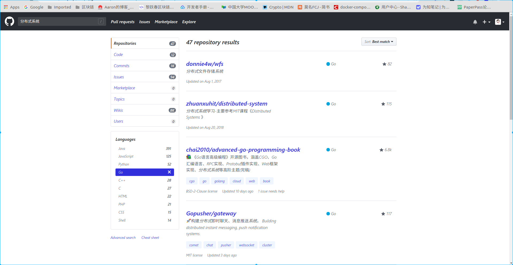

# 分布式系统学习资料

## **该博客下有分布式的文章**

**是原文的译文，很详细，也可以看译文**

https://blog.csdn.net/tianlongtc/article/category/7827608

----------------------------------------------------------------------------------------------------------------------------------------------------------------------------------------------------------------------

- 分布式学习最佳实践：从分布式系统的特征开始（附思维导图）
- https://www.cnblogs.com/xybaby/p/8544715.html
- https://www.cnblogs.com/xybaby/p/7787034.html

- 学习分布式系统需要怎样的知识？
- https://www.zhihu.com/question/23645117

- 分布式架构 -- 学习路线图（入门到进阶）
- https://blog.csdn.net/chunlongyu/article/details/52431200

- 分布式系统学习笔记
- https://www.jianshu.com/p/b244456677f2

- 分布式相关文章
- https://blog.csdn.net/tianlongtc/article/details/804724161

github上关于分布式系统的内容

