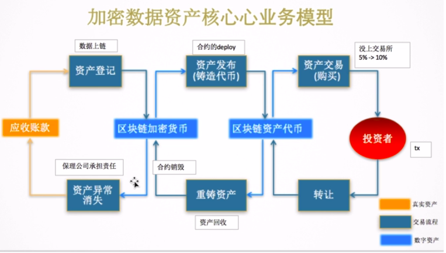
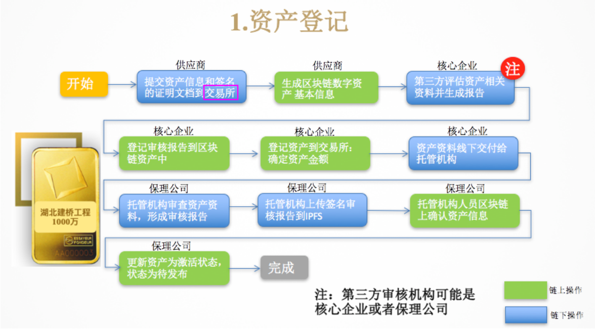
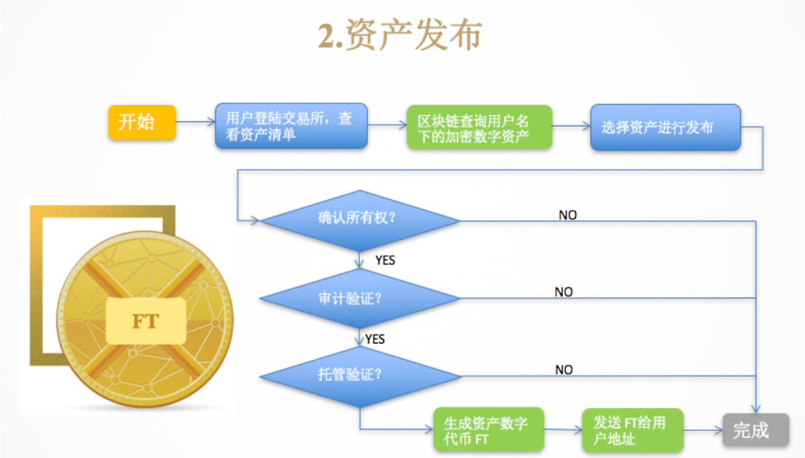
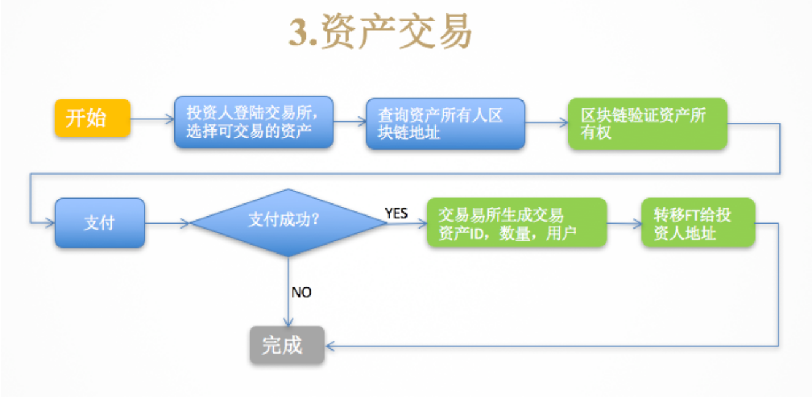
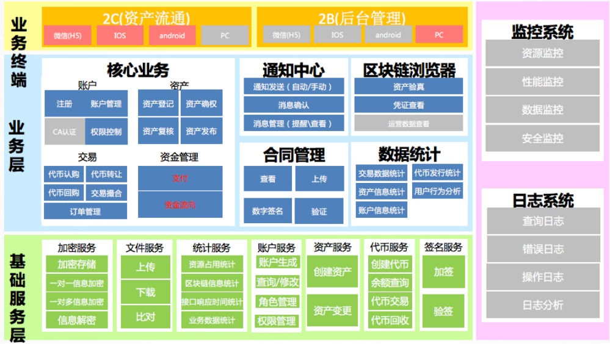
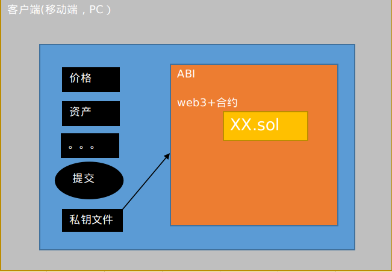
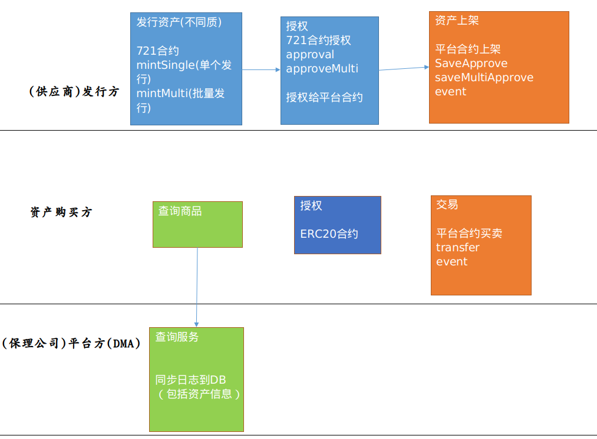
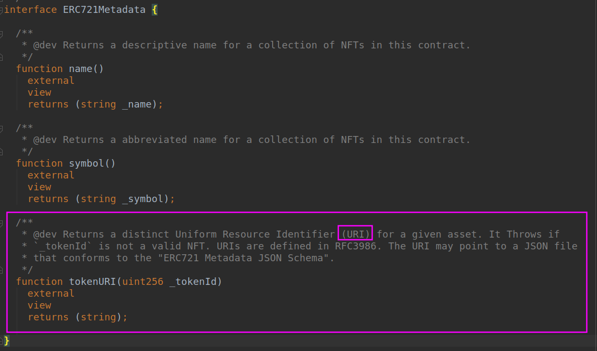
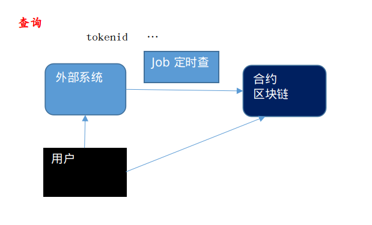

# 供应链金融项目分析

-------------------------------------------------------------------------------------------------------------------------------------------------------------------------------------------------------------------------------

## 项目的名称是：**供应链金融**

### 痛点分析：

上游的核心企业从下游的供应商那里采购了东西，**核心企业付款周期长**，导致下游的供应商没有周转资金，就不能进行下一阶段的生产，此时，下游的供应商要想维持生产，就要向银行和其他融资机构贷款，贷款时又面临一个问题，银行的审查比较严格，同时，与上游核心企业的订购合同是保密的，你不能拿着合同去银行贷款，你企业自身的信用不是很好，银行就不会给你大额的贷款。

### 平台的愿景：

打通**大公司**与其上下游供应商之间的**资金流和信息流**，**将大公司的信用传递给中小微企业**，**真正解决中小微企业融资难、融资贵的现状**。该平台以区块链为底层技术，将利用最新金融科技为各产业垂直领域的**B2B平台**提供专业的金融服务，**为平台上的中小企业对接合适的资金方并促成融资**。

## 需求分析：

**核心的业务流**包括三个方面：

> 1. **资产登记**(应收账款)
> 2. **资产确权**
> 3. **资产流通**

**多方参与：**

> 上游的核心企业
>
> 下游的供应商
>
> 保理公司
>
> 资金购买方

### 为什么要用区块链？

> - **不信任的多方**
>
> ​    首先是供应商和银行之间的不信任，保理公司和核心企业、供应商之间也存在不信任，资金的购买方和其他多方更是不信任，
>
> - **交易**
>
>   区块链的核心是**交易**，那么你设计产品时不用自己再去设计交易逻辑，区块链就能保证交易的原子性。
>
> - **存证**
>
>   一些票据之类的东西可以放在区块链上，区块链可溯源，不可篡改的特性，可以保证票据的真实性。
>
> - **资产上链**
>
>   资产上链，必须是一些可估值的资产，不会变动的。

### 需要注意的问题

> 1. 法律法规的问题(CA)
>
>    **数字签名**
>
> 2. 安全和隐私
>
>    交易采用多地址，资产token化，不暴露企业的真实资产，另外谁可以看到订单的量，
>
> 3. 需求的变化
>
> 4. 开发的各种坑

## 业务模型



首先是**资产的登记**，也就是数据上链的过程，资产登记后，得到数字资产，假设价值1000万，最终是要把数字资产卖掉，这1000万太大了，必须进行拆分，**资产发布**就是把1000万的资产进行拆分，也就是铸造代币，得到区块链资产代币，然后**投资者**可以**购买**这些区块链资产代币。

**上图中的核心业务模型的设计都是对称的**，有资产的登记，必然就有资产的销毁，有资产的发布，就有对应的资产重铸的过程，投资者可以购买资产，也可以把资产转让给其他人。

**资产重铸**又包括两个情况：

第一种是在发布资产时，代币的价格定的低，那么我想提高代币的价格，就需要资产重铸，回到原始登记的数字资产，然后重新发布定价。

第二种情况是，这里有一点需要注意：供应商把资产发布在平台上，投资者买这些数字代币，那么卖家(供应商)就拿到了钱，如果这时核心企业要归还货款了，核心企业应该把钱给供应商，供应商把钱给平台，然后平台找投资者回购数字资产。资产回收后就要调用合约销毁这些数字资产，然后又回归到最初登记的资产。

**资产异常消失的情况：**

如果核心企业最后公司破产了，比如ofo，那么将不能给供应商钱，这时发布的代币也要资产回收，然后销毁，这时，**保理公司**就要承担责任，把汇款给平台，平台再从投资者那里回购资产，投资者也不会损失。

## 业务细化

1. **资产登记**

   

   首先是**供应商链下资产登记**，**供应商**提交**资产和数字签名的证明文档**到一个**第三方的资产确权交易中心**(有一定的资质)，然后在**链上**生成区块链数字资产的基本信息；接着**第三方评估机构** **链下评估***你的资产相关资料并生成审核报告，然后评估机构**链上**登记审核报告到区块链资产中，**链上**登记数字资产到资产确权中心确定资产的金额，然后资产资料**链下**交付给托管机构(也就是最后管理这些数字资产的平台方)，托管机构**链下**审查资产报告，形成审核报告，然后托管机构上传签名审核报告到IPFS,接着托管机构链上去确认资产信息，更新资产为激活状态，状态为待发布，至此登记完成。

2. **资产发布**

   

   资产发布，**供应商登录交易所**(是一个资产确权中心)查询资产清单，然后是链上查询用户名下的加密数字资产，链下选择相应的资产进行发布，这个过程要经过三步验证，(1)确认所有权，(2)是否通过审计验证，(3)是否通过托管验证，这三个验证都确认后，链上生成数字资产代币FT,然后发送给用户(供应商)的地址，至此资产发布完成。

3. **资产交易**



投资人登录交易所，选择可交易的资产，查询资产所有人的区块链地址，**链上**，区块链验证资产的所有权，然后**买家支付**，验证是否支付成功，如果支付成功，交易生成，包括(资产ID,数量，用户)，然后发送相应的数字资产代币FT到投资人的地址。至此，交易完成。

这里**支付**需要注意：**用什么支付**，如果采用像**比特币**和**以太坊**等等的其他代币支付的话，那么很多用户是没有这些数字货币的，**不能形成规模**，如果采用法定货币的话，会有一个**资金池的风险**(比如，钱放在哪里，谁来管理)，**如果一个公司有资金池，募集了大量的资金，是违法**。这里采用的是**平台方自己发行一些数字货币**(**这个数字货币也是受到第三方管理机构认可，保障的**)，链上的数字资产价值用我平台发行的数字货币来衡量，投资者购买数字资产时，会先把法定的货币转化为平台方的数字代币，然后用这些代币购买数字资产。**这里平台发布的数字代币是不上交易所的，只在小范围的利益相关方流通**，因此是合法的，因为目前法律上，对数字货币的定义是**物**，**不是法定货币**，

现金很多做公链的都会**发币**，自己发行的数字货币，用自己发行的币来进行支付，一旦流通使用，就会有一定的价值。目前来说，数字货币不是法定货币。

## 系统架构



根据业务需求，确定技术架构，这个项目是金融产品，侧重于资产的流通，选用以太坊来做会更好。

fabric侧重与企业级联盟链的管理。

上面的**数据统计**是个很重要的一点，如果用户打开一个应用来查询相关的信息，反应很慢，那么这个产品设计的肯定不行，**这里的方法是从链上查询获取数据，然后缓存在数据库中，那么在应用端查询时，将会响应很快，从链上查询数据是不花费gas的**。

## 整体实现



用户(资产发行方)发布资产时要通过客户端调用智能合约，用户**用私钥文件签名发布资产**，合约写好后编译会得到**ABI文件**，用户通过**web3js**来调用合约中的方法，完成资产发布。**先是获取合约实例，然后用合约实例调用合约中的方法**。

## 代码分析

### 业务流程图



在业务逻辑确定后，就要确定有多少个合约，以及合约之间的关系，另外还要注意合约的**粒度**，合约的粒度不宜过大，合约粒度大，修改合约时麻烦。

在这个项目中，主要有三个合约：**ERC721合约**，**ERC20合约**，**平台合约**。

**ERC721合约**：因为用户要发行的资产是不一样的，每一个都是不一样的，因此用721合约，因为721合约是非同质化的token，刚好符合。

**ERC20合约**：平台方自己发行了ERC20代币，这个ERC20代币用来衡量ERC721资产的价格，交易都是通过ERC20实现的。

**怎样设计合约的粒度呢？**

> - 首先是考虑合约的owner是谁？
>
>   ERC721合约的owner是供应商(最开始的时候)
>
>   ERC20合约的owner是平台方(最开始的时候)
>
>   平台合约的owner是平台方

> - 其次考虑合约的继承关系，这个主要是根据业务逻辑划分

**发行资产的逻辑**：

发行资产的方法有个**批量发行(mintMulti)**，ERC721资产是非同质的，但是如果有批量的ERC721资产，每个都是不一样的，但是它们的差别又很小，比如，**电影票**

，100张电影票，每张都不一样，但价格是一样的，在发行时可以采用批量发行，**100张对应1000个ERC20token**，

**为什么会有批量的概念，要根据实际的业务需求**，**关键看资产是否可以拆分来卖**。比如，一辆汽车，它是一个整体，它价值10000个ERC20token，是1对10000的关系，当资产回收时必须是回收一个整体。**而批量发行的就不一样了，100张电影票，我收回时，我可以这个账期收回10个，另一个账期收回50个，可以分期分阶段收回**，

**批量发行的代码**：

```javascript
/**
   * @dev 生成多份同类资产
   * @param    _to        资产所有者
   * @param    _tokenId   首个资产编号(作为资产标识)
   * @param    _count     资产数量
   * @param    _uri       资产数据网址
   */
  function mintMulti(
    address _to,
    uint256 _tokenId,
    uint256 _count,
    string _uri,
    bool   _isTransfer,
    bool   _isBurn
  )
    public
  {
    require(_tokenId > 0, "tokenId should over 0");
    require(_count > 0, "Count number should over 0");
    uint256 startId = assetMap.nextTokenId(_tokenId);
    for (uint256 idx = 0; idx < _count; idx++) {
      _mint(_to, startId.add(idx), _uri, _isTransfer, _isBurn);
    }
    assetMap.update(_tokenId, startId.add(_count));
  }

```

有一个参数很重要，是ERC721合约新增的，那就是**URI**

有一个ERC721元数据合约：**ERC721Metadata.sol**，该合约主要是元数据接口，



**tokenURI方法，传入一个tokenId返回一个URI**，对于给定的资产，返回一个独特的**唯一的资源标识符**(**URI**),URIs用RFC3986定义，**URI可以指向符合“ERC721元数据JSON模式”的JSON文件**。

This is the "**ERC721 Metadata JSON Schema**" referenced above.

```json
{
    "title": "Asset Metadata",
    "type": "object",
    "properties": {
        "name": {
            "type": "string",
            "description": "Identifies the asset to which this NFT represents"
        },
        "description": {
            "type": "string",
            "description": "Describes the asset to which this NFT represents"
        },
        "image": {
            "type": "string",
            "description": "A URI pointing to a resource with mime type image/* representing the asset to which this NFT represents. Consider making any images at a width between 320 and 1080 pixels and aspect ratio between 1.91:1 and 4:5 inclusive."
        }
    }
}

```

## 以下是关于`ERC721 Metadata JSON Schema`的相关文档

### EIP 1047: Token Metadata JSON Schema 

http://eips.ethereum.org/EIPS/eip-1047

### ERC-721 metadata standards and IPFS

https://medium.com/blockchain-manchester/erc-721-metadata-standards-and-ipfs-94b01fea2a89

### ERC721 metadata doesn’t fit our data model

https://ethereum-magicians.org/t/erc721-metadata-doesnt-fit-our-data-model/1568

### Adding metadata

https://docs.opensea.io/docs/2-adding-metadata

### The One Thing Missing from the ERC 721 Standard for Digital Collectibles on the Blockchain

https://hackernoon.com/the-one-thing-missing-from-erc-721-standard-for-digital-collectibles-on-the-blockchain-9ee26e4a918c

### Store ERC721 token metadata

https://ethereum.stackexchange.com/questions/70387/store-erc721-token-metadata

## 0xcert Framework学习(总结在ethereum目录下)

### 0xcert protocol

https://0xcert.org/technical-paper.pdf

### 0xcert/ethereum-erc721

https://github.com/0xcert

### 官网

https://docs.0xcert.org/

----------------------------------------------------------------------------------------------------------------------------------------------------------------------------------------------------------------------------------------------------------

**批量发行方法要注意的点**：


批量发行的方法**mintMulti**，内部有一个for循环调用了**_mint**方法批量的发行资产。

该处的设计可能会出现另外一种方法：

我们是通过外部应用调用合约的，**那为什么不把这个循环发行资产的方法写在外部**？

如果这个for循环是写在外部的话，那么你将会频繁地调用合约，会花费较多的**gas**,

合约内部的方法能保证操作的**原子性**。

**查询服务要注意的点**：



一般的设计是用户通过外部的系统(是一个中心化的节点)查询的，外部系统根据tokenId,交易的hash,区块的高度等等进行**Job定时查询**，调用合约中的方法获取结果，**把结果缓存到数据库中**，那么用户查询时是通过外部系统的数据库得到结果的。

**用户直接向数据库查询是比较耗费时间的，一般不这么做**。

通过外部系统查询，可能会有一个问题：如果这个中心化的节点修改了数据，那么就和区块链系统中数据不一致，这点可以这样解决：**用户在通过外部系统查询时，可以对结果进行hash验证**，比如，用户此时从区块链中查询得到tokenId的hash值，这个查询还是很快的，用户拿这个hash值和从外部系统查到的数据的hash作比对，以此来确保数据没有篡改。

## 整体的逻辑

### 该项目使用了`0xcert/ethereum-erc721`的框架

**供应商**调用ERC721合约发行资产，然后授权给平台合约，平台合约保存授权，这步相当于是721资产上架的过程。

**购买方**查询要购买的资产，然后把自己的钱换成平台方的ERC20代币，**把自己的ERC20代币授权给平台**。

**交易时**，**平台先把ERC721资产转到买家的地址下，然后平台从买家授权到平台的ERC20代币中转移相应的代币到发行方的地址中**。

这里有一个点：**买家必须把自己的ERC20代币授权给平台方**，合约中有一个方法，**approveFreeze**，该方法是ERC20合约下的方法，把买家的资产授权给平台，平台冻结这部分资产。

----------------------------------------------------------------------------------------------------------------------------------------------------------------------------------------------------------------------------------------------------------

## 新增的合约

正常的流程是发行方发行资产，然后授权给平台，平台保存资产(即资产上架)，之后消费者就可以进行买卖了。

在正常的交易逻辑实现后，又**根据业务需求增加了三个合约**：分别是**预售托管合约**，**拍卖合约**，**下注合约**。

**预售托管合约**：为什么要有预售托管合约？

**在产品还没正式进入市场前，可以通过预售来了解该种产品是否有市场**。**预售也是正常的交易**，**erc721和erc20合约都绑定到预售托管合约上**，发行方并没有直接将资产授权给平台合约，**而是授权给了预售托管合约**，**预售托管合约管理授权的721资产，消费者可以购买这部分授权给预售托管合约的72资产**。

**拍卖合约**：拍卖合约和预售托管的逻辑差不多，erc721合约和erc20合约都绑定到拍卖合约上，然后就是拍卖相关的操作，这里采用的是**公开拍卖**(也就是能看到别人的出价)，最后竞拍成功的人，拍卖合约会把erc721资产转移到买家地址下，然后从买家授权到拍卖合约的ERC20代币中转移相应的代币到发行方的地址中**。

**下注合约**：**下注的合约适用于什么业务场景？？？**


