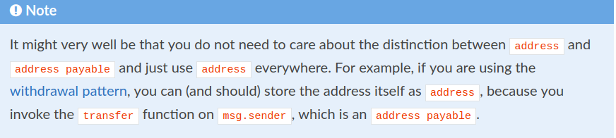
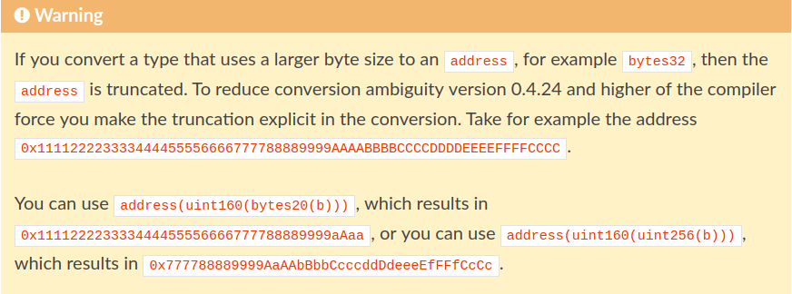
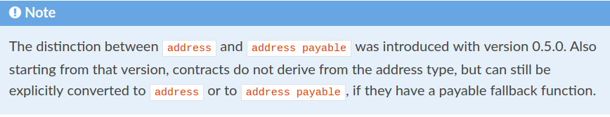
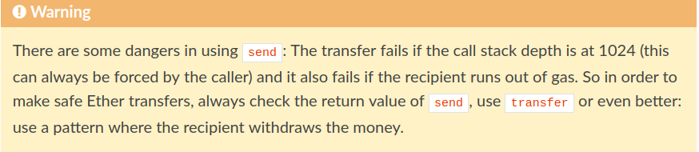
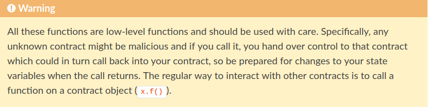
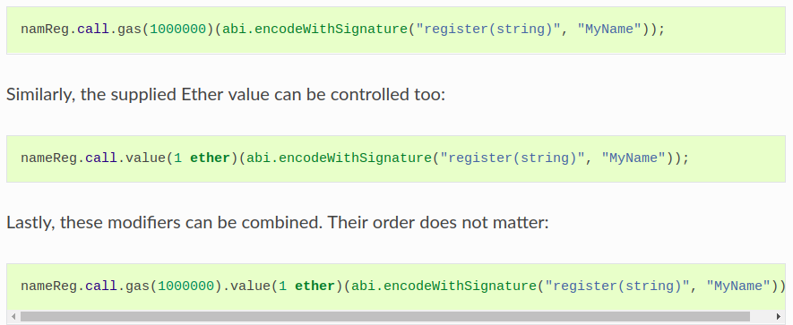
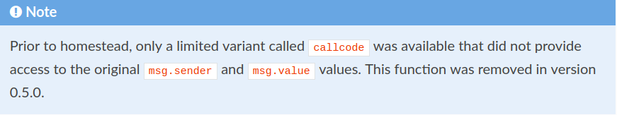
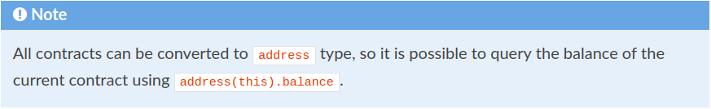

## Address

The address type comes in two flavours, which are largely identical:

地址类型有两种，它们大部分是相同的：

- `address`: Holds a 20 byte value (size of an Ethereum address).
- `address payable`: Same as `address`, but with the additional members `transfer` and `send`.

The idea behind this distinction is that `address payable` is an address you can send Ether to, while a plain `address` cannot be sent Ether.

`address payable` 是一个可以发送以太币的地址，而一个普通的`address`不能发送以太币。


Type conversions:

Implicit conversions from `address payable` to `address` are allowed, whereas conversions from `address` to `address payable` are not possible (the only way to perform such a conversion is by using an intermediate conversion to `uint160`).

隐式转换从 `address payable` to `address`是允许的，然而从 `address` to `address payable` 是不能的(使用这样的转换仅仅有一个方式那就是使用一个中间转换到`uint160`)

[Address literals](https://solidity.readthedocs.io/en/v0.5.0/types.html#address-literals) can be implicitly converted to `address payable`.

地址常量可以隐式转换到`address payable`。

Explicit conversions to and from `address` are allowed for integers, integer literals, `bytes20` and contract types with the following caveat: Conversions of the form `address payable(x)` are not allowed. Instead the result of a conversion of the form `address(x)` has the type `address payable`, if `x` is of integer or fixed bytes type, a literal or a contract with a payable **fallback function**. If `x` is a contract without payable fallback function, then `address(x)` will be of type `address`. In external function signatures `address` is used for both the `address` and the `address payable` type.

对于整数，允许对地址进行显式转换，整型库， `bytes20` 和合约类型有以下警告：

`address payable(x)` 方式的转换是不允许的。代替的转换结果是`address(x)`方式，它有`address payable`类型，如果`x`是一个整型或者一个固定的 bytes类型，一个常量或者是具有一个 payable **fallback function**。如果`x`是一个没有payable **fallback function**的合约，那么`address(x)`将会是`address`类型。在外部函数签名中，`address`被用于`address`和`address payable`类型。



**withdraw pattern**需要看！！！

你不用关心`address`和`address payable`的区别，并且每个地方都用`address`。例如，如果你正在用**提取模式(withdrawal pattern)**，你可以存储地址本身作为`address`，因为你使用`msg.sender`调用`transfer`函数，它本身是一个`address payable`。



如果你使用大的字节类型转换到一个`address`类型，例如，`bytes32`，那么地址将会被缩短的。为了减少在0.4.24版本转换的模糊，更高的编译器强制你缩短显式的转换。



`ddress`和`address payable`的区分在0.5.0版本被介绍。**也是从这个版本开始，合约不从地址类型派生**，如果它们有一个 **payable fallback function**，但是仍然能够显式的转换成`address`或者 `address payable`。

#### Members of Addresses

For a quick reference of all members of address, see [Members of Address Types](https://solidity.readthedocs.io/en/v0.5.0/units-and-global-variables.html#address-related).

- `balance` and `transfer`

It is possible to query the balance of an address using the property `balance` and to send Ether (in units of wei) to a payable address using the `transfer` function:

```javascript
address payable x = address(0x123);
address myAddress = address(this);
if (x.balance < 10 && myAddress.balance >= 10) x.transfer(10);
```

The `transfer` function fails if the balance of the current contract is not large enough or if the Ether transfer is rejected by the receiving account. The `transfer` function reverts on failure.

如果当前合约的余额不够，`transfer`函数会失败，或者被接收者账户拒绝，也会失败。当失败时，`transfer`函数回滚。

**Note**  **Fallback Function函数需要看！！！**

> If `x` is a contract address, its code (more specifically: its [Fallback Function](https://solidity.readthedocs.io/en/v0.5.0/contracts.html#fallback-function), if present) will be executed together with the `transfer` call (this is a feature of the EVM and cannot be prevented). If that execution runs out of gas or fails in any way, the Ether transfer will be reverted and the current contract will stop with an exception.

如果`x`是一个**合约地址**，它的**代码**(**如果存在的话，更具体地说：它是`Fallback Function`**)随着`transfer`调用将会被一起执行(这是以太坊虚拟机的特点，不可避免的)。如果执行gas用完了，或者失败了，**以太币转移将会回滚，并且当前的合约将会由于例外情况而停止**。

- `send`

Send is the low-level counterpart of `transfer`. If the execution fails, the current contract will not stop with an exception, but `send` will return `false`.

`send`是`transfer`的低级别对应。**如果执行失败，当前合约由于例外情况不会停止，但是`send`将会返回`false`**。



- `call`, `delegatecall` and `staticcall`

In order to interface with contracts that do not adhere to the ABI, or to get more direct control over the encoding, the functions `call`, `delegatecall` and `staticcall` are provided. They all take a single `bytes memory` argument as input and return the success condition (as a `bool`) and the returned data (`bytes memory`). The functions `abi.encode`, `abi.encodePacked`, `abi.encodeWithSelector` and `abi.encodeWithSignature` can be used to encode structured data.

Example:

```javascript
bytes memory payload = abi.encodeWithSignature("register(string)", "MyName");
(bool success, bytes memory returnData) = address(nameReg).call(payload);
require(success);
```



这些所有的函数都是低级别的函数，使用时要小心。特别，任何未知的函数可能是恶意的，并且如果你调用它，你移交控制给可以反过来调用你的合约的合约，因此当调用返回时注意状态变量的改变。通常与其他合约交互的方式是用一个合约对象调用一个函数(x.f())。

**:: note::**

Previous versions of Solidity allowed these functions to receive arbitrary arguments and would also handle a first argument of type `bytes4` differently. These edge cases were removed in version 0.5.0.

以前版本的Solidity允许这些函数接收任意参数，并且还会以不同方式处理`bytes4`类型的第一个参数。这中边缘情况在0.5.0时被移除。

It is possible to adjust the supplied gas with the `.gas()` modifier:

使用`.gas()`修饰语可以调整提供的gas量。



In a similar way, the function `delegatecall` can be used: the difference is that only the code of the given address is used, all other aspects (storage, balance, …) are taken from the current contract. The purpose of `delegatecall` is to use library code which is stored in another contract. The user has to ensure that the layout of storage in both contracts is suitable for delegatecall to be used.

函数`delegatecall`可以以相似的方式被使用：不同是仅仅被给定地址的代码可以被使用，所有的其他内容从当前合约获得。`delegatecall`的目的是使用存储在另一个合约的库代码。用户必须确保两个合约的存储层都适合`delegatecall`使用。



在homestead之前，有一个受限的变体叫作`callcode`是可以使用的，它不提供原始的`msg.sender`和`msg.value`的值的访问。这个函数在0.5.0版本被移除。

Since byzantium `staticcall` can be used as well. This is basically the same as `call`, but will revert if the called function modifies the state in any way.

由于拜占庭`staticcall`也可以被调用。基本和`call`相似的，但是如果回调函数以任何方式更改了状态，将会回滚。

All three functions `call`, `delegatecall` and `staticcall` are very low-level functions and should only be used as a *last resort* as they break the type-safety of Solidity.

这三个函数是非常低级的函数，应该只作为最后的手段，因为它们打破了Solidity的类型安全性。

The `.gas()` option is available on all three methods, while the `.value()` option is not supported for `delegatecall`.

`.gas()`操作对于这三个函数都是可以使用的，但是`.value`操作不支持`delegatecall`。



所有的合约都可以转化到`address`类型，因此可以使用`address(this).balance`查询当前合约的余额。

### Address Literals

Hexadecimal literals that pass the address checksum test, for example`0xdCad3a6d3569DF655070DEd06cb7A1b2Ccd1D3AF` are of `address payable` type. Hexadecimal literals that are between 39 and 41 digits long and do not pass the checksum test produce a warning and are treated as regular rational number literals.

十六进制常量通过地址校验和测试，例如，`0xdCad3a6d3569DF655070DEd06cb7A1b2Ccd1D3AF` are of `address payable` type。十六进制常量在39和41数字长度之间，不通过地址校验和测试，产生一个警告，被当作是常规的合理的数字常量。

