# Units and Globally Available Variables

**单位和全局可用的变量**

## Ether Units(以太币单位)

A literal number can take a suffix of `wei`, `finney`, `szabo` or `ether` to specify a subdenomination of Ether, where Ether numbers without a postfix are assumed to be Wei.

一个常量数字拥有`wei`, `finney`, `szabo` or `ether` 这些后缀，它指定以太币的子面值，如果一个数字没有一个后缀，则假定是`Wei`。

> assert(1 wei == 1);
> assert(1 szabo == 1e12);
> assert(1 finney == 1e15);
> assert(1 ether == 1e18);

The only effect of the subdenomination suffix is a multiplication by a power of ten.

subdenomination后缀的唯一影响是乘以10的幂。

## Time Units(时间单位)

Suffixes like `seconds`, `minutes`, `hours`, `days` and `weeks` after literal numbers can be used to specify units of time where seconds are the base unit and units are considered naively in the following way:

有上面后缀的是时间单位，**秒是基础的时间单位**，

> - `1 == 1 seconds`
> - `1 minutes == 60 seconds`
> - `1 hours == 60 minutes`
> - `1 days == 24 hours`
> - `1 weeks == 7 days`

Take care if you perform calendar calculations using these units, because not every year equals 365 days and not even every day has 24 hours because of [leap seconds](https://en.wikipedia.org/wiki/Leap_second). Due to the fact that leap seconds cannot be predicted, an exact calendar library has to be updated by an external oracle.

如果你在用这些单位进行日历计算要小心，因为并不是每年都是365天，由于闰秒，并不是每天都是24小时。由于闰秒不可预测的事实，必须由外部oracle更新确切的日历库。

> The suffix `years` has been removed in version 0.5.0 due to the reasons above.
>
> 由于上面的原因，在0.5.0版本中后缀`years`已经被移除了。

These suffixes cannot be applied to variables. If you want to interpret some input variable in e.g. days, you can do it in the following way:

这些后缀不可以应用到变量中。如果你想说明一些输入变量，比如天，你可以按照下面的方式做：

```javascript
function f(uint start, uint daysAfter) public {
    if (now >= start + daysAfter * 1 days) {
      // ...
    }
}
```

## Special Variables and Functions(特有的变量和函数)

There are special variables and functions which always exist in the global namespace and are mainly used to provide information about the blockchain or are general-use utility functions.

有一些特殊的变量和函数总是存在于全局命名空间中，主要用于提供有关**区块链的信**息或是**通用实用程序函数**。

### Block and Transaction Properties(区块和交易属性)

- `blockhash(uint blockNumber) returns (bytes32)`: hash of the given block - only works for 256 most recent, excluding current, blocks

- 这个`blockhash`函数，返回给定区块的hash,仅仅适用于256个最近区块，不包括当前区块。

- `block.coinbase` (`address payable`): current block miner’s address （当前区块矿工的地址）

- `block.difficulty` (`uint`): current block difficulty  （当前区块的难度值）

- `block.gaslimit` (`uint`): current block gaslimit  （当前区块的gas限制）

- `block.number` (`uint`): current block number  （当前区块号）

- `block.timestamp` (`uint`): current block timestamp as seconds since unix epoch  （自unix epoch以来的当前区块时间戳，单位是秒）

- `gasleft() returns (uint256)`: remaining gas  （函数，返回剩余的gas）

- `msg.data` (`bytes calldata`): complete calldata  (完整的回调数据)

- `msg.sender` (`address payable`): sender of the message (current call)  （信息的发送者，即当前的调用者）

- `msg.sig` (`bytes4`): first four bytes of the calldata (i.e. function identifier)  （一个4个字节的回调数据，比如，函数函数标示符）

- `msg.value` (`uint`): number of wei sent with the message  （发送信息的钱，单位是wei）

- `now` (`uint`): current block timestamp (alias for `block.timestamp`)  （当前区块的时间戳，别名是`block.timestamp`）

- `tx.gasprice` (`uint`): gas price of the transaction  （交易的gas价格）

- `tx.origin` (`address payable`): sender of the transaction (full call chain)  （交易发送者的地址-完全调用链）

  


对于每一个外部函数回调而言，`msg`所有成员的值，包括`msg.sender`和`msg.value`都可以改变。包括调用库函数。

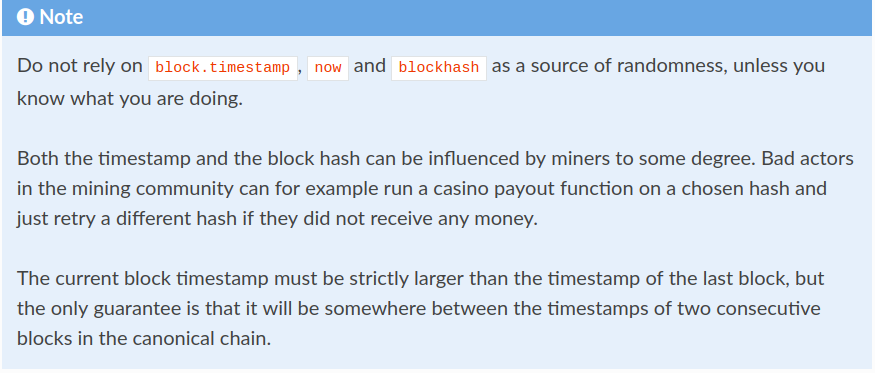

不要依赖于`block.timestamp`，`now`和`blockhash`作为一个随机性的源，除非你知道你在做什么。

**时间戳和区块哈希在某些程度上会受到矿工的影响**。在挖矿社区中坏人可以这样，例如，在一个选定的hash上运行娱乐场支出函数，如果他们没有收到任何钱，他们仅仅是一个不同hssh的重试。

当前块时间戳必须严格大于最后一个块的时间戳，但唯一的保证是它将介于规范链中两个连续块的时间戳之间。

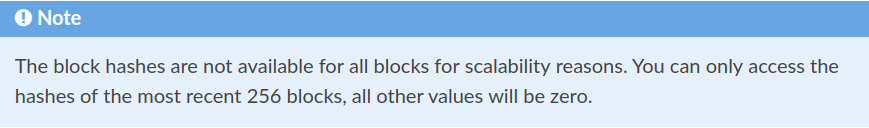

由于扩展性原因，所有区块的hash是不能获得的，你仅仅可以获得最近的256个区块的hash,其他的值将会是0。

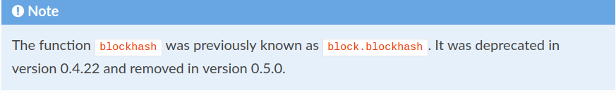

`blockhash`函数之前是`block.blockhash`，在0.4.22版本时被弃用了，在0.5.0版本时被移除了。

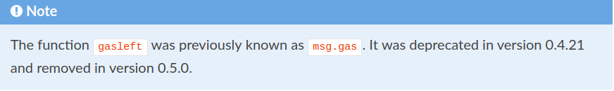

`gasleft`函数之前，返回剩余的`gasg`,之前是`msg.gas`。在0.4.21版本时被弃用了，在0.5.0版本时被移除了。

### ABI Encoding and Decoding Functions(ABI编码和解码函数)

**这个要结合者`ABI规范`章节看**。

- `abi.decode(bytes memory encodedData, (...)) returns (...)`: ABI-decodes the given data, while the types are given in parentheses as second argument. Example: `(uint a, uint[2] memory b, bytes memory c) = abi.decode(data, (uint, uint[2], bytes))`

- `abi.encode(...) returns (bytes memory)`: ABI-encodes the given arguments

- `abi.encodePacked(...) returns (bytes memory)`: Performs [packed encoding](https://solidity.readthedocs.io/en/v0.5.0/abi-spec.html#abi-packed-mode) of the given arguments

- `abi.encodeWithSelector(bytes4 selector, ...) returns (bytes memory)`: ABI-encodes the given arguments starting from the second and prepends the given four-byte selector

- `abi.encodeWithSignature(string memory signature, ...) returns (bytes memory)`: Equivalent to `abi.encodeWithSelector(bytes4(keccak256(bytes(signature))), ...)`

  

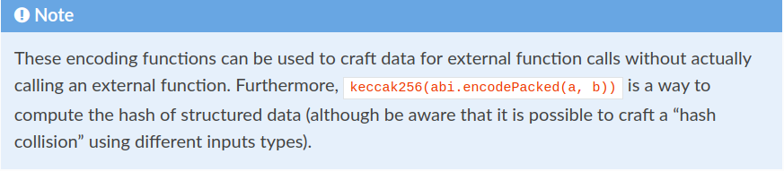

这些编码函数可用于**为外部函数调用创建数据**，**而无需实际调用外部函数**。此外，`keccak256（abi.encodePacked（a，b))`是计算结构化数据的hash的一种方法（尽管意识到使用不同的输入类型可能会产生“hash碰撞")

See the documentation about the [ABI](https://solidity.readthedocs.io/en/v0.5.0/abi-spec.html#abi) and the [tightly packed encoding](https://solidity.readthedocs.io/en/v0.5.0/abi-spec.html#abi-packed-mode) for details about the encoding.

有关编码的详细信息，请参阅有关**ABI和紧密压缩编码**的文档。

### Error Handling

See the dedicated section on [assert and require](https://solidity.readthedocs.io/en/v0.5.0/control-structures.html#assert-and-require) for more details on error handling and when to use which function.

### Mathematical and Cryptographic Functions(数学的和加密的函数)

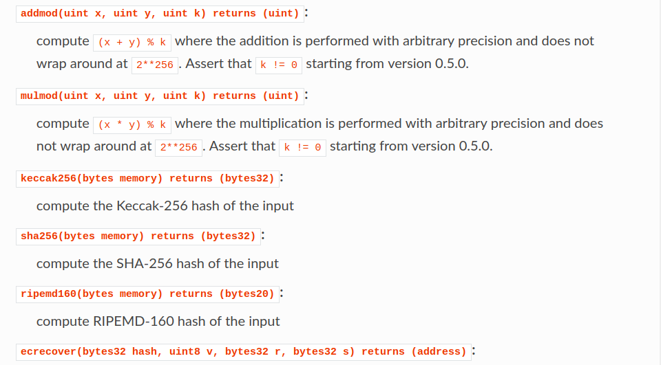

recover the address associated with the public key from elliptic curve signature or return zero on error ([example usage](https://ethereum.stackexchange.com/q/1777/222))

从椭圆曲线签名恢复与公钥关联的地址或在出错时返回零（**示例用法**）**示例用法需要看**

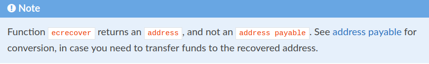

See [address payable](https://solidity.readthedocs.io/en/v0.5.0/types.html#address) for conversion, in case you need to transfer funds to the recovered address.

**`address payable`需要看**

It might be that you run into Out-of-Gas for `sha256`, `ripemd160` or `ecrecover` on a *private blockchain*. The reason for this is that those are implemented as so-called precompiled contracts and these contracts only really exist after they received the first message (although their contract code is hardcoded). Messages to non-existing contracts are more expensive and thus the execution runs into an Out-of-Gas error. A workaround for this problem is to first send e.g. 1 Wei to each of the contracts before you use them in your actual contracts. This is not an issue on the official or test net.

在一个私有区块链上，在使用`sha256`, `ripemd160` or `ecrecover` 时可能会遇到`Out-of-Gas`的问题。原因是这些是作为所谓的预编译合约实现的，这些合约仅仅在它们接收到第一个信息后存在(尽管它们的合约是硬编码的)。信息发送到不存在的合约是更加昂贵的，因此执行遇到一个`Out-of-Gas`的错误。这个问题的应变方法是在你的目前的合约里使用它们之前，首先给每一个合约发送`1 Wei`。在正式或测试网络上不是一个问题。


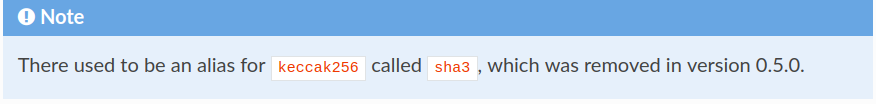

曾经有一个名为`sha3`的`keccak256`的别名，**它在版本0.5.0中被删除**。

### Members of Address Types(地址类型成员)

**这部分要认真看，尤其是下面`Address`链接**,  Address章节看完后再看下这里。

- `<address>.balance` (`uint256`):这个地址的余额，单位是Wei

  balance of the [Address](https://solidity.readthedocs.io/en/v0.5.0/types.html#address) in Wei

- `<address payable>.transfer(uint256 amount)`:

  send given amount of Wei to [Address](https://solidity.readthedocs.io/en/v0.5.0/types.html#address), reverts on failure, forwards 2300 gas stipend, not adjustable

  **transfer**:发送给定数额到这个地址，**当失败时会回滚**，发送(forwards)2300 gas 固定薪金，**不可调节的**。

- `<address payable>.send(uint256 amount) returns (bool)`:

  send given amount of Wei to [Address](https://solidity.readthedocs.io/en/v0.5.0/types.html#address), returns `false` on failure, forwards 2300 gas stipend, not adjustable

  **send**:发送给定数额到这个地址，**当失败时返回`false`**，发送2300 gas 固定薪金，**不可调节的**。

- `<address>.call(bytes memory) returns (bool, bytes memory)`:

  issue low-level `CALL` with the given payload, returns success condition and return data, forwards all available gas, adjustable

  使用给定的有效负载发出低级`CALL`，返回成功的状况和返回数据，**发送所有可利用的gas，可调节的**。

- `<address>.delegatecall(bytes memory) returns (bool, bytes memory)`:

  issue low-level `DELEGATECALL` with the given payload, returns success condition and return data, forwards all available gas, adjustable

  使用给定的有效负载发出低级`DELEGATECALL`，返回成功的状况和返回数据，**发送所有可利用的gas，可调节的**。

- `<address>.staticcall(bytes memory) returns (bool, bytes memory)`:

  issue low-level `STATICCALL` with the given payload, returns success condition and return data, forwards all available gas, adjustable

  使用给定的有效负载发出低级`STATICCALL`，返回成功的状况和返回数据，**发送所有可利用的gas，可调节的**。

For more information, see the section on [Address](https://solidity.readthedocs.io/en/v0.5.0/types.html#address).

更多的信息，可以看`Address`章节


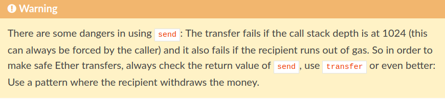

在使用**send**时有一些风险：如果**调用协议栈的深度达到1024**(这总是被调用者强制的)，转账失败，如果接收者用完了gas也会失败。因此为了为了使Ether安全的转移，总是检查**send**的返回值，使用**transfer**或者更好的方式：**用一个接收者提取钱的模式**。

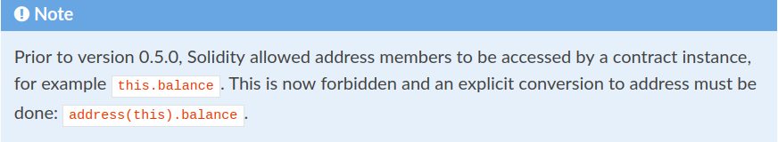

在0.5.0版本之前，Solidity允许一个**合约实例**调用地址成员，例如，**this.balance**。**现在是禁止的，并且要明确转化到地址**：

**address(this).balance**。

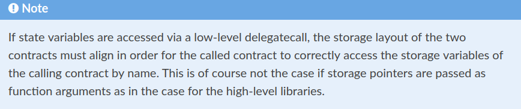

如果通过低级`委托调用`访问状态变量，则两个合约的存储布局必须对齐，以便被调用的合约按名称正确访问调用合约的存储变量。如果将存储指针作为函数参数传递，就像高级库的情况一样，这当然不是这种情况。

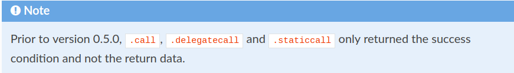

在0.5.0版本之前，`.call`，`delegatecall`和`.staticcall`仅仅返回成功的状态，不返回数据。

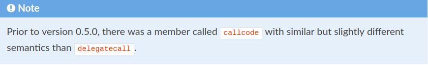

在0.5.0版本之前，有一个成员叫作`callcode`he delegatecall相似，但是在语法上略微不同


### Contract Related(合约相关的)

- `this` (current contract’s type):

  the current contract, explicitly convertible to [Address](https://solidity.readthedocs.io/en/v0.5.0/types.html#address)

  `this`,当前合约，明确地转换到地址

- `selfdestruct(address payable recipient)`:自毁（接收人的地址）

  destroy the current contract, sending its funds to the given [Address](https://solidity.readthedocs.io/en/v0.5.0/types.html#address)

  毁坏当前的合约，发送资金到给定的地址，

Furthermore, all functions of the current contract are callable directly including the current function.

此外，所有当前合约的的函数都是可以直接回调的，包括当前函数。

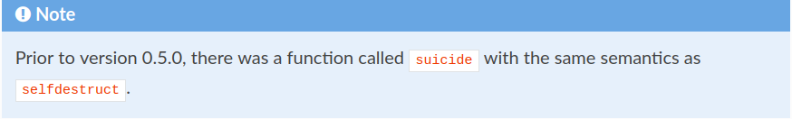

在0.5.0版本之前，有一个叫作`suicide`的函数和`selfdestruct`函数语法相似。

