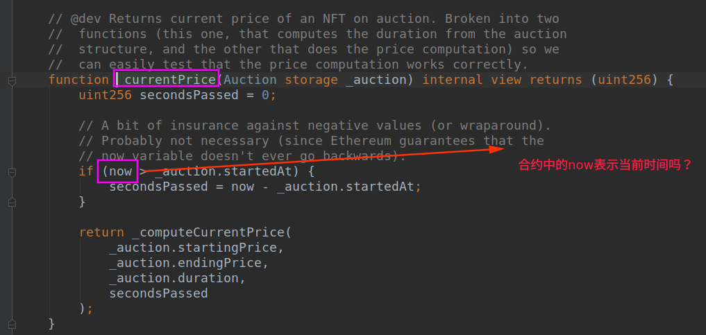

# 以太猫(CryptoKitties)源码解读

- **KittyOwnership.sol**

kitties存储所有猫结构体的数组，Id为0是无效的，也就是说猫的数量是**kitties.length-1**

注意ID为0是无效的猫，不是小猫，所有零代的猫的父母都是虚构的生物。一个奇怪的生物-父亲和母亲都是它自己！它有一个无效的遗传代码。换句话说，**猫ID 0是无效的**。

> // @dev An array containing the Kitty struct for all Kitties in existence. The ID
> 	//  of each cat is actually an index into this array. Note that ID 0 is a negacat,
> 	//  the unKitty, the mythical beast that is the parent of all gen0 cats. A bizarre
> 	//  creature that is both matron and sire... to itself! Has an invalid genetic code.
> 	//  In other words, cat ID 0 is invalid... ;-)
>
> Kitty[] kitties;

这个**tokenMetadata**方法不明白？第二个string类型的参数`_preferredTransport`是什么意思？

```javascript
// @notice Returns a URI pointing to a metadata package for this token conforming to//  ERC-721 (https://github.com/ethereum/EIPs/issues/721)// @param _tokenId The ID number of the Kitty whose metadata should be returned.
function tokenMetadata(uint256 _tokenId, string _preferredTransport) external view returns (string infoUrl) {   
    require(erc721Metadata != address(0));   
    bytes32[4] memory buffer;   uint256 count;   
    (buffer, count) = erc721Metadata.getMetadata(_tokenId, _preferredTransport);   
    return _toString(buffer, count);}
```

这个方法调用了**ERC721Metadata**合约下的**getMetadata**方法

**ERC721Metadata**

> // @title The external contract that is responsible for generating metadata for the kitties,
> //  it has one function that will return the data as bytes.

方法中的**`_tokenId` == 1, 2, 3，有什么特殊的含义吗**？

**buffer[0],[1],[2],[3]**，**等于的内容有什么含义**？

`count`的含义，**15， 49， 128分别的含义是什么**？

```javascript
// @dev Given a token Id, returns a byte array that is supposed to be converted into string.
function getMetadata(uint256 _tokenId, string) public view returns (bytes32[4] buffer, uint256 count) {
	if (_tokenId == 1) {
		buffer[0] = "Hello World! :D";
		count = 15;
	} else if (_tokenId == 2) {
		buffer[0] = "I would definitely choose a medi";
		buffer[1] = "um length string.";
		count = 49;
	} else if (_tokenId == 3) {
		buffer[0] = "Lorem ipsum dolor sit amet, mi e";
		buffer[1] = "st accumsan dapibus augue lorem,";
		buffer[2] = " tristique vestibulum id, libero";
		buffer[3] = " suscipit varius sapien aliquam.";
		count = 128;
	}
}


```
- **KittyOwnership.sol** 

**这两个方法的含义？方法内的语法看不懂？**

**Basic string utilities for Solidity**：Solidity基本字符串工具

https://github.com/Arachnid/solidity-stringutils

```javascript

// @dev Adapted from memcpy() by @arachnid (Nick Johnson <arachnid@notdot.net>)
	//  This method is licenced under the Apache License.
	//  Ref: https://github.com/Arachnid/solidity-stringutils/blob/2f6ca9accb48ae14c66f1437ec50ed19a0616f78/strings.sol
function _memcpy(uint _dest, uint _src, uint _len) private view {
	// Copy word-length chunks while possible
	for(; _len >= 32; _len -= 32) {
		assembly {
			mstore(_dest, mload(_src))
		}
		_dest += 32;
		_src += 32;
	}
   // Copy remaining bytes
	uint256 mask = 256 ** (32 - _len) - 1;
	assembly {
		let srcpart := and(mload(_src), not(mask))
		let destpart := and(mload(_dest), mask)
		mstore(_dest, or(destpart, srcpart))
	}
}

// @dev Adapted from toString(slice) by @arachnid (Nick Johnson <arachnid@notdot.net>)
//  This method is licenced under the Apache License.
//  Ref: https://github.com/Arachnid/solidity-stringutils/blob/2f6ca9accb48ae14c66f1437ec50ed19a0616f78/strings.sol
function _toString(bytes32[4] _rawBytes, uint256 _stringLength) private view returns (string) {
	var outputString = new string(_stringLength);
	uint256 outputPtr;
	uint256 bytesPtr;

	assembly {
		outputPtr := add(outputString, 32)
		bytesPtr := _rawBytes
	}

	_memcpy(outputPtr, bytesPtr, _stringLength);

	return outputString;
}
```
- **KittyBreeding.sol**

  **`block.number`什么意思？**，`_matron.cooldownEndBlock`表示的是冷却时间结束的区块时间戳，按道理，后面的`uint64(block.number)`也表示时间戳。

  **那么在合约中`block`表示什么？**

```javascript
// @dev Set the cooldownEndTime for the given Kitty, based on its current cooldownIndex.
	//  Also increments the cooldownIndex (unless it has hit the cap).
	// @param _kitten A reference to the Kitty in storage which needs its timer started.
	function _triggerCooldown(Kitty storage _kitten) internal {
		// Compute an estimation of the cooldown time in blocks (based on current cooldownIndex).
		_kitten.cooldownEndBlock = uint64((cooldowns[_kitten.cooldownIndex]/secondsPerBlock) + block.number);

		// Increment the breeding count, clamping it at 13, which is the length of the
		// cooldowns array. We could check the array size dynamically, but hard-coding
		// this as a constant saves gas. Yay, Solidity!
		if (_kitten.cooldownIndex < 13) {
			_kitten.cooldownIndex += 1;
		}
	}


// @dev Checks to see if a given Kitty is pregnant and (if so) if the gestation
	//  period has passed.
function _isReadyToGiveBirth(Kitty _matron) private view returns (bool) {
    return (_matron.siringWithId != 0) && (_matron.cooldownEndBlock <= uint64(block.number));
}

```

- **ClockAuctionBase.sol**与拍卖有关的

  这个`bid(竞标)`函数需要再仔细体会，这个竞标函数的逻辑是计算当前竞标的`tokenId`的价格，**并转移奖金**，**这个函数不转移token的所有权**。

  **尤其是，下面我注释`注意！！！`的两个地方**，

  下面有两个**transfer**函数，是solidity自带的吗，在哪里可以找到它的定义？**还有msg.sender,msg.value，的含义**

  **防止重入攻击！！！**

  > // 注意！！！
  > 	// The bid is good! Remove the auction before sending the fees
  > 	// to the sender so we can't have a reentrancy attack.
  > 	_removeAuction(_tokenId);

  ```javascript
      // @dev Computes the price and transfers winnings.
  	// Does NOT transfer ownership of token.
  function _bid(uint256 _tokenId, uint256 _bidAmount) internal returns (uint256) {
      // Get a reference to the auction struct
  	Auction storage auction = tokenIdToAuction[_tokenId];
  
      // Explicitly check that this auction is currently live.
  	// (Because of how Ethereum mappings work, we can't just count
  	// on the lookup above failing. An invalid _tokenId will just
  	// return an auction object that is all zeros.)
  	require(_isOnAuction(auction));
  
  	// Check that the bid is greater than or equal to the current price
  	uint256 price = _currentPrice(auction);
  	require(_bidAmount >= price);
  
  	// Grab a reference to the seller before the auction struct
  	// gets deleted.
  	address seller = auction.seller;
  
  	// 注意！！！
  	// The bid is good! Remove the auction before sending the fees
  	// to the sender so we can't have a reentrancy attack.
  	_removeAuction(_tokenId);
  
  	// Transfer proceeds to seller (if there are any!)
  	if (price > 0) {
  		// Calculate the auctioneer's cut.
  		// (NOTE: _computeCut() is guaranteed to return a
  		// value <= price, so this subtraction can't go negative.)
  		uint256 auctioneerCut = _computeCut(price);
  		uint256 sellerProceeds = price - auctioneerCut;
  
  		// 注意！！！
  		// NOTE: Doing a transfer() in the middle of a complex
  		// method like this is generally discouraged because of
  		// reentrancy attacks and DoS attacks if the seller is
  		// a contract with an invalid fallback function. We explicitly
  		// guard against reentrancy attacks by removing the auction
  		// before calling transfer(), and the only thing the seller
  		// can DoS is the sale of their own asset! (And if it's an
  		// accident, they can call cancelAuction(). )
  		seller.transfer(sellerProceeds);
  	}
  
  	// Calculate any excess funds included with the bid. If the excess
  	// is anything worth worrying about, transfer it back to bidder.
  	// NOTE: We checked above that the bid amount is greater than or
  	// equal to the price so this cannot underflow.
  	uint256 bidExcess = _bidAmount - price;
  
  	// Return the funds. Similar to the previous transfer, this is
  	// not susceptible to a re-entry attack because the auction is
  	// removed before any transfers occur.
  	msg.sender.transfer(bidExcess);
  
  	// Tell the world!
  	emit AuctionSuccessful(_tokenId, price, msg.sender);
  
  	return price;
  }
  ```
  

  

- **ClockAuction.sol** **is Pausable, ClockAuctionBase**,

  **clockAuction**方法中**_cut**的含义，下面提取余额(**withdrawBalance**)方法的理解

  ```javascript
  // @dev Constructor creates a reference to the NFT ownership contract
  //  and verifies the owner cut is in the valid range.
  // @param _nftAddress - address of a deployed contract implementing
  //  the Nonfungible Interface.
  // cut的含义是什么？？？
  // @param _cut - percent cut the owner takes on each auction, must be
  //  between 0-10,000.
  function ClockAuction(address _nftAddress, uint256 _cut) public {
  	require(_cut <= 10000);
  	ownerCut = _cut;
      ERC721 candidateContract = ERC721(_nftAddress);
  	require(candidateContract.supportsInterface(InterfaceSignature_ERC721));
  	nonFungibleContract = candidateContract;
  }
  
  // @dev Remove all Ether from the contract, which is the owner's cuts
  //  as well as any Ether sent directly to the contract address.
  //  Always transfers to the NFT contract, but can be called either by
  //  the owner or the NFT contract.
  function withdrawBalance() external {
  	address nftAddress = address(nonFungibleContract);
  
  	require(
  		msg.sender == owner ||
  		msg.sender == nftAddress
  	);
  	// We are using this boolean method to make sure that even if one fails it will still work
  	bool res = nftAddress.send(this.balance);
  }
  ```

**拍卖逻辑的真正实现，并且转移NFT的所有权**，调用了`ClockAuctionBase`中的`_bid`方法实现竞拍，调`_transfer`方法转移`_tokenId`到`msg.sender`地址下


```javascript
// @dev Bids on an open auction, completing the auction and transferring
//  ownership of the NFT if enough Ether is supplied.
// @param _tokenId - ID of token to bid on.
function bid(uint256 _tokenId)
external
payable
whenNotPaused
{
	// _bid will throw if the bid or funds transfer fails
	_bid(_tokenId, msg.value);
	_transfer(msg.sender, _tokenId);
}

```
`ClockAuctionBase.sol`下的方法，

```javascript
// @dev Transfers an NFT owned by this contract to another address.
	// Returns true if the transfer succeeds.
	// @param _receiver - Address to transfer NFT to.
	// @param _tokenId - ID of token to transfer.
	function _transfer(address _receiver, uint256 _tokenId) internal {
		// it will throw if transfer fails
		nonFungibleContract.transfer(_receiver, _tokenId);
	}
```

`ERC721.sol`下的`transfer`方法

```javascript
function transfer(address _to, uint256 _tokenId) external;
```

- **KittyAuction.sol** is KittyBreeding

  

  ```javascript
  // @dev Transfers the balance of the sale auction contract
  // to the KittyCore contract. We use two-step withdrawal to
  // prevent two transfer calls in the auction bid function.
  function withdrawAuctionBalances() external onlyCLevel {
  	saleAuction.withdrawBalance();
  	siringAuction.withdrawBalance();
  }
  ```
  **ClockAuction.sol**下面的`send`方法，**也是solidity内置的方法吗？**在这里**把合约拍卖合约里的钱转到`KittyCore`地址下**。

  ```javascript
  // @dev Remove all Ether from the contract, which is the owner's cuts
  //  as well as any Ether sent directly to the contract address.
  //  Always transfers to the NFT contract, but can be called either by
  //  the owner or the NFT contract.
  function withdrawBalance() external {
  	address nftAddress = address(nonFungibleContract);
  
  	require(
  		msg.sender == owner ||
  		msg.sender == nftAddress
  	);
  	// We are using this boolean method to make sure that even if one fails it will still work
  	bool res = nftAddress.send(this.balance);
  }
  ```

- **KittyCore.sol** is KittyMinting

  加密猫最核心的合约，

  ```javascript
  // @notice No tipping!
  // @dev Reject all Ether from being sent here, unless it's from one of the
  //  two auction contracts. (Hopefully, we can prevent user accidents.)
  function() external payable {
  	require(
  		msg.sender == address(saleAuction) ||
  		msg.sender == address(siringAuction)
  	);
  }
  
  // @dev Allows the CFO to capture the balance available to the contract.
  function withdrawBalance() external onlyCFO {
  	uint256 balance = this.balance;
  	// Subtract all the currently pregnant kittens we have, plus 1 of margin.
  	uint256 subtractFees = (pregnantKitties + 1) * autoBirthFee;
  
  	if (balance > subtractFees) {
  		cfoAddress.send(balance - subtractFees);
  	}
  }
  
  
  ```

