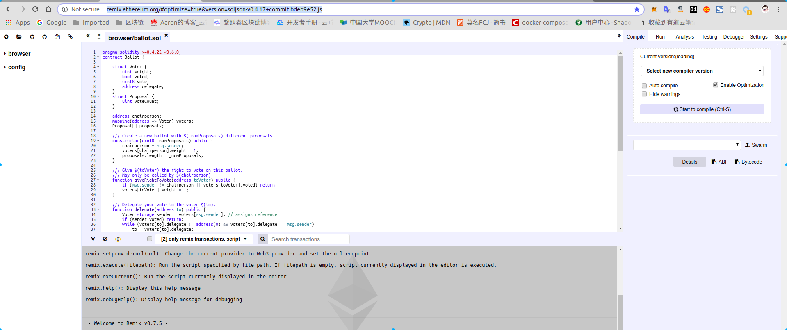
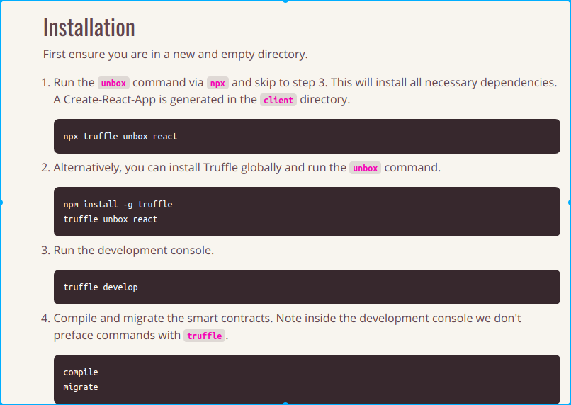
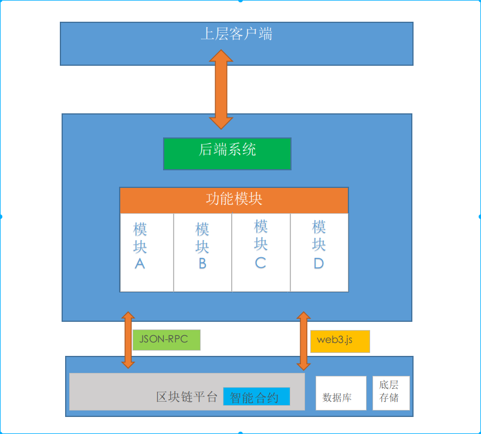

# 总结
### 1.以太坊基础入门
    以太坊是一个图灵完备构建去中心化应用的开源平台.以太坊的核心理念是内置图灵完备编程语言的区块链,"图灵完备"的意思是一切可计算的问题都能通过计算解决.建立这种图灵完备的基础就是以太坊虚拟机(EVM).EVM类似于Java虚拟机(JVM),编译后基于字节码运行,开发时可以使用高级语言实现,编译器会自动转化为字节码.
### 2.以太坊的基本概念
    (1)节点. 通过节点可以进行区块链数据的读写.目前以太坊上的很多应用都是基于公有链的,所以每一个节点都有相同的地位和权利,没有中央服务器,每个节点都可以加入网络,读写以太坊中的数据.节点之间使用共识机制来确保数据交互的可靠性和准确性.单独的一个节点可以搭建私有链,几个相互信任的节点可以搭建私有链.
    (2)矿工. 矿工是指通过不断重复哈希运算来产生工作量的网络节点.最先计算出结果的节点,将向全网进行广播,当结果被确认后,新生成的区块所包含的奖励将会给节点,存入以太币地址中.
    (3)挖矿. 在以太坊中,发行以太币的唯一途径就是挖矿.挖矿的过程也保证了区块链中交易的验证与可靠性.挖矿是一个需要消耗大量算力和时间的工作,并被限制在一定的期限内,同时挖矿的难度可以动态调整.简单来说,挖矿的过程就是矿工寻找一个随机数进行HASH256计算哈希值,如果计算后的哈希值满足一定的条件,比如前60位为0或者小于等于某个预先的随机数的的哈希值,那么这个矿工久赢得了创建区块的权利.
    (4)账户. 以太坊中包含了两类账户:外部账户和合约账户.外部账户有公私钥对控制.合约账户则在区块链上唯一标识了某个智能合约.两类账户都包含了以太币余额,都能发送交易,每个账户的地址长度为20个字节,有一块持久化内存区域被称为存储区(storage),其形式为键值对,键和值的长度均为32字节.重要的是外部账户的地址是由公钥决定的,合约账户的地址实在部署合约的时候确定的,当合约账户接受到一笔合法的交易后,就会执行里面包含的合约代码.所以两类账户最大的区别是:合约账户存储了代码,外部账户没有.
    (5)gas. 以太坊上的每一笔交易都有矿工的参与,且都需要支付一定的费用,这个费用在以太坊中称之为gas.gas的目的是限制执行交易所需的工作量,同时作为执行交易支付费用.合约的代码在EVM上运行,gas会按照既定的规则逐渐消耗.gas价格是由交易创建者设置的,交易费用=gas price * gas amount.如果执行结束后还有gas剩余,这些gas将会返回给发送者账户,而消费的gas则被当作奖励,发放到矿工账户.
    (6)EVM. 以太坊虚拟机是以太坊中智能合约约的运行环境，并且是一个沙盒，与外界隔离,智能合约的代码在EVM内运行时,是不能进行网络操作,文件I/O或执行其他进程.智能合约之间只能进行有限的调用.这样保证了合约运行的独立性,并尽可能提高了运行时的安全性.
    (7)智能合约. 合约是代码和数据的集合，存在于以太坊区块链的指定地址.合约方法支持回滚操作，如果在执行某个力法时发生异常，如gas消托完，则该方法已经执行的操作都会被回滚。但是如果错误的交易一旦执行完毕， 是没有办法幕改的。
    (8)交易. 在以太坊中，**交易都是通过状态转移来标记的**，状态由被称为“账户”的对象和两个账户之间的**转移价值和信息状态转换构成**。以太坊账户分为由公私钥控制的外部账户和由合约代码控制的合约账户。**外部账户没有代码，用户通过创建和签名一笔交易从一个外部账户发送消息，合约财户收到消息后，合约内部代码会被激话，对内部存储进行读取和写人，或者发送消息，或者调用方法**。
    确定了账户后，即开始以太坊的交易。在以太垓中，**“交易”是指存储从外部账户发出的消息的签名数据包**，在交易过程中比较重要的是**消息机制**.以太坊的消息机制能够确保合约账户和外部账户拥有同等的权利，包括发送消息和创建其他合约。这使得合约可以同时由多个不同角色参与，共同签名来提供服务，而不需要关心合约的每一方 到底是什么类型的账户.
    每一笔交易的执行过程如下:
    (1)检查交易是否有效,格式是否正确.
    (2)计算交易所需的费用,并判断交易发送者余额是否足够,如果足够,则从发送这账户中扣除交易费用.
    (3)设定gas初始值.
    (4)从发送者账户转移价值到接受者账户,若接受账户不存在,则创建账户并作为接受者.如果接受者是合约,则执行合约代码,则执行合约代码,直至代码运行完毕或gas消耗完.
### 以太坊的核心原理
###### P2P协议
    以太坊最底层的网络协议是P2P协议,即点对点的通信协议.在P2P网络中,没有中心服务器,没有中心路由器,每个节点都是对等的,每个节点都充当服务器,为其他节点提供服务,同时也享用其他节点提供的服务,即同时具有信息消费者,信息提供者和信息通信等功能.P2P网络体系是去中心化的,去信任和集体协作的的网络体系,基于此,以太坊区块链有如下特点:
    (1)去信任化.
    (2)去中心化.
    (3)数据可靠.
    (4)集体协作.
###### LevelDB是以太坊底层的数据库.
    以太坊中存储数据的结构是Merkle Patricia Tree,即默克尔-帕特里夏树,
    在比特币网络中,Merkle树被用来归纳一个区块中的所有交易,Merkle树是自底向上构建的,
    Merkle树的一个明显优势是验证过程中可以快速定位"不正确"数据的位置,
    由于Merkle树在比特币的应用比较单一,尽管它可以证明包含的交易,但是它不能进行涉及当前状态的证明(如数字资产的持有,名称注册,金融合约的状态等),且Merkle树在以太坊中主要的操作是构建树,而对于树节点内容的更改,插入等操作十分不方便.为了扩展这些操作,以太坊对Merkle树进行了修改,并融合了Patricia树.
    Patricia树会存储每个账户的状态.这个树的建立是通过从每个节点开始的,将节点分成多达16个组,然后哈希每个组,再对哈希结果进行哈希,直到整棵树有一个最后的"根哈希".Patricia树很容易进行更新,添加,或者删除树节点,以及生成新的根哈希.


###### 多种不同的非对称加密算法,哈希算法从密码学的角度保证了在以太坊平台上的账户安全和交易信息安全,并使用数字签名和验证签名等机制保证了数据的不可篡改.
    以太坊中最主要的加密算法是哈希算法和非对称加密算法.
    非对称加密是由一组具有唯一性的密钥对组成的加密方式,密钥对包含公私钥.在以太坊中,用户发送的每一笔交易都会使用私钥去签名,然后区块链会使用公钥去验证签名.验证通过则表示这笔交易是合法的,然后就可以持久化到区块链中.以太坊中的公私钥对使用ECC椭圆加密算法来生成.

### 3.以太坊应用开发基础
#### 3.1以太坊开发环境搭建
##### 3.1.1配置以太坊环境
##### 以太坊客户端工具以太坊钱包的安装:
[以太坊钱包的安装](https://ethereum.org/)


###### 详细的操作步骤,我的区块链学习笔记上有.我是以ubuntu:16.04的镜像搭建的开发环境,
##### 3.1.2搭建以太坊私有链环境
[官网搭建私有链](https://github.com/ethereum/go-ethereum/wiki/Private-network)
###### 搭建私有链的环境,在以太坊环境配置的基础上,还是以ubuntu这个镜像启动一个容器,在容器里安装了ubuntu系统所需的基本工具,下载了以太坊的客户端:go-ethereum,并安装,完成后保存容器,我搭建好的镜像,ubuntu16.04的开发环境,有truffle,ganache-cli,go-ethereum


##### 以太坊命令行工具的安装:
[以太坊命令行工具的安装](https://ethereum.org/cli)


###### 我后来装了双系统,win10基础上装了ubuntu18.04.使用Geth建立私有链,我在我的ubuntu18.04的系统上也装上了geth,安装方式如下:
[ethereum/go-ethereum源码](https://github.com/ethereum/go-ethereum)
[各个操作系统的安装方式](https://github.com/ethereum/go-ethereum/wiki/Building-Ethereum)


###### ubuntu的apt-get install的默认安装路径
[apt-get默认安装位置](https://blog.csdn.net/machinezj/article/details/79389390)


###### 采用源码安装make geth后会在go-ethereum/build/bin目录下生成geth可执行文件,如果make all,将会生成所有的开发工具,可以sudo vi /etc/profile,在profile文件中添加环境变量,那么以后在哪里都可以使用geth命令, export PATH=$PATH:~//home/gaojie/gopath/src/github.com/ethereum/go-ethereum/build/bin


##### 开启geth客户端
###### main Ethereum network


###### 如果不退出的话,一直处于同步状态,直到同步完.


##### 以太坊账户管理:
    (1)使用geth命令行
  

      (2)使用geth控制台
      首先进入控制台
 

#### 另一个快速开启Ethereum客户端的方法,不用安装命令行客户端
##### Docker quick start

One of the quickest ways to get Ethereum up and running on your machine is by using Docker:

```
docker run -d --name ethereum-node -v /Users/alice/ethereum:/root \
           -p 8545:8545 -p 30303:30303 \
           ethereum/client-go

```

This will start geth in fast-sync mode with a DB memory allowance of 1GB just as the above command does. It will also create a persistent volume in your home directory for saving your blockchain as well as map the default ports. There is also an `alpine` tag available for a slim version of the image.

Do not forget `--rpcaddr 0.0.0.0`, if you want to access RPC from other containers and/or hosts. By default, `geth` binds to the local interface and RPC endpoints is not accessible from the outside.
[ethereum/client-go
镜像](https://hub.docker.com/r/ethereum/client-go)
```
docker run -d --name ethereum-node -v /home/gaojie/ethereum:/root \
           -p 8545:8545 -p 30303:30303 \
           ethereum/client-go
```

sudo su获得root权限,然后执行上述命令,将会开启一个容器,本地home/gaojie/ethereum, 挂载到了容器的根目录,接下来docker attach进入容器后,就开始同步数据,同步的数据都在ethereum/.ethereum目录下面.


#### docker attach ethereum-node,进入容器,即开始数据同步,可以开启多个daocker attach ethereum-node,的进程,那么相当于有多个进程在同时同步数据,则同步数据的速度将加快.


## 搭建私有链
#### (1)私有链初始化
先创建一个创世区块文件 genesis.json.


### (2)创建私有链外部帐号

### (3)指定网络id,进入控制台模式

### (4)开始挖矿

###### 开始并没有产生区块,当产生100个DAG后开始挖矿.

### (6)查看私有链的状态

输入eth,可以查看挖矿信息,以及相关函数

### (7)控制台操作

### (8)geth attach data/geth.ipc, 进入正在挖矿的进程,查看挖矿的相关信息,相关API如下:
##### official DApp APIs interface go-ethereum
[JSON-RPC](https://github.com/ethereum/wiki/wiki/JSON-RPC)

##### Management APIs
[Managerments APIS](https://github.com/ethereum/go-ethereum/wiki/Management-APIs)


## 局域网集群环境搭建
###### 使用docker创建集群环境
先把我之前创建的镜像pull 下来


##### 徐信来老师的geth-truffle-env镜像
[徐老师的镜像](https://hub.docker.com/r/xuxinlai2002/geth-truffle-env)
docker pull xuxinlai2002/geth-truffle-env:fix-1027 
---------------------------------------------------------------------------------------------------------------------------------
###### 集群环境(1)dokcer bridge
镜像是:geth-truffle-env:v3.1
创建局域网my_net:

查看创建的局域网信息:


## 集群环境(2) –启动节点

ifconfig查看该系统的ip,为172.19.0.2

ifconfig查看该系统的ip,为172.19.0.3
docker ps查看容器信息:

在node1检测两个节点是否为通的,
ping 172.19.0.3

有数据返回,说明是通的

两个节点进入用户目录下的cluster目录下:
node1


node2


## 集群环境(3) –nodeInfo
##### 分别在两个节点初始化以太坊私有链,并创建两个账户
node1:


node2:


node1开启挖矿:

```
geth --datadir data --networkid 1201 --rpc --rpcapi eth,net,web3,personal,admin,miner --minerthreads 1 --rpccorsdomain "*" --maxpeers '100' --mine

```


再打开一个终端,进入node1容器:

进入node1的挖矿进程:

admin.nodeInfo,查询节点信息:


node2不挖矿,只进入控制台:

```
geth --datadir data --networkid 1201 --rpc --rpcapi eth,net,web3,personal,admin,miner --rpccorsdomain "*"  console 
```


在node2把node1添加到node2,则node2将开始同步node1的区块信息:

再打开一个终端,进入node2,并进入node2的geth.ipc进程,查看加入node2的节点信息:


```
web3.fromWei(eth.getBalance(eth.accounts[0]) , "ether")
personal.unlockAccount("0xd62b6c65fdc7182467056e4458a2a932b0a9d760")
eth.sendTransaction({from: eth.accounts[0], to:eth.accounts[1],value:web3.toWei(100, "ether")})
eth.getTransaction("0xb20a3d409833f85c07f4cb31a501380eb6840ce85f3b91bf7e024a807cddfa32")
```
官方的API,有web3,net,eth
https://github.com/ethereum/wiki/wiki/JSON-RPC

web3的API
https://github.com/ethereum/wiki/wiki/JavaScript-API

在node1进行交易:


退出挖矿后,查看节点数据:
node1:

node2:


###### 我原来电脑上的镜像,除去fabric之外的有,geth-truffle-env:v3.0(以太坊私有链的环境),  klaemo/couchdb:latest(couchdb数据库),   xuxinlai2002/btcorg:latest(徐信来老师关于btcoin的一个项目).


## 3.2以太坊集成开发环境
###### Solidity 在线实时编译器,
[solidity](http://remix.ethereum.org/#optimize=true&version=soljson-v0.4.17+commit.bdeb9e52.js)


###### 用到的浏览器插件MetaMask,
在MetaMask测试网中,智能合约的部署和调用时,都要花费ETH,
##### 3.3以太坊编程接口
###### 3.3.1JSON RPC
    以太坊区块链平台作为独立的底层平台,需要与外界交互,则必须为外界提供接口,目前RPC接口是以太坊原生支持的,不限语言,跨平台,JSON是一种轻量级的数据交换格式,可以用来表示数字,字符串,值的有序序列和键值对集合.JSON-RPC是一种无状态的,轻量级的远程过程访问协议,并使用JSON(RFC 4627)作为其数据格式.JSON-RPC主要是在处理过程中定义了一些数据结构和规则,可以在不同的消息传递环境中如Sockets,HTTP中传递信息.
###### 3.3.2JavaScript API(web3.js)
    使用JSON-RPC来调用合约的过程比较繁琐,会涉及复杂的编码解码以及进制转换.目前以太坊官方使用JavaScripts实现的web3.js模块,对RPC的方式进行了封装,对外提供了简洁的接口.
    [web3.js中文文档]http://web3.tryblockchain.org/
    https://web3js.readthedocs.io/en/1.0/
    https://github.com/juzix/web3js
    https://github.com/ethereum/wiki/wiki/JavaScript-API
    https://ethereumbuilders.gitbooks.io/guide/content/en/ethereum_javascript_api.html?tdsourcetag=s_pcqq_aiomsg

##### 3.4DApp开发框架与流程
##### 3.4.1Truufle
    Truffle是一款非常优秀的DApp开发框架.在Truffle中可以很方便地使用JavaScript进行开发,并使用JavaScript中的所有机制,如Promise,异步调用等.
    Truffle内置了智能合约编译器,只要使用脚本命令就可以完成合约的编译,动态库链接,部署,测试等工作,大大简化了合约开发的生命周期.
Truffle项目的创建
[Truffle 官网](https://truffleframework.com/docs/truffle/getting-started/creating-a-project)
[Truffle unbox](https://truffleframework.com/boxes)
    例如:安装react框架, truffle unbox react的安装可能会有一些问题,具体的问题在我的笔记**solidity学习.docx**中有记录,以及如何使用的.

   

##### 3.4.2分层可扩展开发流程
    使用Truffle框架来开发有网页的去中心化应用非常方便,架构相对比较简单,同时可以快速部署到服务器上.但是Truffle等框架的使用有较大的局限性,最大的一个问题就是开发的系统很难实现跨平台.如果在实际的去中心化商业项目中,要求客户端同时运行在浏览器,移动端和其他终端上,则Truffle就明显不能满足需求.为了结解决这个问题,需要设计一套**分层可可扩展的项目开发流程**,这种模式在现在的行业开发过程中已经很普遍了.

可扩展项目开发流程的大致架构如下图所示:


    该架构主要分为三层,下面进行分层介绍.
    (1)底层存储.底层使用区块链保证交易的安全性和不可篡改性.平台可以是以太坊Ethereum,超级账本Hyperledger,趣链科技的Hyperchain等主流的区块链平台.核心的业务逻辑全部使用智能合约实现,并把智能合约部署到区块链上运行.在底层存储中使用数据库是为了对区块链数据做一个完整的备份,实现灾备.**同时因为目前行业内还没有很好的区块链数据可视化的解决方案,所以加入数据库可以间接查看区块链的数据.在实际开发中,可以进行区块链和数据库的双写,以实现数据的同步.**
    (2)后端系统.中间层作为上层应用和底层区块链的桥接.后端系统可以使用多种不同的接口和区块链进行交互,常见的有JSON-RPC接口和web3.js接口.如果使用java作为后端,则可以选择JSON-RPC;如果使用Nodejs作为后端,,则可以选择web3.js.由于关键的合约逻辑都已经在智能合约中实现,所以后台实现的主要功能就是数据的编码,解码,转发,以及为上层提供RESTful接口调用.
    (3)上层客户端.客户端直接面向客户提供服务.客户端可以简单理解为浏览器网页,PC客户端,移动客户端等.这些客户端可以使用中间层提供的RESTful接口来和区块链实现交互.中间层服务和底层区块链对用户是透明的,并且是一种轻客户端设计,不需要把太多和区块链相关的加密解密,解码编码等负责操作放在客户端来实现,客户端一般只需要处理RESTful返回的JSON数据.
    使用这种分层的可扩展的项目开发流程符合软件工程的思想,不同层次的设计让不同的开发人员进行设计实现.更重要的是这是高内聚,低耦合的设计方法.内聚是指一个模块内各个元素彼此结合的紧密程度,意味着重用和独立.耦合是指该软件系统内不同模块之间的互联程度.设计原则符合高内聚,低耦合可以让更多的独立模块复用,方便代码优化和扩展.采用分层可扩展的模式,不同平台近使用接口进行调用,使耦合程度降到最低.同时系统在开发中可以进行多人并行开发,对接容易,提高了开发速度.
##### 3.5 什么是RESTful接口
    [Restful架构详解](https://www.runoob.com/w3cnote/restful-architecture.html)

