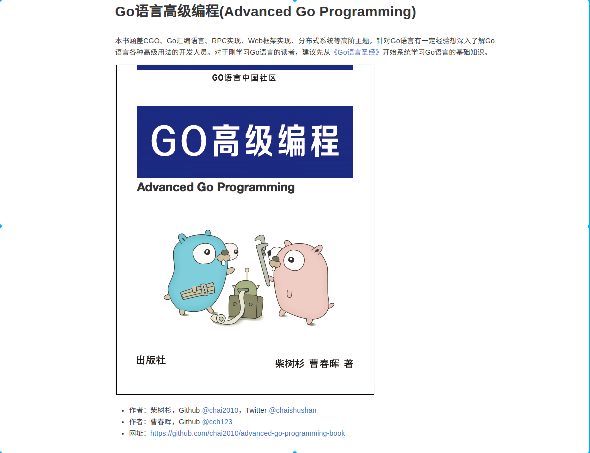
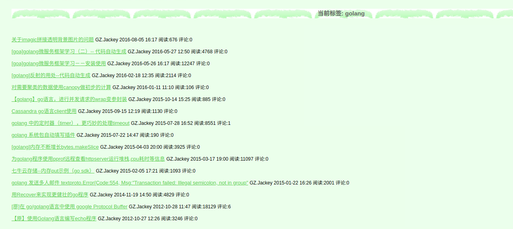

# Go语言高级编程
《Go语言高级编程》开源图书，涵盖CGO、Go汇编语言、RPC实现、Protobuf插件实现、Web框架实现、分布式系统等高阶主题(完稿) 
https://chai2010.cn/advanced-go-programming-book/

作者的github:
https://github.com/chai2010
https://github.com/cch123

深入浅出分布式基础架构，Linux 篇 | MySQL 篇 | NoSQL 篇 | 虚拟化篇 | 分布式系统篇
https://github.com/wxyyxc1992/Distributed-Infrastructure-Series

别人关于golang的博客

https://www.cnblogs.com/zhangqingping/tag/golang/

# Go教程

http://c.biancheng.net/golang/

https://www.cnblogs.com/aresxin/category/1431989.html

