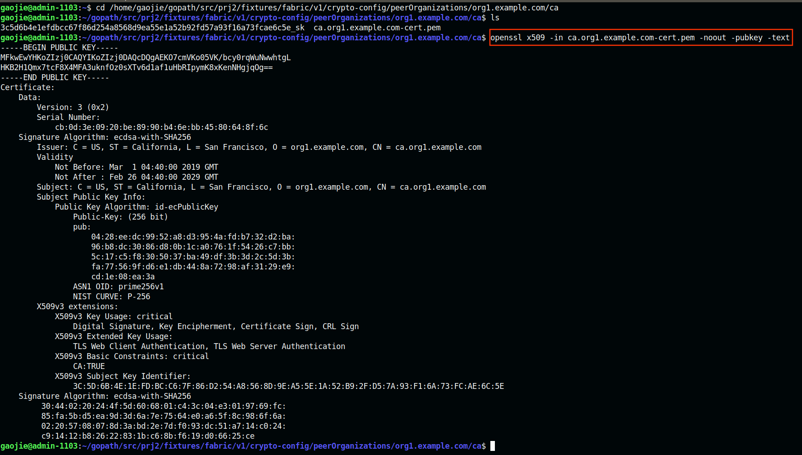

# x509查看证书
1. openssl的x509命令简单入门
https://blog.csdn.net/u010846177/article/details/54356897

https://www.cnblogs.com/huhu0013/p/4791109.html

https://en.wikipedia.org/wiki/X.509

2. openssl 详解
https://www.cnblogs.com/gordon0918/category/797669.html

https://blog.csdn.net/gengxiaoming7/article/details/78505107

3. openssl 证书请求和自签名命令req详解
https://www.cnblogs.com/gordon0918/p/5409286.html

