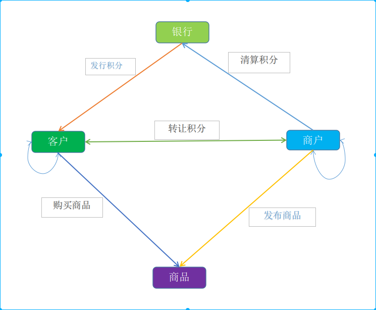
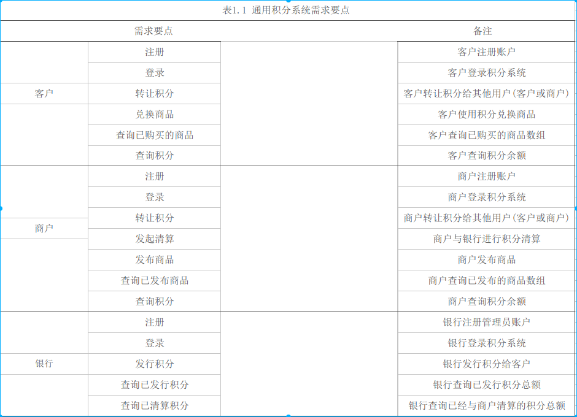
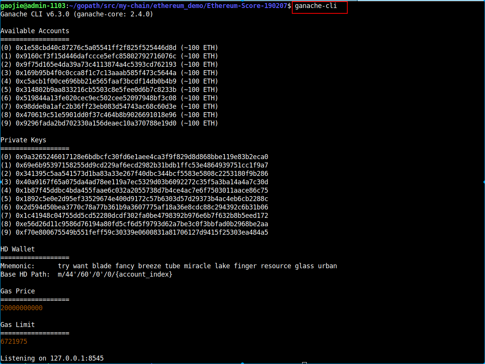
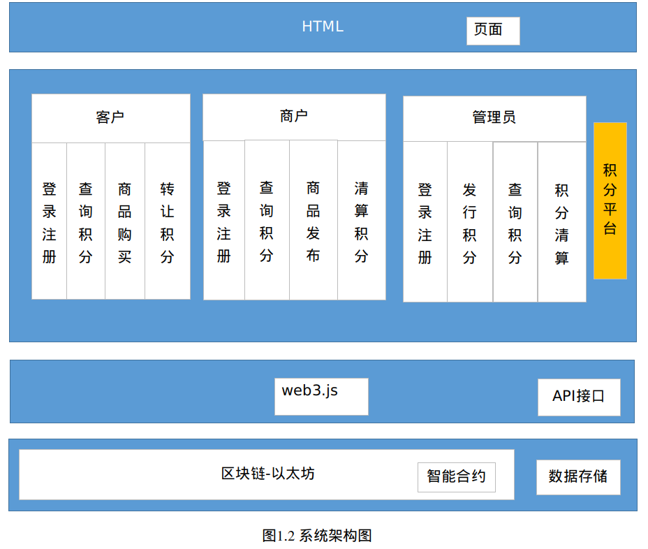

# 1. 基于以太坊的通用积分系统案例分析
奖励积分是银行,大型超市,证券公司等用以提高用户忠诚度的营销手段,这种传统的积分机制具有使用限制多,兑换麻烦,难以流通等缺点,已不适应现今人们的消费习惯.本积分系统基于区块链技术实现不同用户之间积分的转让,并且引入线下商家,提供丰富的积分兑奖品服务.把以太坊平台与银行积分系统进行结合具有一定的实际意义.
## 1.1. 项目简介
区块链作为一种不可篡改的分布式数据库账本技术,其存储的数据分布于网络的每一个节点,从而决定了其安全性.每一个区块链上的用户都将拥有自己的私钥,每一笔交易都是通过私钥签名的,经过全网节点认证后方可存入区块链,并且一经存储将不得修改,保证流通过程中的安全性,使得积分设计不再“鸡肋”,**大大改善了用户体验,增加了用户黏性**.

本系统的核心业务为银行积分的流通,简要流程为:银行可以向本行内的客户发行积分,客户可以将自己账户内的积分转让给其他客户或者商户,同时可以使用积分购买积分商城中的商品.商户可以向积分商城发布商品,每售出一件商品都可以获得相应的积分,商户可以向银行发起积分清算,把积分兑换成货币.系统的整体流程图如图1.1所示.

图1.1 积分系统流程图
## 1.2. 系统功能分析
本系统主要设计三类用户:客户,商户和银行.银行可以直接和商户进行交互,银行可以进行积分的发行,商户可以向银行发起积分清算.商户和客户之间也可以直接进行积分的流通,客户-客户,商户-商户,商户-客户两两之间都可以进行积分的转让,同时客户可以购买商户的商品,对应额度的积分会从客户账户流入商户账户.不同的用户都可以进行常见的查询操作.各个用户的具体功能如表1..1所示.

## 1.3. 系统总体设计
本案例的总体设计主要包括**方案选型**和**总体架构设计**.方案选型包括**以太坊客户端的选型,开发框架的选型和以太坊接口的选型;** 总体架构设计主要是**底层区块链平台与上层业务之间的设计**.良好的系统总体设计功能为后续的智能合约设计和系统实现提供保障.
**1.方案选型**
方案选型主要包括以太坊客户端,开发框架和接口类型.
(1)以太坊客户端
在目前开发去中心化应用(DApp)中,TestRPC(现在已被**ganache-cli**取代)和geth这两种以太坊客户端使用比较普遍,本案例可以同时运行在ganache和geth中.但是在测试开发中,推荐ganache.ganache是基于Node.js开发的以太坊客户端,整个区块链的数据驻留在内存,发送给ganache的交易会被马上处理而不需要等待挖矿时间.ganache可以启动时创建一堆有资金的测试账户,它运行速度更快,因此更适合开发和测试.开启ganache-cli的命令行界面如下:

(2)开发框架
本案例使用Truffle开发工具.Truffle是基于以太坊的智能合约的开发工具,支持对合约代码的单元测试,非常适合测试驱动开发.同时内置了智能合约编译器,只要使用脚本命令就可以完成合约的编译,部署,测试等工作,大大简化了合约开发的生命周期.
(3)以太坊接口
目前以太坊提供有`JSON-RPC`和`web3.js`两种接口.如果我们使用了Truffle框架,就默认使用web3.js接口,因为Truffle包装了web3.js的一个JavaScript Promise框架ether-pudding,可以非常方便地使用JavaScript代码异步调用智能合约中的方法.
**2.总体架构**
本案例的系统架构如图1.2所示,底层使用以太坊区块链,本地使用ganache-cli来开启以太坊,通过Truffle工具,把智能合约部署到以太坊上.积分系统使用web3.js接口来调用智能合约中的方法.用户可以使用前端页面来非常方便地使用积分系统中的功能.

## 1.4. 智能合约设计
本案例的以太坊智能合约用solidity编写.智能合约的设计有两种方案:
第一个方案就是项目中一个实体对应一个合约,这样项目中可能就会有多个合约,比如客户实体,商户实体,银行实体,分别设计3个合约,这样比较符合面向对象的思想;
另一种方案是只设计一个合约,不同的对象通过结构体和映射的方式存储在一个合约中.相对来说,第二种方案较为容易理解,测试较为简单,后续的扩展维护也比较方便,因此本案例使用第二种方案.

