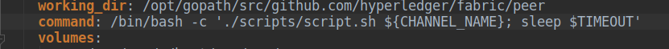
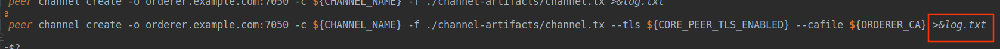
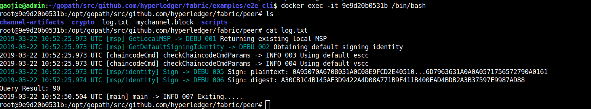

# 区块链学记录
## 2019年3月23日 星期六
    今天主要把fabric_vi.0的e2e_cli实例整个流程分析了一遍，从network_setup.sh up执行的结果开始分析代码，也做了代码分析记录，在源码分析的fabric目录下面。
    在分析config配置模块的设计时出现了问题，纠结于cli容器启动时的 command是在容器内执行的还是容器外执行的，因为终端输出的日志是 docker logs -f cli， 而日志是怎么生成的？日志是需要调用fabric相关代码的，而根据分析 script.sh 是在容器内执行的，日志就是该脚本执行的结果

    问题就是这个command是容器内执行的，还是容器外执行的，如果是在容器内执行的，那么容器的日志又怎么解释？

## 2019年3月24日 星期日
    今天已经确定了 ./scripts/script.sh 这个脚本是在容器内执行的.
    这个脚本完成了{1.创建channel; 2.各个peer节点分别加入channel； 3.更新两个org的锚节点； 4. 安装 chaincode; 5.实例化chaincode; 6. invoke chaincode; 7. query chaincode.}
    这7个操作都使用了peer命令，终端 docker logs -f cli， 终端cli容器输出日志，我不明白日志是什么生成的？
    我今天大概分析了fabric的代码， fabric/peer 目录是peer命令的，终端执行peer命令执行的操作会调用fabric目录下的代码，会有相应的日志输出。
    难道是在cli容器内执行peer命令会调用容器外fabric目录下代码，日志输出在容器里 >&log.txt
    

    在 network_setup.sh up 执行完成后，我进入cli容器， 直接进入到工作目录peer下，ls 查看，有挂载进来的三个目录，
    有log.txt文件，每一个peer命令生成的日志记录在这里面， >&log.txt 不是追加，mychannel.block是创建channnel时生成的创世区块。

## 2019年6月8日 星期五
