# Install Gaia

This guide will explain how to install the `gaiad` and `gaiacli` entrypoints onto your system. With these installed on a server, you can participate in the mainnet as either a [Full Node](https://cosmos.network/docs/cosmos-hub/join-mainnet.html) or a[Validator](https://cosmos.network/docs/cosmos-hub/validators/validator-setup.html).

这个指导将会说明如何安装`gaiad`和`gaiacli`入口点到你的系统。将这些安装在服务器上后，你可以作为完整节点或验证器参与主网络。

## Install Go
---------------------------------------------------------------------------------------------------------------------------------------------------------

Install `go` by following the [official docs](https://golang.org/doc/install). Remember to set your `$GOPATH`, `$GOBIN`, and `$PATH` environment variables, for example:

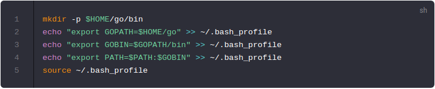

## Install the binaries
---------------------------------------------------------------------------------------------------------------------------------------------------------

Next, let's install the latest version of Gaia. Here we'll use the `master` branch, which contains the latest stable release. If necessary, make sure you` git checkout` the correct [released version](https://github.com/cosmos/cosmos-sdk/releases).

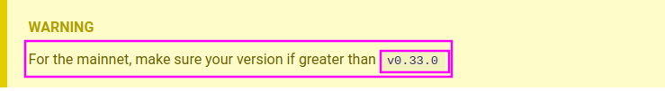

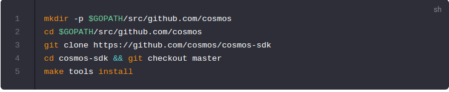

### make tools install 出现了错误
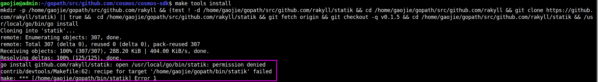

开启代理再次执行 make tools install ,几次之后终于安装完成，对应的工具会出现在$GOPATH/bin目录下，

测试：gaiad version --long, 找不到命令，我在$GOPATH/bin目录下也没找到gaiad 和 gaiacli命令，我再次执行 make tools install ,也提示没有tool安装。

我开始找问题，在github上找到了cosmos/gaia项目，有对应的安装这两个工具的教程

https://github.com/cosmos/gaia/blob/master/docs/installation.md

- cd $GOPATH/src/github.com/cosmos
- git clone https://github.com/cosmos/gaia
- cd gaia && make install

make install又出现了错误，

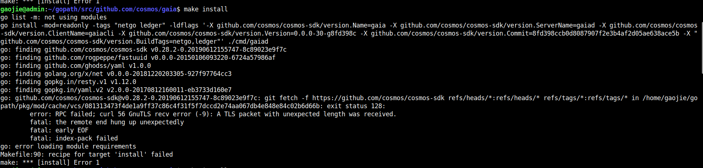

go环境变量的配置 /etc/profile中

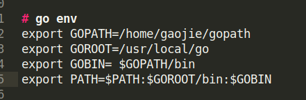

看错误的地方是/home/gopath/src/pkg/mod/cache/vcs 下有一个文件已经存在了，我把它删除之后，再次make install ,成功了

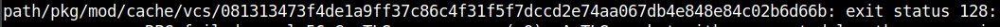

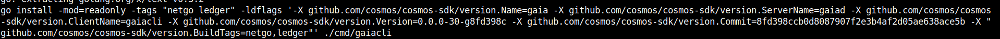

**验证：**

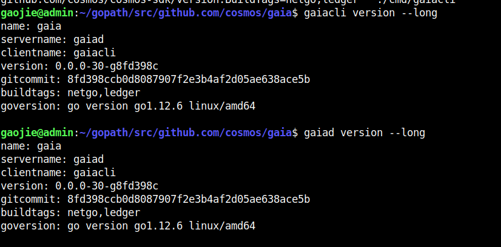

验证的结果和官网给出的不一样，没有出现cosmos-sdk的版本。 不知道是否成功了，

That will install the `gaiad` and `gaiacli` binaries. Verify that everything is OK:

`gaiacli` for instance should output something similar to:

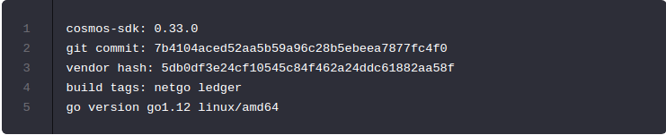

##### Build Tags

Build tags indicate special features that have been enabled in the binary.

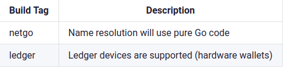

## Install binary distribution via snap (Linux only)

Do not use snap at this time to install the binaries for production until we have a reproducible binary system.

在我们拥有可重复的二进制系统之前，请不要使用snap来安装生产二进制文件。

## Next

Now you can join [the mainnet](https://cosmos.network/docs/cosmos-hub/join-mainnet.html), [the public testnet](https://cosmos.network/docs/cosmos-hub/join-testnet.html) or [create you own testnet](https://cosmos.network/docs/cosmos-hub/deploy-testnet.html)

