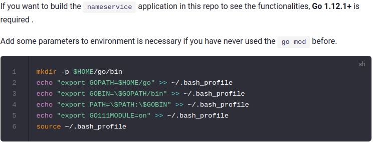
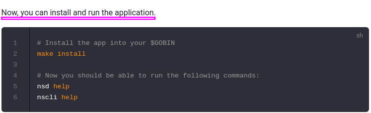
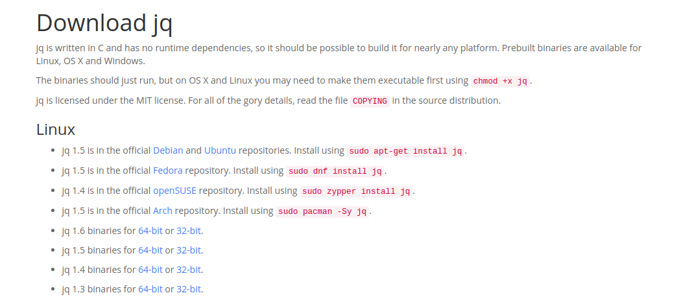
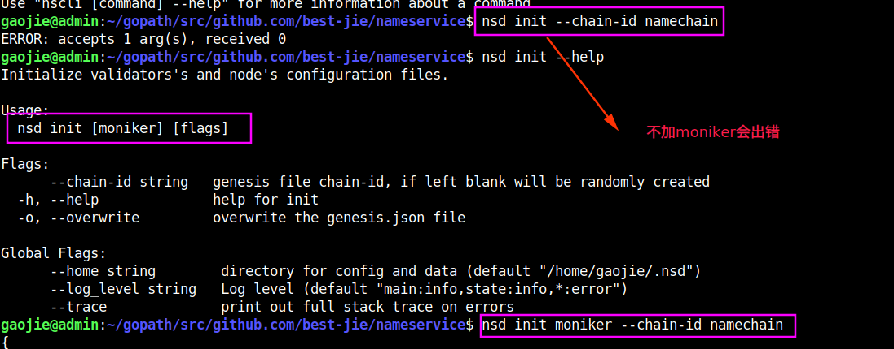
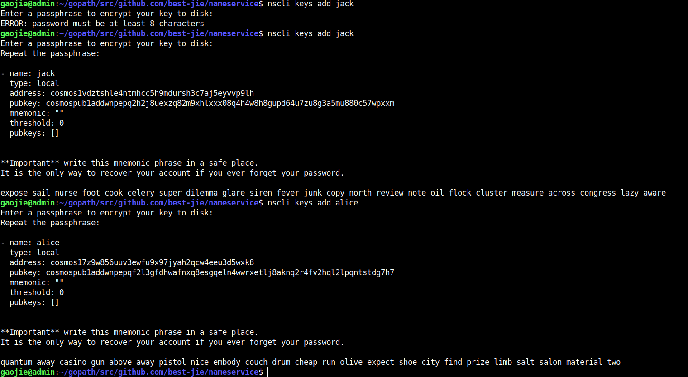
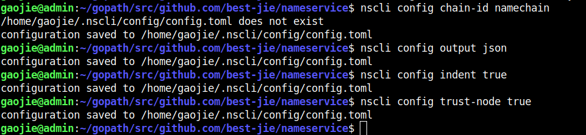
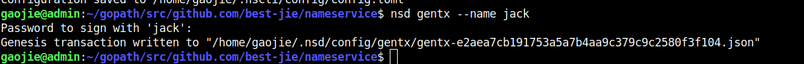
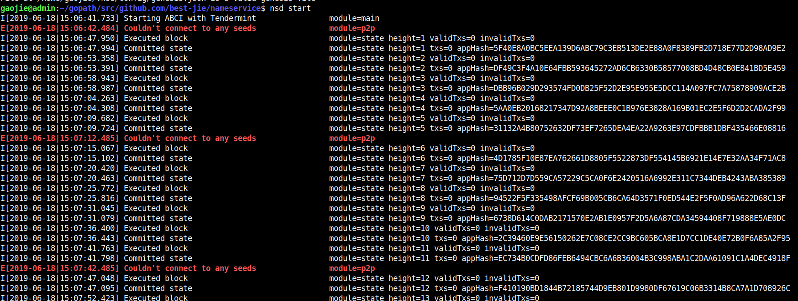

# Building and running the application

## Building the `nameservice` application

## Running the live network and using the commands

To initialize configuration and a `genesis.json` file for your application and an account for the transactions, start by running:

要初始化配置和应用程序的`genesis.json`文件以及**交易帐户**，请先运行：

**NOTE**: In the below commands addresses are are pulled using terminal utilities. You can also just input the raw strings saved from creating keys, shown below. The commands require [jq](https://stedolan.github.io/jq/download/) to be installed on your machine.

**NOTE**: If you have run the tutorial before, you can start from scratch with a `nsd unsafe-reset-all` or by deleting both of the home folders `rm -rf ~/.ns*`

**注意**：如果你之前运行过教程，你可以通过运行`nsd unsafe-reset-all`这个命令从头开始，或者用这个`rm -rf ~/.ns*`命令删除home目录下的所有`.ns`*文件夹

**NOTE**: If you have the Cosmos app for ledger and you want to use it, when you create the key with `nscli keys add jack `just add `--ledger` at the end. That's all you need. When you sign, `jack` will be recognized as a Ledger key and will require a device.

如果你有帐本的Cosmos应用程序并且您想要使用它，当你使用nscli键创建`密钥`时，只需在`nscli keys add jack `末尾添加-`-ledger`。这就是你所需要的。签名时，`jack`将被识别为`Ledger`的密钥，并且将会需要一个 `device`。

**安装jq**

## 以下是终端命令：

#### 1. nsd init moniker --chain-id namechain

#### 2. nscli keys add jack, nscli keys add alice

#### 3.  Add both accounts, with coins to the genesis file
##### nsd add-genesis-account $(nscli keys show jack -a) 1000nametoken,100000000stake

##### nsd add-genesis-account $(nscli keys show alice -a) 1000nametoken,100000000stake

#### 4. # Configure your CLI to eliminate need for chain-id flag
- nscli config chain-id namechain
- nscli config output json
- nscli config indent true
- nscli config trust-node true

5. nsd gentx --name jack

After you have generated you a genesis transcation, you will have to input the gentx into the genesis file, so that your nameservice chain is aware of the validators. To do so, run:

7. `nsd collect-gentxs`

and to make sure your genesis file is correct, run:

8. `nsd validate-genesis`

You can now start `nsd` by calling `nsd start`. You will see logs begin streaming that represent blocks being produced, this will take a couple of seconds.

Open another terminal to run commands against the network you have just created:

你现在可以通过调用`nsd start`来启动`nsd`。你将看到日志开始不停输出，表示正在生成的区块，这将花费几秒钟。

9. `nsd start`

打开另一个终端，对刚刚创建的网络运行命令：

## First check the accounts to ensure they have funds

nscli query account $(nscli keys show jack -a)

nscli query account $(nscli keys show alice -a)

## Buy your first name using your coins from the genesis file

nscli tx nameservice buy-name jack.id 5nametoken --from jack

## Set the value for the name you just bought

nscli tx nameservice set-name jack.id 8.8.8.8 --from jack

## Try out a resolve query against the name you registered

nscli query nameservice resolve jack.id

> 8.8.8.8

## Try out a whois query against the name you just registered

nscli query nameservice whois jack.id
> {"value":"8.8.8.8","owner":"cosmos1l7k5tdt2qam0zecxrx78yuw447ga54dsmtpk2s","price":[{"denom":"nametoken","amount":"5"}]}

## Alice buys name from jack

nscli tx nameservice buy-name jack.id 10nametoken --from alice

# Run second node on another machine (Optional)

在另一台电脑上运行第二个节点，可以那么做，**作一个docker镜像，那么就可以开启多个节点**

