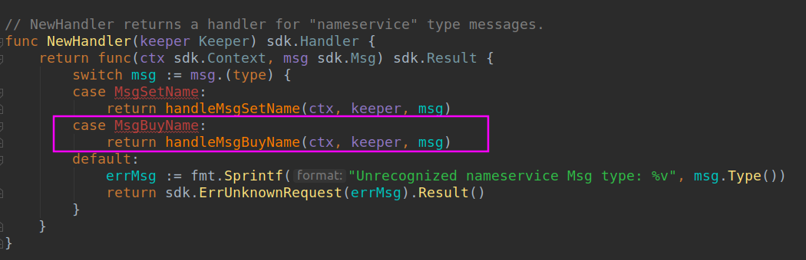
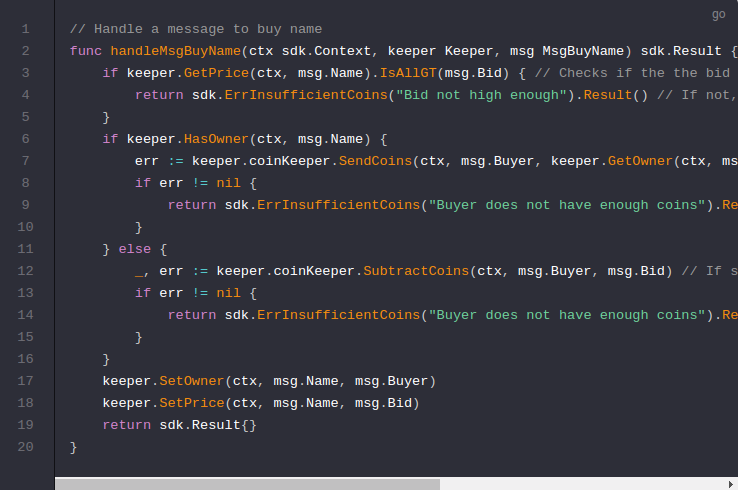

# Buy Name

## Msg
-----------------------------------------------------------------------------------------------------------------------------------------------------------

Now it is time to define the `Msg` for buying names and add it to the `./x/nameservice/types/msgs.go` file. This code is very similar to SetName:

现在是时候定义购买名字的信息了，把它添加到`./x/nameservice/types/msgs.go`文件中，这个代码和SetNmae很相似。

Next, in the `./x/nameservice/handler.go` file, add the `MsgBuyName` handler to the module router:

Finally, define the `BuyName` `handler` function which performs the state transitions triggered by the message. Keep in mind that at this point the message has had its `ValidateBasic` function run so there has been some input verification. However, `ValidateBasic` cannot query application state. Validation logic that is dependent on network state (e.g. account balances) should be performed in the `handler` function.

First check to make sure that the `bid` is higher than the current price. Then, check to see whether the name already has an owner. If it does, the former owner will receive the money from the `Buyer`.

首先检查确保出价高于当前价格。然后检查名字是否已经有一个所有者。如果有，之前的所有者将会收到来自`Buyer`的钱。

**If there is no owner**, your `nameservice` module "burns" (i.e. sends to an unrecoverable address) the coins from the `Buyer`.

**如果没有所有者**，你的`nameservice`模块 “burns”(例如，发送到一个不可恢复的地址中) 来自`Buyer`的coin.

If either `SubtractCoins` or `SendCoins` returns a non-nil error, the handler throws an error, reverting the state transition. Otherwise, using the getters and setters defined on the `Keeper` earlier, the handler sets the buyer to the new owner and sets the new price to be the current bid.

如果 `SubtractCoins` or `SendCoins`返回一个非空的错误，处理器抛出错误，回滚状态转变。否则，就早些使用定义在`Keeper`中的getters和setters,处理器设置购买者成为新的所有者，设置新的价格为当前的出价。

NOTE: This handler uses functions from the `coinKeeper` to** perform currency operations**. If your application is performing currency operations you may want to take a look at the [godocs for this module](https://godoc.org/github.com/cosmos/cosmos-sdk/x/bank#BaseKeeper) to see what functions it exposes.

注意：处理器使用来自`coinKeeper`的函数执行资产操作。如果你的应用正在**执行资产操作**，你可能需要看下关于这个模块的文档。以查看它暴露的功能。 

## Now that you have your Msgs and Handlers defined it's time to learn about making the data from these transactions [available for querying](https://cosmos.network/docs/tutorial/queriers.html)!

## 现在您已经定义了Msgs和Handler，现在可以了解如何使这些交易中的数据可用于查询！

