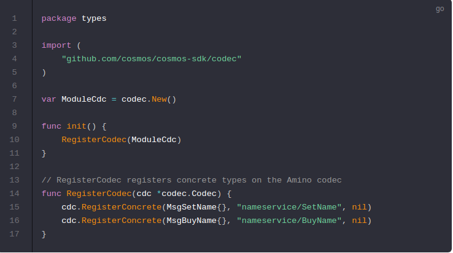

# Codec File

To [register your types with Amino](https://github.com/tendermint/go-amino#registering-types) so that they can be encoded/decoded, there is a bit of code that needs to be placed in` ./x/nameservice/types/codec.go`. Any interface you create and any struct that implements an interface needs to be declared in the RegisterCodec function. In this module the two Msg implementations (SetName and BuyName) need to be registered, but your Whois query return type does not. In addition, we define a module specific codec for use later.

## Next you need to define [CLI interactions](https://cosmos.network/docs/tutorial/cli.html) with your module.

