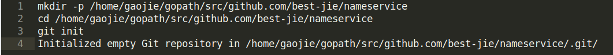

# Getting Started

In this tutorial, you will build a functional `Cosmos SDK` application and, in the process, learn the basic concepts and structures of the SDK. The example will showcase how quickly and easily you can build your own blockchain from scratch on top of the Cosmos SDK.

在这个教程中，你将构建一个功能性的Cosmos SDK应用程序，在这个过程中，你会学到基本的概念和SDK的结构。该示例将展示如何快速，轻松地在Cosmos SDK之上从头开始构建自己的区块链。

By the end of this tutorial you will have a functional `nameservice` application, a mapping of strings to other strings (`map[string]string`). This is similar to [Namecoin](https://namecoin.org/), [ENS](https://ens.domains/), or [Handshake](https://handshake.org/), which all model the traditional DNS systems (`map[domain]zonefile`). Users will be able to buy unused names, or sell/trade their name.

在这个教程的最后，你将会有一个功能性的`nameservice`应用，一个从string到另一个string的mapping，和`Namecoin`,`ENS`,`Handshake`相似的，它们都是所有模型的传统DNS系统（map [domain] zonefile）。用户可以买未使用的名字，或者卖或交易他们的名字。

All of the final source code for this tutorial project is in this directory (and compiles). However, it is best to follow along manually and try building the project yourself!

本教程项目的所有最终源代码都在此目录中（并编译）。但是，最好手动完成并尝试自己构建项目！

## Requirements
---------------------------------------------------------------------------------------------------------------------------------------------------------

- 安装 golang的版本 >1.12.1
- $GOPATH配置
- 渴望创建自己的区块链！

## Tutorial
---------------------------------------------------------------------------------------------------------------------------------------------------------

Start by creating a new git repository:

Then, just follow along! The first step describes the design of your application. If you want to jump directly to the coding section, you can start with the[second step.](https://cosmos.network/docs/tutorial/keeper.html)

然后，继续关注！第一步描述了应用程序的设计。如果要直接跳转到编码部分，可以从[第二步](https://cosmos.network/docs/tutorial/keeper.html)开始。

## Tutorial parts
---------------------------------------------------------------------------------------------------------------------------------------------------------

1. [Design](https://cosmos.network/docs/tutorial/app-design.html) the application.

2. Begin the implementation of your application in [./app.go](https://cosmos.network/docs/tutorial/app-init.html).

3. Start building your module by defining some basic Types.
4. Define the keys needed for your module key
5. Create the main core of the module using the Keeper.
6. Define state transitions through Msgs and Handlers.
7. SetName
8. BuyName
9. Make views on your state machine with Queriers.
10. Create the alias file
11. Register your types in the encoding format using sdk.Codec.
12. Create CLI interactions for your module.
13. Create HTTP routes for clients to access your nameservice.
14. Implement the AppModule interface
15. Configure your Genesis state.
16. Import your module and finish building your application!
17. Create the nsd and nscli entry points to your application.
18. Setup dependency management using go.mod.
19. Build and run the example.
20. Run REST routes.
