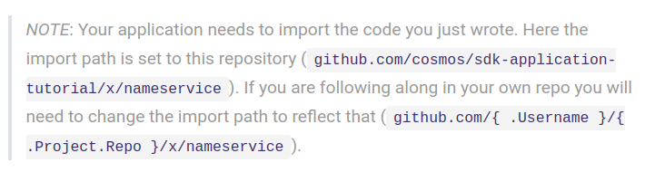
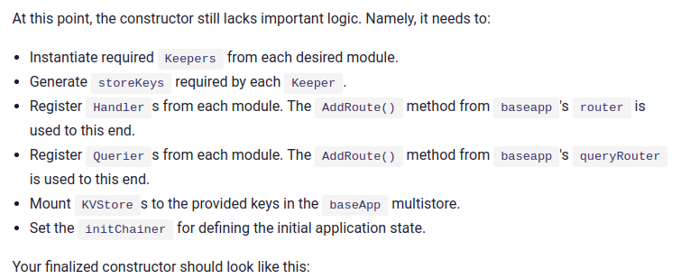
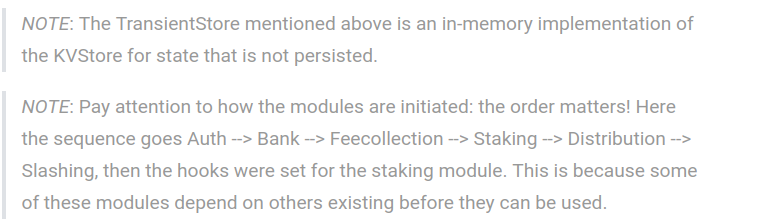
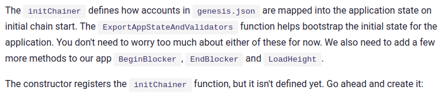
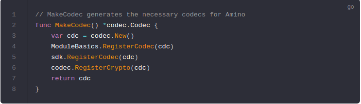

# Import your modules and finish your application

Now that your module is ready, it can be incorporated in the` ./app.go` file, along with the other two modules [auth](https://godoc.org/github.com/cosmos/cosmos-sdk/x/auth) and [bank](https://godoc.org/github.com/cosmos/cosmos-sdk/x/bank). Let's begin by adding your new nameservice module to the imports:

Next you need to add the stores' keys and the Keepers into your `nameServiceApp` struct.

Finally add a helper function to generate an amino [*codec.Codec](https://godoc.org/github.com/cosmos/cosmos-sdk/codec#Codec) that properly registers all of the modules used in your application:

## Now that you have created an application that includes your module, it's time to[build your entrypoints](https://cosmos.network/docs/tutorial/entrypoint.html)!

