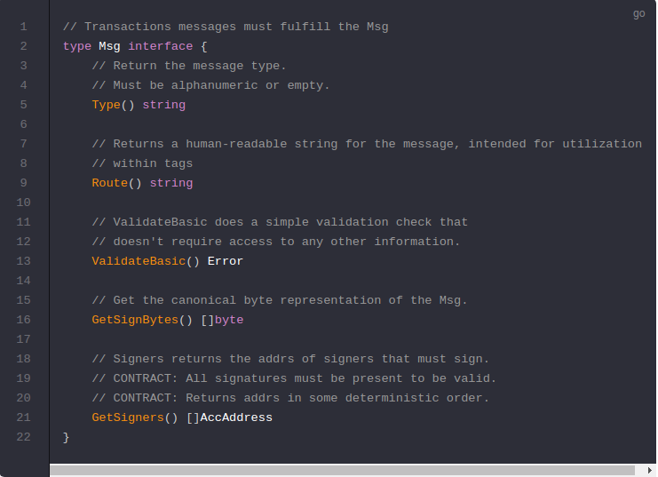

# Msgs and Handlers

Now that you have the `Keeper` setup, it is time to build the `Msgs` and `Handlers` that actually allow users to buy names and set values for them.

现在您已经设置好了`Keeper`，现在是时候构建实际上允许用户购买名称和设置值的消息和处理程序。

## Msgs
---------------------------------------------------------------------------------------------------------------------------------------------------------

`Msgs` trigger state transitions. `Msgs` are wrapped in [Txs](https://github.com/cosmos/cosmos-sdk/blob/develop/types/tx_msg.go#L34-L38) that clients submit to the network. The Cosmos SDK wraps and unwraps `Msgs` from `Txs`, which means, as an app developer, you only have to define `Msgs`. `Msgs` must satisfy the following interface (we'll implement all of these in the next section):

 `Msgs`触发状态转变。`Msgs`被包装到客户端提交到网络的交易中。Cosmos SDK从`Txs`中打包和解包`Msgs`,意味着，作为一个app开发者，你只需要定义`Msgs`。`Msgs`必须满足下面的接口(我们将在下一节中实现这些接口)。

## Handlers
---------------------------------------------------------------------------------------------------------------------------------------------------------

`Handlers` define the action that needs to be taken (which stores need to get updated, how, and under what conditions) when a given `Msg` is received.

In this module you have two types of `Msgs` that users can send to interact with the application state: `SetName` and `BuyName`. They will each have an associated `Handler`.

## Now that you have a better understanding of `Msgs` and `Handlers`, you can start building your first message: [SetName](https://cosmos.network/docs/tutorial/set-name.html).

