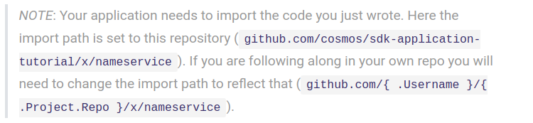

# Nameservice Module CLI

The Cosmos SDK uses the [cobra](https://github.com/spf13/cobra) library for CLI interactions. This library makes it easy for each module to expose its own commands. To get started defining the user's CLI interactions with your module, create the following files:

- `./x/nameservice/client/cli/query.go`
- `./x/nameservice/client/cli/tx.go`

## Queries
---------------------------------------------------------------------------------------------------------------------------------------------------------

Start in `query.go`. Here, define `cobra.Commands` for each of your modules `Queriers` (`resolve`, and `whois`):

Notes on the above code:

- The CLI introduces a new `context`: [CLIContext](https://godoc.org/github.com/cosmos/cosmos-sdk/client/context#CLIContext). It carries data about user input and application configuration that are needed for CLI interactions.
- CLI引入了新的上下文：`CLIContext`。它包含有关CLI交互所需的用户输入和应用程序配置的数据。
- The `path` required for the `cliCtx.QueryWithData()` function maps directly to the names in your query router.
- `cliCtx.QueryWithData（）`函数所需的路径直接映射到查询路由器中的名称。

    - The first part of the path is used to differentiate the types of queries possible to SDK applications: `custom` is for `Queriers`.
    - 路径的第一部分用于区分SDK应用程序可能的查询类型：自定义用于查询器。
    - The second piece (nameservice) is the name of the module to route the query to.
    - 第二部分（nameservice）是将查询路由到的模块的名称。
    - Finally there is the specific querier in the module that will be called.
    - 最后，将调用模块中的特定查询器。
    - In this example the fourth piece is the query. This works because the query parameter is a simple string. To enable more complex query inputs you need to use the second argument of the .[QueryWithData()](https://godoc.org/github.com/cosmos/cosmos-sdk/client/context#CLIContext.QueryWithData) function to pass in `data`. For an example of this see the queriers in the [Staking module](https://github.com/cosmos/cosmos-sdk/blob/develop/x/stake/querier/querier.go#L103).
    - 在这个例子中，第四部分是查询。这是因为查询参数是一个简单的字符串。要启用更复杂的查询输入，你需要使用`.QueryWithData（`）函数的第二个参数来传入数据。**有关此示例，请参阅Staking模块中的查询器**。

## Transactions
---------------------------------------------------------------------------------------------------------------------------------------------------------

Now that the query interactions are defined, it is time to move on to transaction generation in` tx.go`:

Notes on the above code:

The `authcmd` package is used here. The [godocs have more information on usage](https://godoc.org/github.com/cosmos/cosmos-sdk/x/auth/client/cli#GetAccountDecoder). It provides access to accounts controlled by the CLI and facilitates signing.

这里使用`authcmd`包。 godocs有更多关于使用的信息。它提供对CLI控制的帐户的访问，并便于签名。

## Now your ready to define [the routes that the REST client will use to communicate with your module!](https://cosmos.network/docs/tutorial/rest.html)

