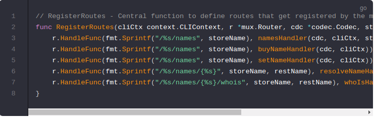

# Nameservice Module Rest Interface

Your module can also expose a REST interface to allow programatic access to the module's functionality. To get started create a file to hold the HTTP handlers:

- `./x/nameservice/client/rest/rest.go`

## RegisterRoutes
---------------------------------------------------------------------------------------------------------------------------------------------------------

First, define the REST client interface for your module in a `RegisterRoutes` function. Have the routes all start with your module name to prevent name space collisions with other modules' routes:

首先，在`RegisterRoutes`函数里定义你的模块的REST客户端接口。路由都以模块名称开头，以防止名称空间与其他模块的路由冲突：

## Query Handlers
---------------------------------------------------------------------------------------------------------------------------------------------------------

Next, its time to define the handlers mentioned above. These will be very similar to the CLI methods defined earlier. Start with the queries `whois` and `resolve`:

Notes on the above code:

- Notice we are using the same cliCtx.QueryWithData function to fetch the data
- These functions are almost the same as the corresponding CLI functionality

## Tx Handlers
---------------------------------------------------------------------------------------------------------------------------------------------------------

Now define the `buyName` and `setName` transaction routes. Notice these aren't actually sending the transactions to buy and set names. That would require sending a password along with the request which would be a security issue. Instead these endpoints build and return each specific transaction which can then be signed in a secure manner and afterwards broadcast to the network using a standard endpoint like` /txs`.

**Notes on the above code:**

- The [BaseReq](https://godoc.org/github.com/cosmos/cosmos-sdk/client/utils#BaseReq) contains the basic required fields for making a transaction (which key to use, how to decode it, which chain you are on, etc...) and is designed to be embedded as shown.
- 

- `baseReq.ValidateBasic` and `clientrest.CompleteAndBroadcastTxREST` handle setting the response code for you and therefore you don't need to worry about handling errors or successes when using those functions.

## Next its time to augment `nameservice` by implementing the [AppModule interface](https://cosmos.network/docs/tutorial/module.html)!
---------------------------------------------------------------------------------------------------------------------------------------------------------

## AppModule Interface

The Cosmos SDK provides a standard interface for modules. This [AppModule](https://github.com/cosmos/cosmos-sdk/blob/master/types/module.go) interface requires modules to provide a set of methods used by the `ModuleBasicsManager` to incorporate them into your application. First we will scaffold out the interface and implement some of its methods. Then we will incorporate our nameservice module alongside `auth` and `bank` into our app.

Cosmos SDK提供了一个标准的模块接口。此`AppModule`接口要求模块提供`ModuleBasicsManager`使用的一组方法，以将它们合并到你的应用程序中。首先，我们将构建接口并实现其一些方法。然后我们将我们的`nameservice`模块与auth和bank一起合并到我们的应用程序中。

Start by opening two new files, `module.go` and `genesis.go`. We will implement the AppModule interface in `module.go `and `the functions specific to genesis state management` in `genesis.go`. The `genesis-specific` methods on your AppModule struct will be pass-though calls to those defined in `genesis.go`.

首先打开两个新文件`module.go`和`genesis.go`。我们将在`module.go`中实现AppModule接口，并在genesis.go中实现特定于创世状态管理的功能。AppModule结构上`genesis-specific` 方法将通过调用genesis.go中定义的方法。

Lets start with adding the following code to `module.go`. We will leave a number of the functions unimplemented for now.

让我们首先将以下代码添加到`module.go`。我们现在将保留一些未实现的功能。

To see more examples of AppModule implementation, check out some of the other modules in the SDK such as [https://github.com/cosmos/cosmos-sdk/blob/master/x/staking/genesis.go](x/staking)

## Next, we need to [implement the genesis-specific methods called above](https://cosmos.network/docs/tutorial/genesis.html).

----------------------------------------------------------------------------------------------------------------------------------------------------------------------------------------------------------------------------

# Genesis

The AppModule interface includes a number of functions for use in initializing and exporting GenesisState for the chain. The `ModuleBasicManager` calls these functions on each module when starting, stopping or exporting the chain. Here is a very basic implementation that you can expand upon.

AppModule接口包含许多用于初始化和导出链的GenesisState的函数。在启动，停止或导出链时，`ModuleBasicManager`在每个模块上调用这些函数。这是一个你可以扩展的非常基本的实现。

Go to `x/nameservice/genesis.go` and add the following code:

A few notes about the above code:

- `ValidateGenesis()` validates the provided genesis state to ensure that expected invariants hold
- 验证提供的创世状态以确保预期的不变量保持不变

- `DefaultGenesisState() `is used mostly for testing. This provides a minimal GenesisState.
- `DefaultGenesisState() `通常被用来测试。它提供了最小的GenesisState

-` InitGenesis() `is called on chain start, this function imports genesis state into the keeper.
- 当chain启动时` InitGenesis() `被调用，这个函数导入创世状态到keeper中

- `ExportGenesis() `is called after stopping the chain, this function loads application state into a GenesisState stuct to later be exported to genesis.json alongside data from the other modules.
- 在停止chain后，`ExportGenesis() `函数被回调，这个函数加载应用状态到 GenesisState 结构体中，随后和其他模块的数据一起导出到genesis.json文件中。

## Now your module has everything it needs to be [incorporated into your Cosmos SDK application](https://cosmos.network/docs/tutorial/app-complete.html)!

