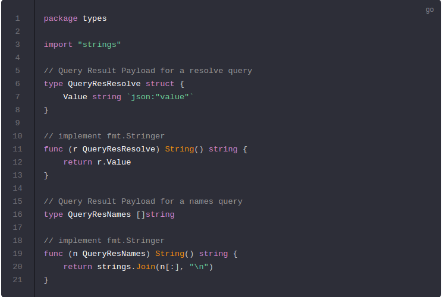
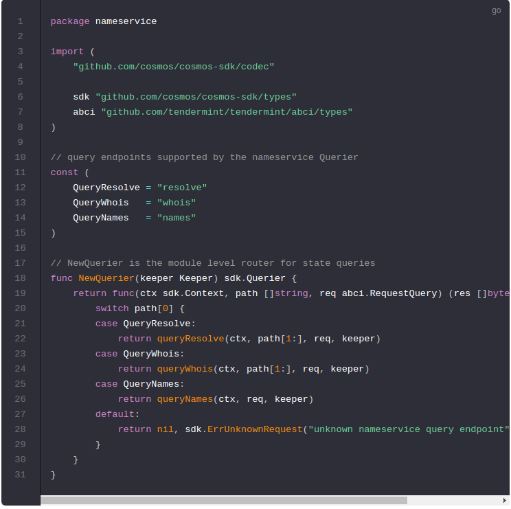
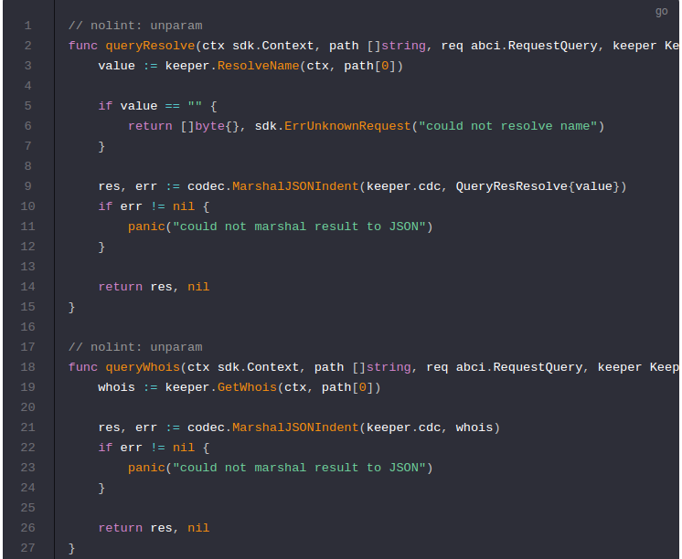
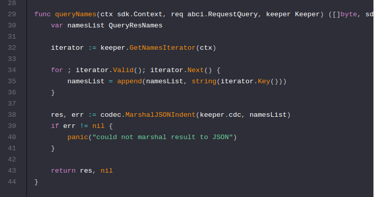
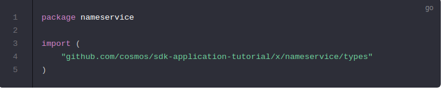
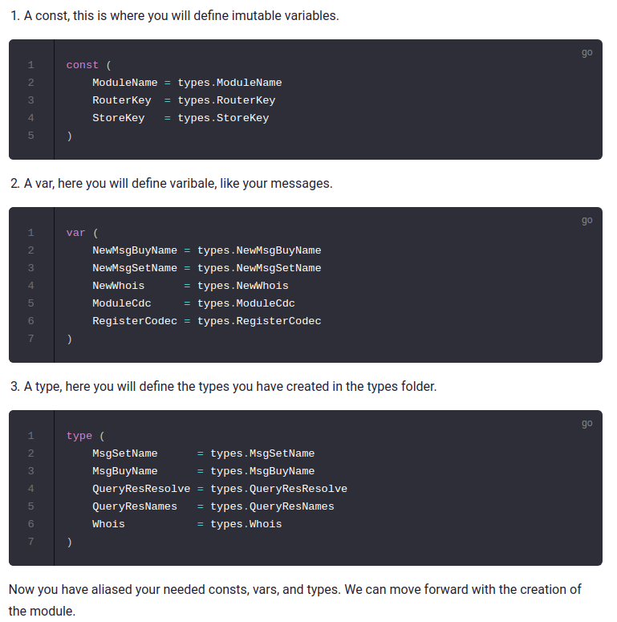

# Queriers

## Query Types
---------------------------------------------------------------------------------------------------------------------------------------------------------

Start by creating the `./x/nameservice/types/querier.go` file. This is where you will define your querier types.

开始创建`./x/nameservice/types/querier.go`这个文件。在这个文件中将会定义你的查询类型。

## Querier
---------------------------------------------------------------------------------------------------------------------------------------------------------

Now you can create the `./x/nameservice/querier.go` file. This is the place to define which queries against application state users will be able to make. Your `nameservice` module will expose three queries:

现在你可以创建`./x/nameservice/querier.go`文件。这是定义针对应用程序状态用户可以进行哪些查询的地方。你的`nameservice`模块将公开三个查询：

- `resolve`: This takes a name and returns the value that is stored by the nameservice. This is similar to a DNS query.
- `resolve`: 传入一个名字并返回nameservice存储的值。**这类似于DNS查询**。
- `whois`: This takes a name and returns the price, value, and owner of the name. Used for figuring out how much names cost when you want to buy them.
- `whois`: 传入一个名字，返回价格，值，和名字的所有者。用来去计算当你要买它们时会花费多少。
- `names` : This does not take a parameter, it returns all the names stored in the nameservice store.
- `names` : 不传入一个参数，它返回存储在namesrvice中的所有名字。

Start by defining the `NewQuerier` function which acts as a sub-router for queries to this module (similar the `NewHandler` function). Note that because there isn't an interface similar to `Msg` for queries, you need to manually define switch statement cases (they can't be pulled off of the query` .Route()` function):

首先定义NewQuerier函数，该函数充当查询此模块的子路由器（类似于NewHandler函数）。请注意，因为查询没有类似于`Msg`的接口，所以需要手动定义switch-case语句（不能从查询`.Route（）`函数中删除它们）：

Now that the `router` is defined, define the inputs and responses for each query:

**Notes on the above code:**

- Here your `Keeper`'s getters and setters come into heavy use. When building any other applications that use this module you may need to go back and define more getters/setters to access the pieces of state you need.
- 在这里你的`Keeper`的getters and setters大量使用。在构建使用此模块的任何其他应用程序时，你可能需要返回并定义更多getter / setter以访问所需的状态。

- By convention, each output type should be something that is both JSON marshallable and stringable (implements the Golang `fmt.Stringer` interface). The returned bytes should be the JSON encoding of the output result.
- 按照惯例，每个输出类型都应该是JSON marshallable和stringable（实现Golang fmt.Stringer接口）。返回的字节应该是输出结果的JSON编码。

    - So for the output type of `resolve` we wrap the resolution string in a struct called `QueryResResolve` which is both JSON marshallable and has a `.String()` method.
    - 因此，对于输出类型的解析，我们将解析字符串包装在一个名为`QueryResResolve`的结构中，该结构既是JSON可序列化的的又具有`.String（）`方法。
    - For the output of Whois, the normal Whois struct is already JSON marshalable, but we need to add a `.String()` method on it.
    - 对于Whois的输出，正常的Whois结构已经是JSON可序列化的，但我们需要在其上添加`.String（`）方法。
    - Same for the output of a names query, a` []string` is already natively marshalable, but we want to add a `.String()` method on it.
    - 对于名称查询的输出相同，[]string本身已经可序列化的，但我们想在其上添加`.String（）`方法。

- The type Whois is not defined in the` ./x/nameservice/types/querier.go `file because it is created in the `./x/nameservice/types/types.go` file

## Now that you have ways to mutate and view your module state it's time to put the finishing touches on it! Define the vairables and types you would like to bring to the top level of the module. [https://cosmos.network/docs/tutorial/alias.html](alias.go)

----------------------------------------------------------------------------------------------------------------------------------------------------------------------------------------------------------------------------
## Alias

Start by creating a  `./x/nameservice/alias.go`  file. The main reason for having this file is to prevent ` import cycles`. You can read more about import cycles in go here:[Golang import cycles](https://stackoverflow.com/questions/28256923/import-cycle-not-allowed)

首先创建一个`./x/nameservice/alias.go`文件。此文件的主要原因是为了防止`导入循环`。你可以在此处阅读有关导入循环的更多信息：[Golang导入循环](https://stackoverflow.com/questions/28256923/import-cycle-not-allowed)。

First start by import the types folder you have created.

There are three types of types we will create in the `alias.go` file.

## Register your types in the [Amino encoding format next](https://cosmos.network/docs/tutorial/codec.html)!

## 接下来，以`Amino编码格式注`册您的类型

