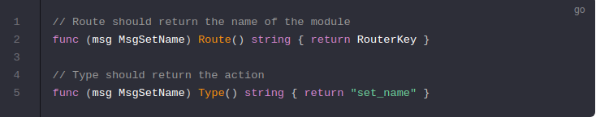
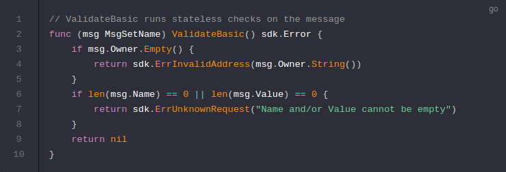
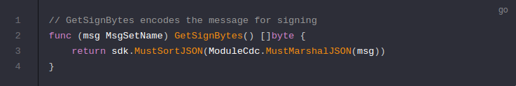
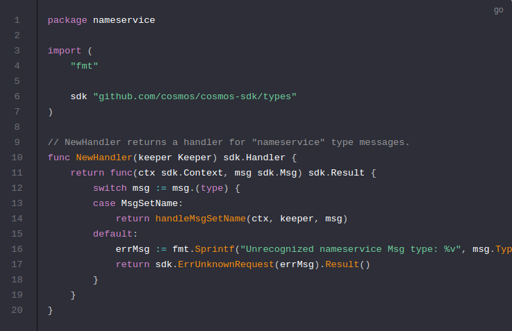
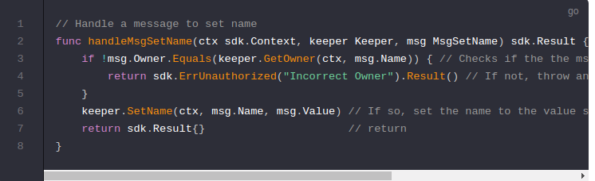

# SetName

## Msg
---------------------------------------------------------------------------------------------------------------------------------------------------------

The naming convention for the SDK Msgs is Msg{ .Action }. The first action to implement is SetName, so we'll call it MsgSetName. This Msg allows the owner of a name to set the return value for that name within the resolver. Start by defining `MsgSetName` in a new file called` ./x/nameservice/types/msgs.go`:

The `MsgSetName` has the three attributes needed to set the value for a name:

`name` - The name trying to be set.
`value` - What the name resolves to.
`owner` - The owner of that name.

Next, implement the `Msg` interface:

The above functions are used by the SDK to route `Msgs` to the proper module for handling. They also add human readable names to database tags used for indexing.

SDK使用上述函数将`Msgs`路由到适当的模块进行处理。它们还为用于索引的数据库标签添加了人类可读的名称。

`ValidateBasic` is used to provide some basic **stateless** checks on the validity of the `Msg`. In this case, check that none of the attributes are empty. Note the use of the `sdk.Error` types here. The SDK provides a set of error types that are frequently encountered by application developers.

`ValidateBasic`用于提供对`Msg`有效性的一些基本无状态检查。在这种情况下，请检查没有属性为空。请注意这里使用`sdk.Error`类型。 SDK提供了一组应用程序开发人员经常遇到的错误类型。

`GetSignBytes` defines how the `Msg` gets encoded for signing. In most cases this means marshal to sorted JSON. The output should not be modified.

`GetSignBytes`定义了如何编码`Msg`以进行签名。在大多数情况下，这意味着要序列化成排序的JSON。不应修改输出。

`GetSigners` defines whose signature is required on a `Tx` in order for it to be valid. In this case, for example, the `MsgSetName` requires that the `Owner` signs the transaction when trying to reset what the name points to.

`GetSigners`定义在`Tx`上需要谁的签名以使其有效。在这种情况下，例如，`MsgSetName`要求`所有者`在尝试重置名称所指向的内容时签名该交易。

## Handler
---------------------------------------------------------------------------------------------------------------------------------------------------------

Now that `MsgSetName `is specified, the next step is to define what action(s) needs to be taken when this message is received. This is the role of the `handler`.

In a new file (`./x/nameservice/handler.go`) start with the following code:

`NewHandler` is essentially a sub-router that directs messages coming into this module to the proper handler. At the moment, there is only one `Msg/Handler`.

`NewHandler`本质上是一个子路由器，它将进入该模块的消息定向到正确的处理程序。目前，只有一个`Msg / Handler`。

Now, you need to define the actual logic for handling the `MsgSetName` message in `handleMsgSetName`:

现在，你需要定义处理`handleMsgSetName`中的`MsgSetName`消息的实际逻辑：

NOTE: The naming convention for handler names in the SDK is `handleMsg{ .Action }`

**注意：SDK中处理程序名称的命名约定是handleMsg {.Action}**

In this function, check to see if the `Msg` sender is actually the owner of the name (`keeper.GetOwner`). If so, they can set the name by calling the function on the `Keeper`. If not, throw an error and return that to the user.

在这个函数中，`Msg`的发送者是否是实际的名称所有者。如果是，你可以使用`Keeper`调用函数来设置名字。如果不是，抛出一个错误返回给用户。

## Great, now owners can `SetNames`! But what if a name doesn't have an owner yet? Your module needs a way for users to buy names! Let us [define the BuyName message](https://cosmos.network/docs/tutorial/buy-name.html).

## 很好，现在所有者可以`SetNames`！但是如果一个名字现在还没有所有者？你的模块需要一个方式让用户购买名字！定义购买名字信息。

