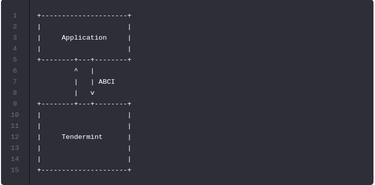
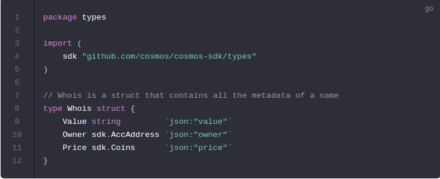
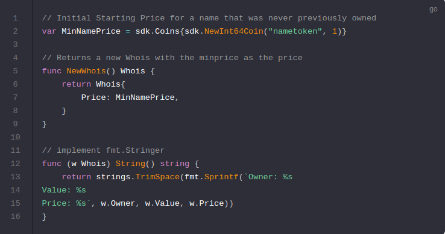
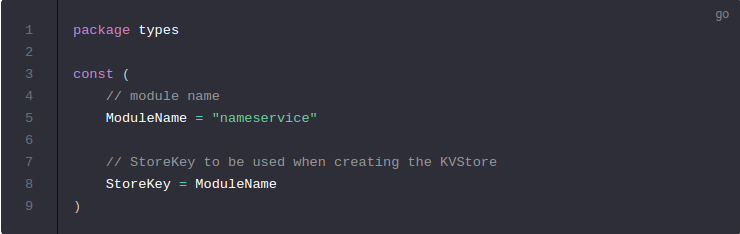

# Start your application

Get started by creating a new file:` ./app.go`. This file is the heart of your deterministic state-machine (blockchain). `app.go` is where the different modules are initialized and configured into a complete application using the `sdk.ModuleBasicManager`.

通过创建新文件开始：`./ app.go`。此文件是确定性状态机（区块链）的核心。` app.go`是使用`sdk.ModuleBasicManager`初始化不同模块，并配置到完整应用程序的位置。

In `app.go`, you define what the application does when it receives a transaction. But first, it needs to be able to receive transactions in the correct order. This is the role of the [Tendermint consensus engine](https://github.com/tendermint/tendermint).

在`app.go`中，你可以定义应用程序在接收交易时执行的操作。但首先，它需要能够以正确的顺序接收交易。这是[Tendermint共识引擎](https://github.com/tendermint/tendermint)的作用。

Start by importing the necessary dependencies:

从导入必要的依赖开始：

Links to godocs for each module and package imported:

每个模块和导入的包都链接到godocs:

- [log](https://godoc.org/github.com/tendermint/tendermint/libs/log): Tendermint's logger.
- [auth](https://godoc.org/github.com/cosmos/cosmos-sdk/x/auth): The `auth` module for the Comsos SDK.
- [dbm](https://godoc.org/github.com/tendermint/tendermint/libs/db): Code for working with the Tendermint database.
- [baseapp](https://godoc.org/github.com/cosmos/cosmos-sdk/baseapp): See below

A couple of the packages here are `tendermint` packages. Tendermint passes transactions from the network to the application through an interface called the [ABCI](https://github.com/tendermint/tendermint/tree/master/abci). If you look at the architecture of the blockchain node you are building, it looks like the following:

这里有几个包是`Tendermint`包。Tendermint通过`ABCI`接口从网络中传递`交易`到应用程序。如果你看了你正在构建的区块链节点的架构，它看起来像下面的：

Fortunately, you do not have to implement the ABCI interface. The Cosmos SDK provides a boilerplate implementation of it in the form of [baseapp](https://godoc.org/github.com/cosmos/cosmos-sdk/baseapp).

幸运的是，你不必实现ABCI接口。 Cosmos SDK以`baseapp`的形式提供了它的样板实现。

Here is what `baseapp` does:

下面是`baseapp`做了什么：

- Decode transactions received from the Tendermint consensus engine.
- 解码从Tendermint共识引擎那里接收到的交易。

- Extract messages from transactions and do basic sanity checks.
- 从交易中提取信息，并做基本地健全检查。

- Route the message to the appropriate module so that it can be processed. Note that `baseapp` has no knowledge of the specific modules you want to use. It is your job to declare such modules in `app.go`, as you will see later in this tutorial. `baseapp` only implements the core routing logic that can be applied to any module.
- 发送信息到适当的模块，以便它可以被处理。注意，`baseapp`并不知道你想要使用的模块。正如你随后在教程中看到的，你的工作是在`app.go`中声明这些模块。`baseapp`仅仅实现可以被应用到各个模块的核心路由逻辑。

- Commit if the ABCI message is [DeliverTx](https://tendermint.com/docs/spec/abci/abci.html#delivertx) (CheckTx changes are not persistent).
- 如果ABCI消息是`DeliverTx`则提交（CheckTx更改不是持久化的）。

- Help set up [Beginblock](https://tendermint.com/docs/spec/abci/abci.html#beginblock) and [Endblock](https://tendermint.com/docs/spec/abci/abci.html#endblock), two messages that enable you to define logic executed at the beginning and end of each block. In practice, each module implements its own `BeginBlock` and `EndBlock` sub-logic, and the role of the app is to aggregate everything together (Note: you won't be using these messages in your application).
- 帮助设置`Beginblock`和`Endblock`，这两条消息使你能够定义在每个区块的开头和结尾执行的逻辑。特别地，每个模块都实现了它们自己的`BeginBlock`和`EndBlock`的子逻辑，并且应用程序的作用是将所有内容聚合在一起(注意：你不会在应用程序中使用这些消息)。

- Help initialise your state.
- 帮助初始化你的状态。

- Help set up queries.
- 帮助建立查询。

Now you need to create a new custom type `nameServiceApp` for your application. This type will embed `baseapp` (embedding in Go similar to inheritance in other languages), meaning it will have access to all of `baseapp`'s methods.

现在，你需要为应用程序创建新的自定义类型`nameServiceApp`。这种类型将嵌入`baseapp`(在Go语言中的嵌入和其他语言的继承是相似的)，意味着它可以访问`baseapp`的所有方法。

Add a simple constructor for your application:

为你的应用添加一个简单的构造函数：

Great! You now have the skeleton of your application; however, it still lacks functionality.

很好！你现在拥有应用程序的骨架；但是，它仍然缺乏功能。

`baseapp` has no knowledge of the routes or user interactions you want to use in your application. The primary role of your application is to define these routes. Another role is to define the initial state. Both these things require that you add modules to your application.

`baseapp`不知道在你的应用中你想要使用的路由或用户交互。你的应用的主要作用是定义这些路由。另一作用是定义初始的状态。这两件事都要求你向应用程序添加模块。

As you have seen in the [application design](https://cosmos.network/docs/tutorial/app-design.html) section, you need a couple modules for your nameservice: `auth`, `bank`, `staking`, `distribution`, `slashing` and `nameservice`. The first two already exist, but not the last! The `nameservice` module will define the bulk of your state machine. The next step is to build it.

正如你在应用程序设计部分所看到的，你需要为你的`名称服务`提供几个模块：`auth，bank，staking，distribution，slashing和nameservice`。前两个模块已经存在，但是不是最新的！`nameservice`模块将会定义你的状态机的容量。下一步是构建它。

## In order to complete your application, you need to include modules. Go ahead and [start building your nameservice module](https://cosmos.network/docs/tutorial/types.html). You will come back to `app.go` later.

为了完成你的应用程序，你需要包含模块。继续，开始构建你的名称服务模块。你稍后会回到`app.go`。

---------------------------------------------------------------------------------------------------------------------------------------------------------------------------------------------------------------------------

# 以下是关于nameservice 模块的

## Types
--------------------------------------------------------------------------------------------------------------------------------------------------------

First Thing we're going to do is define a struct that holds all the metadata of a name. We will call this struct `Whois` after the ICANN DNS terminology.

我们要做的第一件事是定义包含一个名字所有元数据的结构体。我们将在ICANN DNS术语之后调用`Whois`结构体。

#### `types.go`

Begin by creating the file`./x/nameservice/types/types.go` to hold the customs types for your module. In Cosmos SDK applications, the convention is that modules live in the`./x/` folder.

首先创建文件`./x/nameservice/types/types.go`以保存你的模块的自定义类型。**在Cosmos SDK应用程序中**，**惯例是模块位于**`./x/`**文件夹中**。

## Whois
--------------------------------------------------------------------------------------------------------------------------------------------------------

Each name will have three pieces of data associated with it.

每个名称都有三个与之关联的数据。

- `Value` - The value that a name resolves to. This is just an arbitrary string, but in the future you can modify this to require it fitting a specific format, such as an IP       address, DNS Zone file, or blockchain address.
- `Value`- 名称解析的值。这是一个任意的字符串，**但是将来你可以更改这个值使它符合一个特定的格式，比如一个IP地址，DNS空间文件，或者区块链地址。**

- `Owner` - The address of the current owner of the name
- `Owner` - 当前名字所有者的地址。

- `Price` - The price you will need to pay in order to buy the name
- `Price` - 购买这个名字你将支付的价格

To start your SDK module, define your `nameservice.Whois` struct in the .`/x/nameservice/types/types.go` file:

As mentioned in the [Design doc](https://cosmos.network/docs/tutorial/app-design.html), if a name does not already have an owner, we want to initialize it with some `MinPrice`.

如设计文档中所述，如果名称尚未拥有所有者，我们希望使用一些`MinPrice`对其进行初始化。

## Now we can create our [key file](https://cosmos.network/docs/tutorial/key.html)
--------------------------------------------------------------------------------------------------------------------------------------------------------

### Key

Start by creating a `./x/nameservice/types/key.go` file withing in the types folder. Within your key.go file, you will set your keys to be used throughout the creation of the module.

首先在`types`文件夹中创建一个key.go文件。在`key.go`文件中，你将设置要在整个模块创建过程中都要使用的关键字。

Defining the keys that will be used throughout the application helps with writing `DRY` code.

定义将在整个应用程序中使用的关键字有助于编写`DRY`代码。

