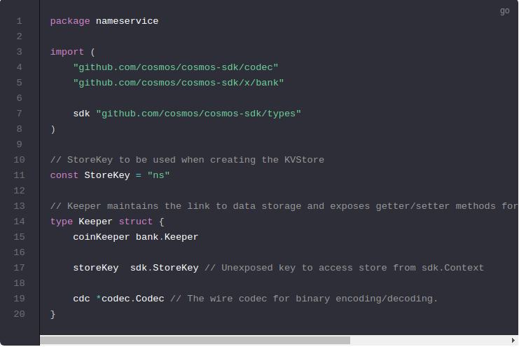
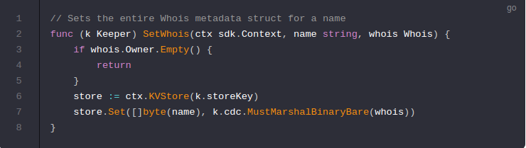
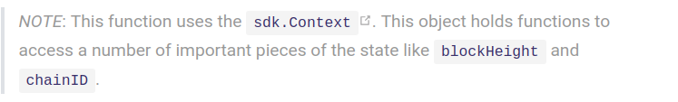
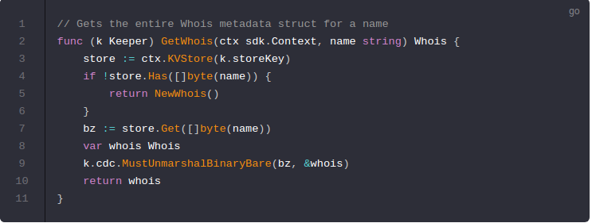
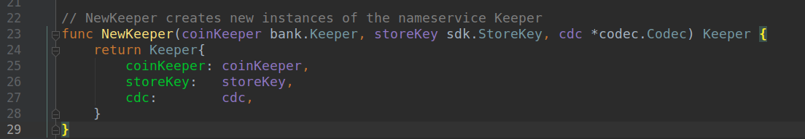

# The Keeper

The main core of a Cosmos SDK module is a piece called the `Keeper`. It is what handles interaction with the store, has references to other keepers for cross-module interactions, and contains most of the core functionality of a module.

Cosmos SDK模块的主要核心是一个名为`Keeper`的部分。它**处理与存储的交互**，引用其他keepers进行跨模块交互，并包含一个模块的大部分核心功能。

## Keeper Struct
---------------------------------------------------------------------------------------------------------------------------------------------------------

To start your SDK module, define your `nameservice.Keeper` in a new `./x/nameservice/keeper.go` file:

开始SDK模块，在一个新的`./x/nameservice/keeper.go` 文件中定义你的`nameservice.Keeper`

A couple of notes about the above code:

关于上述代码的几点说明：

- 3 different `cosmos-sdk` packages are imported:
- 三个不同的`cosmos-sdk`包被导入：
    - [codec](https://godoc.org/github.com/cosmos/cosmos-sdk/codec) - the `codec` provides tools to work with the Cosmos encoding format, [Amino](https://github.com/tendermint/go-amino).
    - [codec](https://godoc.org/github.com/cosmos/cosmos-sdk/codec) - 编解码器提供了使用Cosmos编码格式的工具，[Amino](https://github.com/tendermint/go-amino).
    - **Amino是什么？**
    - [bank](https://godoc.org/github.com/cosmos/cosmos-sdk/x/bank) - the bank module controls accounts and coin transfers.
    - [bank](https://godoc.org/github.com/cosmos/cosmos-sdk/x/bank) - bank模块控制账户和coin的转移。
    - [types](https://godoc.org/github.com/cosmos/cosmos-sdk/types) - types contains commonly used types throughout the SDK.
    - [types](https://godoc.org/github.com/cosmos/cosmos-sdk/types) - types包含整个SDK中常用的类型。

- The Keeper struct. In this keeper there are a couple of key pieces:
- Keeper结构体。在这个keeper中有几个关键部分：

    - [bank.Keeper](https://godoc.org/github.com/cosmos/cosmos-sdk/x/bank#Keeper) - This is a reference to the `Keeper` from the `bank` module. Including it allows code in this module to call functions from the `bank` module. The SDK uses an [object capabilities](https://en.wikipedia.org/wiki/Object-capability_model) approach to accessing sections of the application state. This is to allow developers to employ a least authority approach, limiting the capabilities of a faulty or malicious module from affecting parts of state it doesn't need access to.
    - `Keeper`引用了`bank`模块。包括它允许该模块中的代码调用`bank`模块中的函数。SDK使用`对象功能方法`来访问应用程序状态的各个部分。这是为了允许开发人员采用最少权限的方法，从它不需要访问的影响部分状态那里，限制故障或恶意模块的功能。

    - [*codec.Codec](https://godoc.org/github.com/cosmos/cosmos-sdk/codec#Codec) - This is a pointer to the codec that is used by Amino to encode and decode binary structs.
    - 这是Amino用于编码和解码结构体的编解码器的指针

    - [sdk.StoreKey](https://godoc.org/github.com/cosmos/cosmos-sdk/types) - This is a store key which gates access to a sdk.KVStore which persists the state of your application: the `Whois` struct that the name points to (i.e. `map[name]Whois`).
    - 这是一个存储关键，可以访问sdk.KVStore，它会持久保存你的应用程序的状态：名称所指向的`Whois`结构（`map [name] Whois`）

## Getters and Setters
---------------------------------------------------------------------------------------------------------------------------------------------------------

Now it is time to add methods to interact with the stores through the `Keeper`. First, add a function to set the Whois a given name resolves to:

现在是时候添加通过Keeper与存储交互的方法了。首先，添加一个函数来设置给定名称解析为的Whois：

In this method, first get the store object for the `map[name]Whois` using the the `storeKey` from the `Keeper`.

Next, you insert the` <name, whois>` pair into the store using its .`Set([]byte, []byte) `method. As the store only takes `[]byte`, we use the Cosmos SDK encoding library **called Amino **to marshal the Whois struct to` []byte `to be inserted into the store.

If the owner field of a Whois is empty, we do not write anything to the store, as all names that exist must have an owner.

如果 `Whois`的owner字段是空的，我们不往存储里写任何东西，因为名字存在必须有一个所有者。

Next, add a method to resolve the names (i.e. look up the Whois for the name):

接下来，添加一个名字去解析名字：

Here, like in the `SetName` method, first access the store using the `StoreKey`. Next, instead of using the `Set` method on the store key, use the .`Get([]byte) []byte ` method. As the parameter into the function, pass the key, which is the `name` string casted to `[]byte`, and get back the result in the form of` []byte`. We once again use **Amino**, but this time to unmarshal the byteslice back into a `Whois` struct which we then return.

If a name currently does not exist in the store, it returns a new Whois, which has the `minimumPrice` initialized in it.

Now, we add functions for getting specific parameters from the store based on the name. However, instead of rewriting the store getters and setters, we reuse the `GetWhois` and `SetWhois` functions. For example, to set a field, first we grab the whole Whois data, update our specific field, and put the new version back into the store.

The SDK also includes a feature called an `sdk.Iterator`, which returns an iterator over all the `<Key, Value>` pairs in a specific spot in a store. We will add a function to get an iterator over all the names that exist in the store.

The last piece of code needed in the` ./x/nameservice/keeper.go` file is a constructor function for `Keeper`:

## Next its time to move onto describing how users interact with your new store using[Msgs and Handlers](https://cosmos.network/docs/tutorial/msgs-handlers.html)

