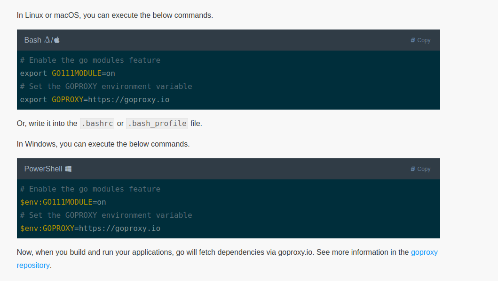
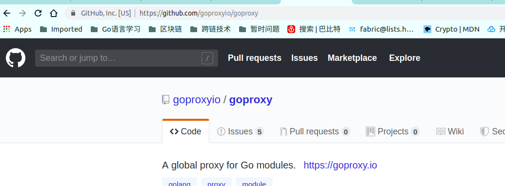
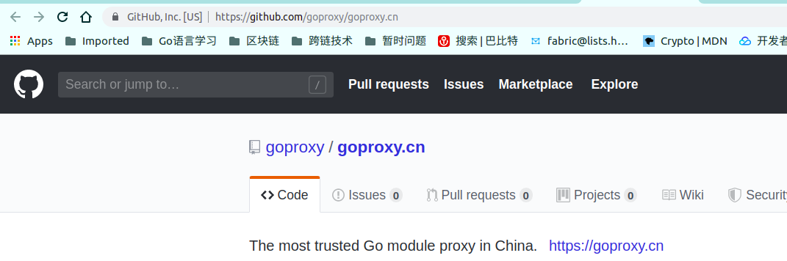
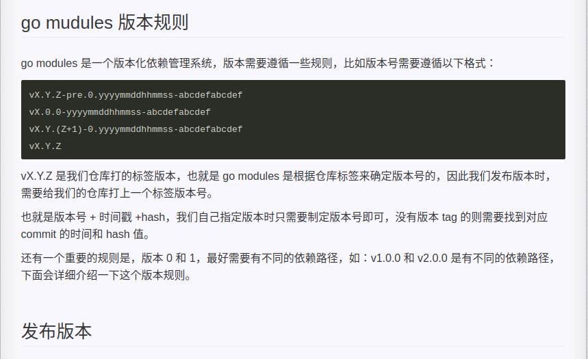
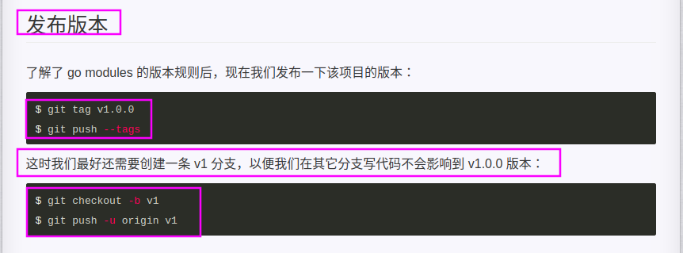
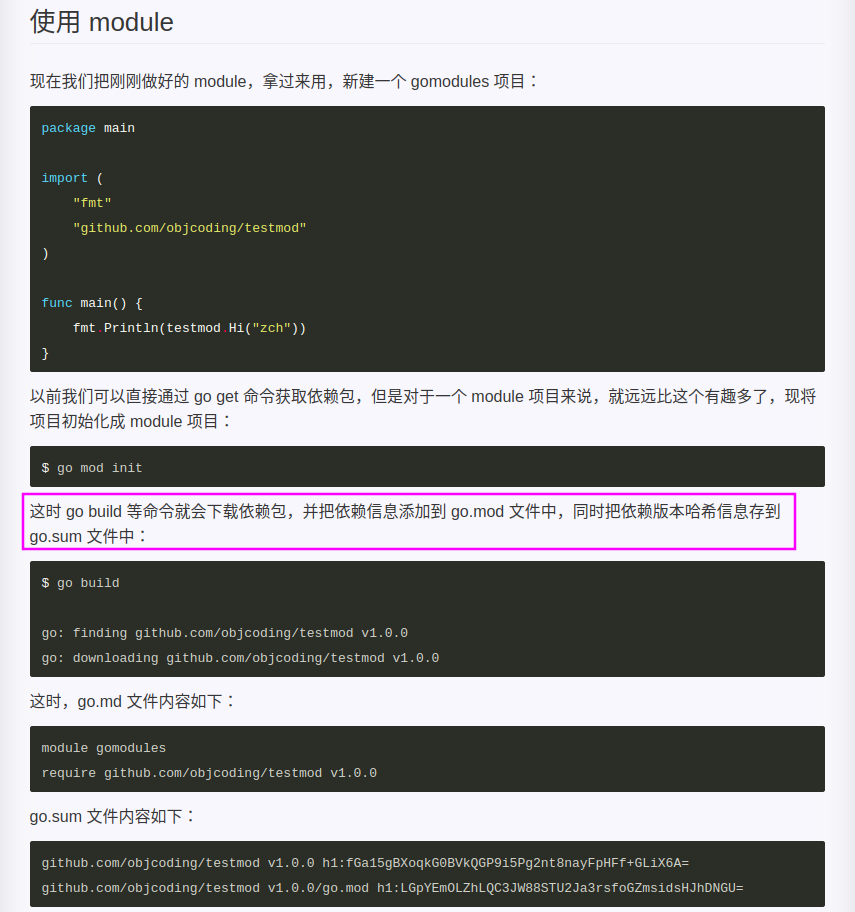
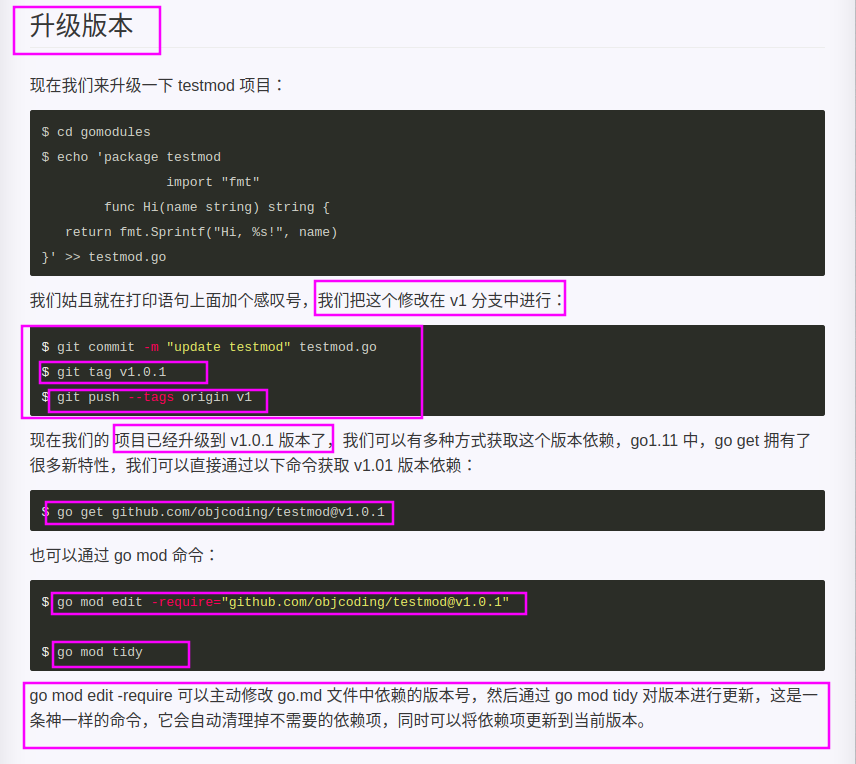
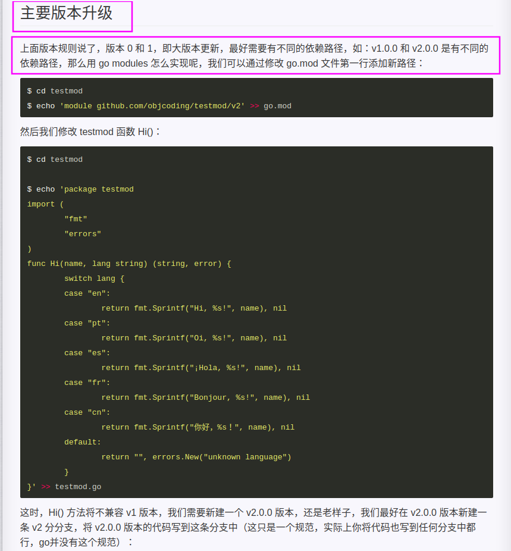
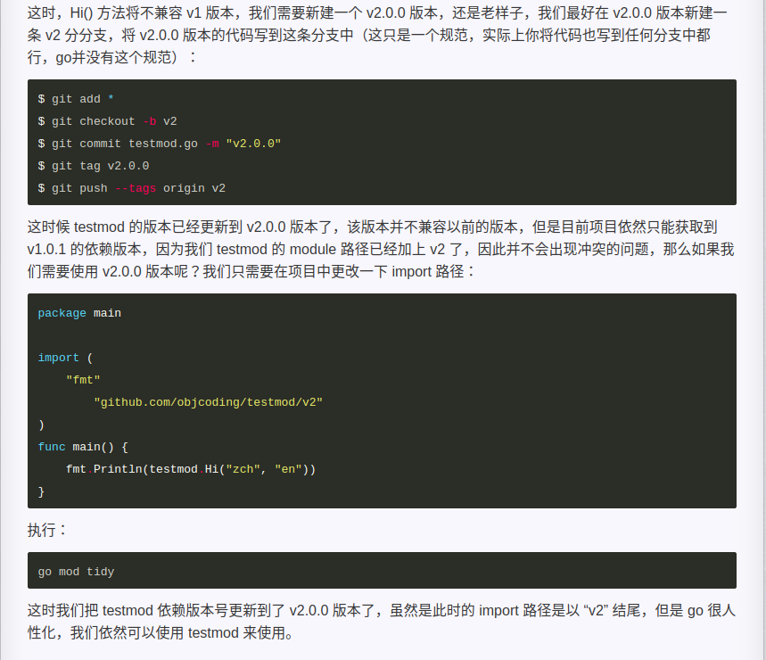

# 1. go module依赖管理

## 1.1. golang之前的版本依赖管理的方式

之前的管理方式有Vendor,GoVendor,GoDep,Dep,Glide等等

## 1.2. Go Mod 命令

```
download    download modules to local cache (下载依赖的module到本地cache)
edit        edit go.mod from tools or scripts (编辑go.mod文件)
graph       print module requirement graph (打印模块依赖图))
init        initialize new module in current directory (在当前文件夹下初始化一个新的module, 创建go.mod文件))
tidy        add missing and remove unused modules (增加丢失的module，去掉未用的module)
vendor      make vendored copy of dependencies (将依赖复制到vendor下)
verify      verify dependencies have expected content (校验依赖)
why         explain why packages or modules are needed (解释为什么需要依赖)
go list -m all显示依赖关系。go list -m -json all显示详细依赖关系。

```

## 1.3. 设置 GO111MODULE

可以用环境变量 GO111MODULE 开启或关闭模块支持，它有三个可选值：off、on、auto，默认值是 auto。

```
GO111MODULE=off 无模块支持，go 会从 GOPATH 和 vendor 文件夹寻找包。
GO111MODULE=on 模块支持，go 会忽略 GOPATH 和 vendor 文件夹，只根据 go.mod 下载依赖。
GO111MODULE=auto 在 GOPATH/src 外面且根目录有 go.mod 文件时，开启模块支持。

```
**在使用模块的时候，GOPATH 是无意义的**，不过它还是会**把下载的依赖储存在 GOPATH/pkg/mod** 中，也会**把 go install 的结果放在 $GOPATH/bin** 中。**`Mod Cache` 路径在`$GOPATH/pkg/mod/cache`下面**。

在默认情况下，$GOPATH 是不支持 go mudules 的，如果项目的目录在$GOPATH/src目录下，那么要想使用`go modules`,我们需要在项目目录下手动执行以下命令：

```
$ export GO111MODULE=on
```
GO111MODULE默认是auto,在 `$GOPATH/src` 外面且根目录有` go.mod` 文件时，开启模块支持, 为了以后所有项目都的依赖关系都转向` go modiules`，我`export GO111MODULE=on`这句命令写到了配置文件里，也就是说，项目的依赖使用`go modules`来管理，不用再考虑`$GOPATH/src`下的依赖包了，创建项目也不用在`$GOPATH/src`下了。

## 1.4. 使用 go modules

### 1.4.1. 先初始化

在$GOPATH之外的目录下，执行`go mod init`,后面可以加上项目的名称：`go mod init github.com/best-jie/nameservice`,bet-jie为我github的用户名，nameservice为我的项目名，

`go mod init`，会在当前项目目录下生成一个`go.mod`文件，此时，这个文件因为没有同步依赖关系，所以文件里只有一行，就是项目目录，

```
如果你的项目之前使用了 dep 或其他依赖管理工具，那么在首次使用go mod的时候会自动同步依赖关系，并提示从某工具迁移到 go modules。
这招果然漂亮，直接从其他社区工具接管。
```

```
go mod init <项目模块名称>初始化模块，会在项目根目录下生成 go.mod 文件。参数<项目模块名称>是非必写的，但如果你的项目还没有代码编写，这个参数能快速初始化模块。如果之前使用其它依赖管理工具(比如dep，glide等)，mod会自动接管原来依赖关系。
```


### 1.4.2. 创建依赖关系

**执行以下命令会自动分析项目里的依赖关系同步到go.mod文件中，同时创建go.sum文件**

```
go mod tidy
```

**在日后的开发工作中，直接使用这个命令就可以增删同步依赖关系。**

### 1.4.3. 下载依赖modules

使用` go mod download`,下载依赖的module到本地cache,下载时会把go.mod中的所有依赖下载到本地cache($GOPATH/pkg/mod)

## 1.5. 特殊情况

**初始化一个go.mod文件后，在没有同步依赖之前，文件里只有一行，就是项目目录，有些项目的依赖有一定的版本要求，如果不在go.mod中写出指定的依赖及版本，那么在下载依赖时默认是下载最新的，例如，有关cosmos-sdk的项目，尤其是cosmos-sdk和tendermint的版本要指定：**

**indirect 表示这个库是间接引用进来的。**

```
module github.com/best-jie/nameservice

go 1.12

require (
	github.com/cosmos/cosmos-sdk v0.35.0
	github.com/gorilla/mux v1.7.0
	github.com/mattn/go-isatty v0.0.7 // indirect
	github.com/prometheus/procfs v0.0.0-20190328153300-af7bedc223fb // indirect
	github.com/spf13/afero v1.2.2 // indirect
	github.com/spf13/cobra v0.0.3
	github.com/spf13/viper v1.0.3
	github.com/syndtr/goleveldb v1.0.0 // indirect
	github.com/tendermint/go-amino v0.15.0
	github.com/tendermint/tendermint v0.31.5
	golang.org/x/sys v0.0.0-20190329044733-9eb1bfa1ce65 // indirect
	google.golang.org/genproto v0.0.0-20190327125643-d831d65fe17d // indirect
	google.golang.org/grpc v1.19.1 // indirect
)

replace golang.org/x/crypto => github.com/tendermint/crypto v0.0.0-20180820045704-3764759f34a5

replace github.com/cosmos/cosmos-sdk => github.com/cosmos/cosmos-sdk v0.28.2-0.20190605232616-5f9c3fdf8895
```

**如何在Go模块里使用本地依赖包？**首先在项目的g`o.mod`文件的`require处添加依赖包`，**然后在replace处添加替换本地依赖包(路径要处理妥当)**。比如：

```
require (
    mytest v0.0.0
)
replace (
    mytest v0.0.0 => ../mytest
)
```
## 1.6. 网上的资源

- go modules详解

- http://objcoding.com/2018/09/13/go-modules/

- GO1.11 Module全攻略

- https://www.cnblogs.com/cnxkey/articles/10107165.html

## 1.7. 置环境变量 GOPROXY 的值为代理网址

**可以设置模块代理**：设置环境变量 GOPROXY 的值为代理网址，**目前可用的模块公共代理网址有**:
```
https://goproxy.io
https://athens.azurefd.net
https://goproxy.cn
https://gocenter.io
```

或者使用:
```
https://github.com/goproxyio/...
https://github.com/gomods/athens
```

**Go官方代理**

**A Global Proxy for Go Modules**







[Goproxy China](https://github.com/goproxy/goproxy.cn) - Open source project - The most trusted Go module proxy in China.




## 1.8. Git建议

`go.mod`文件必须要提交到git仓库，**但go.sum文件可以不用提交到git仓库(git忽略文件.gitignore中设置一下)**。

### 1.8.1. 如何获取依赖的特定版本？

go get可以在末尾加@符号，用来指定版本。

```
go get github.com/gorilla/mux           #匹配最新的一个tag
go get github.com/gorilla/mux@latest    #跟上面一样
go get github.com/gorilla/mux@master    #匹配master分支
go get github.com/gorilla/mux@v1.6.2    #匹配v1.6.2
go get github.com/gorilla/mux@c856192   #匹配commit的SHA-1码的版本
```

- 针对于开发者的建议：仓库必须是带v前缀的、语义化的版本号来打标签tag，格式如v1.2.0 
- 注：有些模块代理还不支持一些指定版本的处理。












