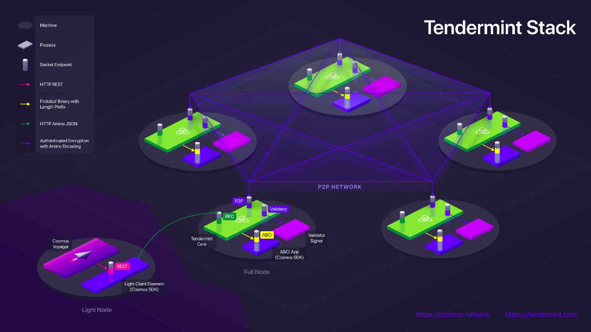

# Application Architecture Guide

Here we provide a brief guide on the recommended architecture of a Tendermint blockchain application.

The following diagram provides a superb example:

在这里，我们提供了Tendermint区块链应用程序的推荐架构的简要指南。 下图提供了一个极好的示例：

这里的最终用户应用程序是左下角的Cosmos Voyager。Voyager与本地Light-Client守护程序公开的REST API进行通信。Light-Client守护程序是一个特定于应用程序的程序，它与Tendermint节点通信并通过Tendermint Core RPC验证Tendermint轻客户端证明。Tendermint Core 处理与本地ABCI应用程序通信，那是实际处理用户查询或交易的位置。

ABCI应用程序必须是Tendermint共识的确定性结果 - 对未通过Tendermint的应用状态产生的任何外部影响都可能导致共识失败。因此除了Tendermint之外，没有任何东西可以通过ABCI与应用程序通信。

如果应用程序是用Go编写的，则可以将其编译为Tendermint二进制文件。否则，它应该使用unix socket与Tendermint进行通信。如果需要使用TCP，则必须格外小心以加密和验证连接。

应用程序的所有读取都通过Tendermint `/ abci_query`端点进行。对应用程序的所有写入都通过Tendermint `/ broadcast_tx_` *端点进行。

Light-Client守护程序为轻客户端（最终用户）提供了几乎所有全节点的安全性。它格式化和广播交易，并验证查询和交易结果的证明。请注意，它不必是守护进程 - Light-Client逻辑可以在与最终用户应用程序相同的进程中实现。

注意那些安全性要求较低的ABCI应用程序，Light-Client守护程序的功能可以移入ABCI应用程序进程本身。也就是说，除了Tendermint之外，将应用程序进程暴露在ABCI之外需要极其谨慎，因为所有交易，可能还有所有查询，都应该通过Tendermint。

See the following for more extensive documentation:

- [Interchain Standard for the Light-Client REST API](https://github.com/cosmos/cosmos-sdk/pull/1028)
- [Tendermint RPC Docs](https://tendermint.com/rpc/)
- [Tendermint in Production](https://tendermint.com/docs/tendermint-core/running-in-production.html)
- [ABCI spec](https://tendermint.com/docs/app-dev/abci-spec.html)

