# Getting Started

# First Tendermint App

作为通用区块链引擎，Tendermint是与你想运行的应用程序无关的。所以，要运行一个完整的区块链来做一些有用的事情，你需要开启两个进程：一个是Tendermint Core，另一个是可以用任何编程语言写的应用程序。回想一下ABCI的介绍，Tendermint Core处理所有p2p和共识内容，只需在需要验证时将交易转发给应用程序，或者当它们准备好提交到块时。

在本指南中，我们将向您展示如何使用Tendermint运行应用程序的一些示例。

### Install

我们将要运行的第一个app是用GO写的，因此需要安装GO，把$GOPATH/bin放到$PATH下，然后运行：

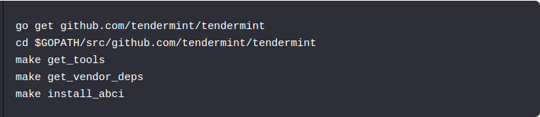

现在你已经把`abci-cli`安装到`$GOPATH/bin`下，你将会看到一组命令(`counter`和`kvstore`),这些命令是用GO言写的实例应用程序。下面的一个应用程序是JavaScript写的。

现在，让我们运行一些app.

## KVStore - A First Example
---------------------------------------------------------------------------------------

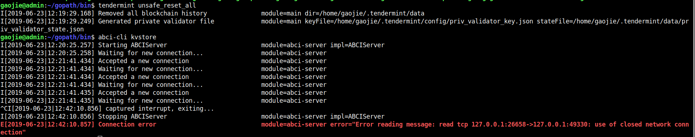

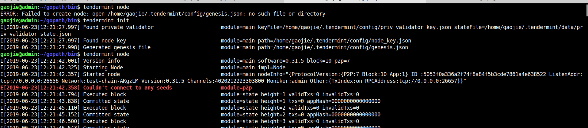

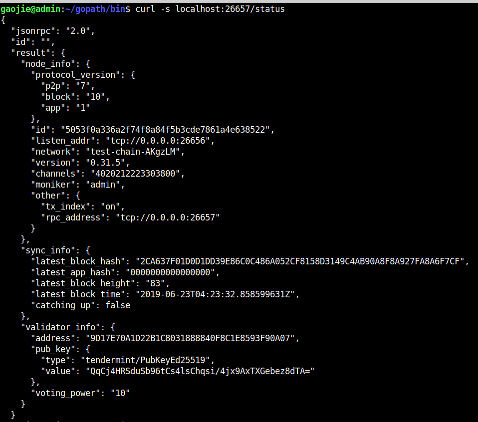

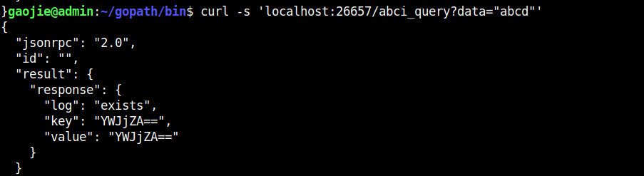

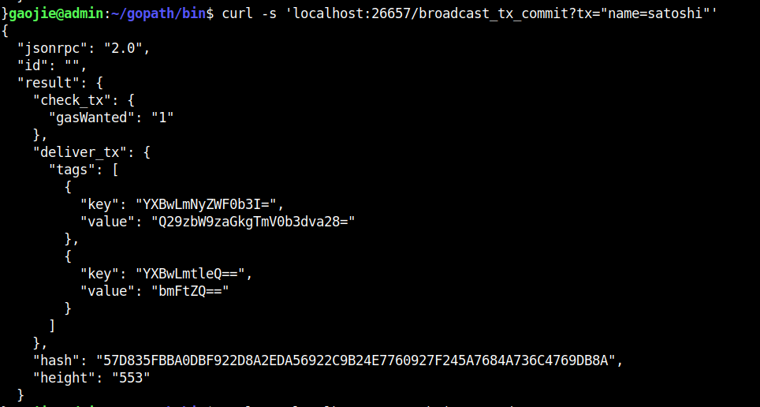

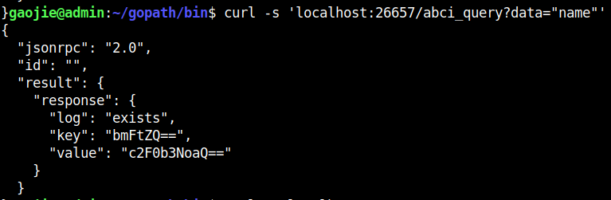

## Counter - Another Example
------------------------------------------------------------------------------------------------------------------------------------------------------

Now that we've got the hang of it, let's try another application, the `counter` app.

现在我们已经掌握了它，让我们尝试另外一个应用程序，计数器`counter `app

The counter app doesn't use a Merkle tree, it just counts how many times we've sent a transaction, or committed the state.

计数器app不使用Merkle tree，它仅仅计算我们发送交易或者提交状态的次数。

This application has two modes: `serial=off` and `serial=on`.

When `serial=on`, transactions must be a big-endian encoded incrementing integer, starting at 0.

If `serial=off`, there are no restrictions on transactions.

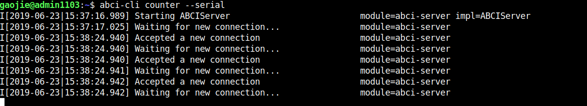

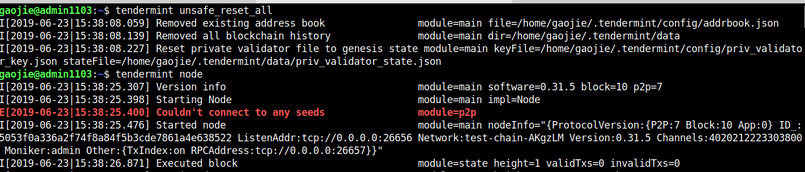

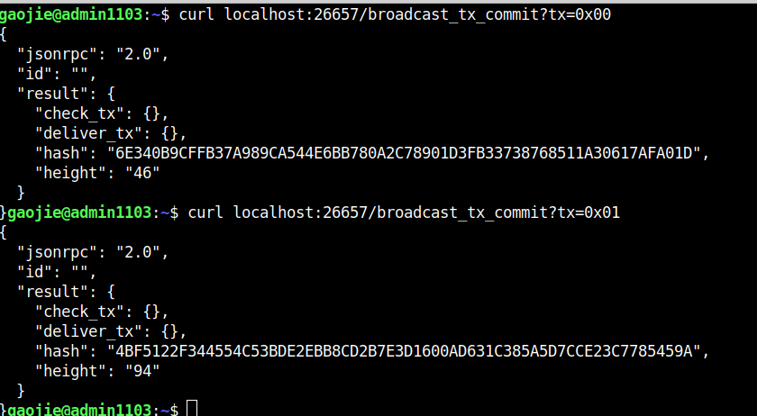

For more details on the `broadcast_tx` API, see the [guide on using Tendermint](https://tendermint.com/docs/tendermint-core/using-tendermint.html).

## CounterJS - Example in Another Language

We also want to run applications in another language - in this case, we'll run a Javascript version of the `counter`. To run it, you'll need to `install node`.

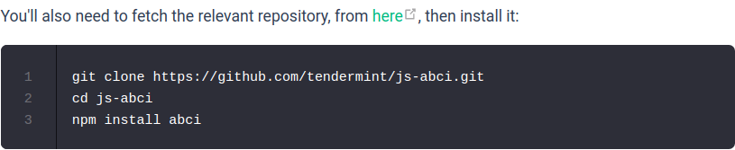

cnpm install安装依赖包

cnpm install abci 安装abci

node example/counter.js 开启node服务端

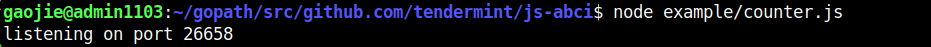

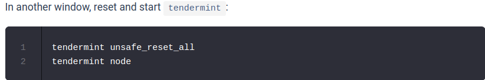

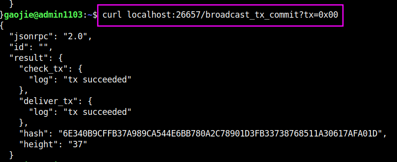

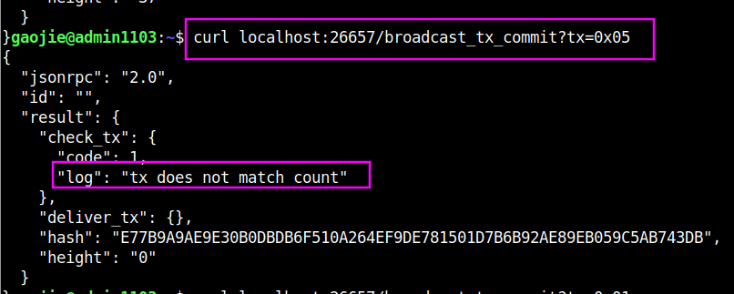

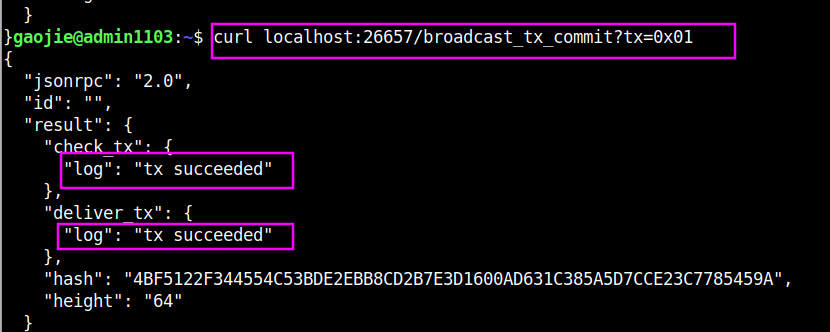

### 以上所有的example都在tendermint/abci/example目录下，js的的example是单独下载的。

### 现在只是把命令给操作了一遍，具体的代码执行逻辑还不明白，这需要仔细看代码。

