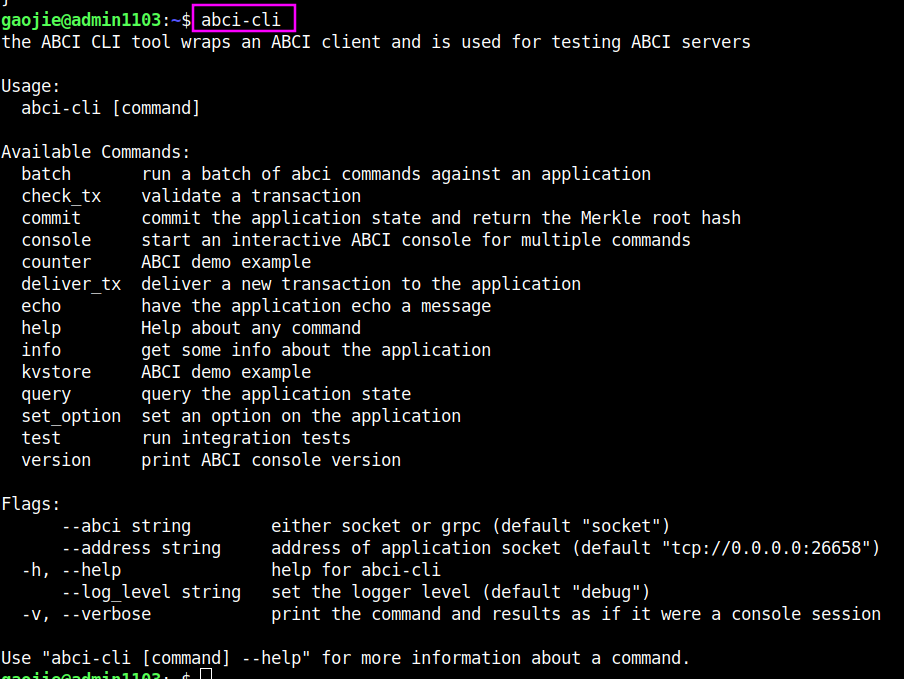
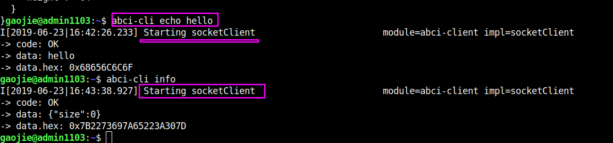
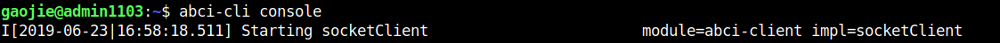

# Using ABCI-CLI

To facilitate testing and debugging of ABCI servers and simple apps, we built a CLI, the `abci-cli`, for sending ABCI messages from the command line.

为了满足测试和调试ABCI服务端和简单的应用程序，我们构建了一个CLI,叫作`abci-cli`，为了从命令行发送ABCI信息。

Now run `abci-cli `to see the list of commands:



## KVStore - First Example

The `abci-cli` tool lets us send ABCI messages to our application, to help build and debug them.

`abci-cli`工具让我们发送ABCI信息给我们的应用程序，帮助构建和调式它们。

The most important messages are `deliver_tx`, `check_tx`, and `commit`, but there are others for convenience, configuration, and information purposes.

最重要的信息是`deliver_tx`, `check_tx`, and `commit`，但出于方便，配置和信息的目的，还有其他一些。

We'll start a kvstore application, which was installed at the same time as `abci-cli` above. The kvstore just stores transactions in a merkle tree.

我们将会开启一个`kvstore`的应用程序，同时`abci-cli`要被安装，这个`kvstore`仅仅在一个merkle tree存储交易。




#### An ABCI application must provide two things:
- a socket server
- a handler for ABCI messages

------------------------------------------------------------------------------------------------------------------------------

When we run the `abci-cli` tool we open a new connection to the application's socket server, send the given ABCI message, and wait for a response.

当我们运行`abci-cli`工具打开一个新的对应用程序的socket server连接，我们可以发送ABCI信息，等待响应。

The server may be generic for a particular language, and we provide a [reference implementation in Golang](https://github.com/tendermint/tendermint/tree/develop/abci/server). See the [list of other ABCI implementations](https://tendermint.com/docs/app-dev/ecosystem.html) for servers in other languages.

对于一个指定的语言，服务端是通用的，我们提供了一个Go语言的的参考实现。可以看更多的服务端用其他语言的ABCI实现列表。

The handler is specific to the application, and may be arbitrary, so long as it is deterministic and conforms to the ABCI interface specification.

处理器对于应用程序来说是指定的，也可以是任意的，只要它是确定的，并且符合ABCI接口规范。

So when we run `abci-cli info`, we open a new connection to the ABCI server, which calls the `Info()` method on the application, which tells us the number of transactions in our Merkle tree.

因此，我们运行`abci-cli info`，我们代开一个新的连接到ABCI服务，回调在应用程序上的`Info()`方法，告诉我们在我们的 Merkle tree上交易的数量。

Now, since every command opens a new connection, we provide the `abci-cli console` and `abci-cli batch` commands, to allow multiple ABCI messages to be sent over a single connection.

现在，每一个命令都会打开一个新的连接，我们提供了`abci-cli console` and `abci-cli batch`命令，允许在一个单一的连接中发送多个ABCI信息。

Running `abci-cli console` should drop you in an interactive console for speaking ABCI messages to your application.

Try running these commands:



```sh

> echo hello
-> code: OK
-> data: hello
-> data.hex: 0x68656C6C6F

> info
-> code: OK
-> data: {"size":0}
-> data.hex: 0x7B2273697A65223A307D

> commit
-> code: OK
-> data.hex: 0x0000000000000000
> deliver_tx "abc"
-> code: OK

> info
-> code: OK
-> data: {"size":1}
-> data.hex: 0x7B2273697A65223A317D

> commit
-> code: OK
-> data.hex: 0x0200000000000000

> query "abc"
-> code: OK
-> log: exists
-> height: 0
-> key: abc
-> key.hex: 616263
-> value: abc
-> value.hex: 616263

> deliver_tx "def=xyz"
-> code: OK
> commit
-> code: OK
-> data.hex: 0x0400000000000000

> query "def"
-> code: OK
-> log: exists
-> height: 0
-> key: def
-> key.hex: 646566
-> value: xyz
-> value.hex: 78797A

> check_tx "def"
-> code: OK
>

```

Note that if we do `deliver_tx` `"abc"` it will store (`abc`, `abc`), but if we do `deliver_tx`` "abc=efg"` it will store (`abc`,` efg`).

Similarly, you could put the commands in a file and run `abci-cli --verbose batch < myfile`.

相似的，你也可以把命令放到一个文件中，然后运行`abci-cli --verbose batch < myfile`.

## Counter - Another Example


This is a very simple application, but between `counter` and `kvstore`, its easy to see how you can build out arbitrary application states on top of the ABCI. [Hyperledger's Burrow](https://github.com/hyperledger/burrow) also runs atop ABCI, bringing with it Ethereum-like accounts, the Ethereum virtual-machine, Monax's permissioning scheme, and native contracts extensions.

这是一个非常简单的应用程序，但是在`counter` and `kvstore`之间，很容易看出你是如何在ABCI之上构建任意的应用程序状态。`Hyperledger's Burrow`也运行在ABCI之上，使用了类似以太坊的账户，以太坊虚拟机，Monax's的权限机制，和原生的合约扩展。

But the ultimate flexibility comes from being able to write the application easily in any language.

但是最终的适应性是能够用任何语言轻松地写应用程序


## Bounties

