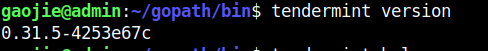
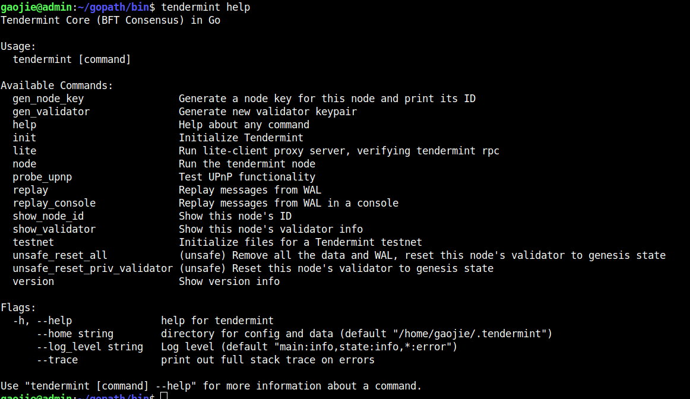

# Tendermint BFT engine
 - https://github.com/tendermint/tendermint

# Tendermint Documentation
- https://tendermint.com/docs/introduction/what-is-tendermint.html

---------------------------------------------------------------------------------------------------------------------------------------------------------------------------------------------------------------------------

# Tendermint 安装

https://github.com/tendermint/tendermint/blob/master/docs/introduction/install.md

### Get Source Code

```
mkdir -p $GOPATH/src/github.com/tendermint
cd $GOPATH/src/github.com/tendermint
git clone https://github.com/tendermint/tendermint.git
cd tendermint
```
### Get Tools & Dependencies

以下两个命令，都是开启了终端代理，下载的很顺利，没有出现缺少依赖包的问题

```
新版本没有了
make get_tools
make get_vendor_deps
```

### Compile

make install 把Tendermint编译后得到的二进制文件安装到$GOPATH/bin目录下

```
make install
```

### 验证

```
tendermint version
```


### 查看使用帮助



### 如果没有开启代理，那么会出现各种缺少依赖包的错误，可以参考下面的文章解决：

https://blog.csdn.net/u014454538/article/details/89668309

```
gaojie@admin:~/gopath/src/github.com/tendermint/tendermint$ make get_tools
--> Installing tools
./scripts/get_tools.sh
--> Installing golang/dep (22125cfaa6ddc71e145b1535d4b7ee9744fefff2)...
Cloning into 'golang/dep'...
remote: Enumerating objects: 19, done.
remote: Counting objects: 100% (19/19), done.
remote: Compressing objects: 100% (15/15), done.
remote: Total 20995 (delta 4), reused 11 (delta 4), pack-reused 20976
Receiving objects: 100% (20995/20995), 12.23 MiB | 3.09 MiB/s, done.
Resolving deltas: 100% (12474/12474), done.
~/gopath/src/github.com/golang/dep ~/gopath/src/github.com
/home/gaojie/gopath/src/github.com/golang/dep
~/gopath/src/github.com
--> Done

--> Installing gogo/protobuf (61dbc136cf5d2f08d68a011382652244990a53a9)...
~/gopath/src/github.com/gogo/protobuf ~/gopath/src/github.com
/home/gaojie/gopath/src/github.com/gogo/protobuf
~/gopath/src/github.com
--> Done

--> Installing square/certstrap (e27060a3643e814151e65b9807b6b06d169580a7)...
Cloning into 'square/certstrap'...
remote: Enumerating objects: 12, done.
remote: Counting objects: 100% (12/12), done.
remote: Compressing objects: 100% (11/11), done.
remote: Total 1418 (delta 3), reused 5 (delta 1), pack-reused 1406
Receiving objects: 100% (1418/1418), 2.97 MiB | 1.42 MiB/s, done.
Resolving deltas: 100% (535/535), done.
~/gopath/src/github.com/square/certstrap ~/gopath/src/github.com
/home/gaojie/gopath/src/github.com/square/certstrap
~/gopath/src/github.com
--> Done

--> Installing mitchellh/gox (51ed453898ca5579fea9ad1f08dff6b121d9f2e8)...
Cloning into 'mitchellh/gox'...
remote: Enumerating objects: 5, done.
remote: Counting objects: 100% (5/5), done.
remote: Compressing objects: 100% (5/5), done.
remote: Total 394 (delta 0), reused 2 (delta 0), pack-reused 389
Receiving objects: 100% (394/394), 112.66 KiB | 257.00 KiB/s, done.
Resolving deltas: 100% (208/208), done.
~/gopath/src/github.com/mitchellh/gox ~/gopath/src/github.com
/home/gaojie/gopath/src/github.com/mitchellh/gox
~/gopath/src/github.com
--> Done

--> Installing golangci/golangci-lint (7b2421d55194c9dc385eff7720a037aa9244ca3c)...
Cloning into 'golangci/golangci-lint'...
remote: Enumerating objects: 134, done.
remote: Counting objects: 100% (134/134), done.
remote: Compressing objects: 100% (99/99), done.
remote: Total 7302 (delta 41), reused 64 (delta 29), pack-reused 7168
Receiving objects: 100% (7302/7302), 6.10 MiB | 2.34 MiB/s, done.
Resolving deltas: 100% (3932/3932), done.
~/gopath/src/github.com/golangci/golangci-lint ~/gopath/src/github.com
/home/gaojie/gopath/src/github.com/golangci/golangci-lint
~/gopath/src/github.com
--> Done

--> Installing petermattis/goid (b0b1615b78e5ee59739545bb38426383b2cda4c9)...
Cloning into 'petermattis/goid'...
remote: Enumerating objects: 119, done.
remote: Total 119 (delta 0), reused 0 (delta 0), pack-reused 119
Receiving objects: 100% (119/119), 26.28 KiB | 143.00 KiB/s, done.
Resolving deltas: 100% (67/67), done.
~/gopath/src/github.com/petermattis/goid ~/gopath/src/github.com
/home/gaojie/gopath/src/github.com/petermattis/goid
~/gopath/src/github.com
--> Done

--> Installing sasha-s/go-deadlock (d68e2bc52ae3291765881b9056f2c1527f245f1e)...
Cloning into 'sasha-s/go-deadlock'...
remote: Enumerating objects: 20, done.
remote: Counting objects: 100% (20/20), done.
remote: Compressing objects: 100% (14/14), done.
remote: Total 159 (delta 8), reused 15 (delta 6), pack-reused 139
Receiving objects: 100% (159/159), 43.07 KiB | 364.00 KiB/s, done.
Resolving deltas: 100% (87/87), done.
~/gopath/src/github.com/sasha-s/go-deadlock ~/gopath/src/github.com
/home/gaojie/gopath/src/github.com/sasha-s/go-deadlock
~/gopath/src/github.com
--> Done

gaojie@admin:~/gopath/src/github.com/tendermint/tendermint$ make get_vendor_deps
--> Running dep

gaojie@admin:~/gopath/src/github.com/tendermint/tendermint$ make install
CGO_ENABLED=0 go install  -ldflags "-X github.com/tendermint/tendermint/version.GitCommit=`git rev-parse --short=8 HEAD`" -tags 'tendermint' ./cmd/tendermint

```

