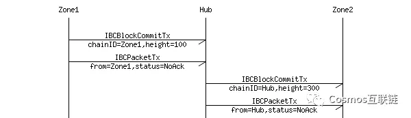

# 白皮书学习

## Tendermint

### 验证人

在经典拜占庭容错（BFT）算法中，每个节点都同样重要。在Tendermint网络里，节点的投票权不能为负，而拥有投票权的节点被称作"验证人"。验证人通过传播加密签名或选票，来参与共识协议并商定下一区块。

**验证人的投票权是一开始就确定好的，或者根据应用程序由区块链来决定是否有改变**。比如，**在Cosmos中心这种权益证明类应用程序中**，**投票权可能就是通过绑定为保证金的代币数量来确定的**。

注意：**像⅔和⅓这样的分数指的是占总投票权的分数，而不是总验证人**，除非所有验证人拥有相同币种。而+⅔ 的意思是"超过⅔ "，⅓+则是"⅓或者更多"的意思。

### 轻客户端

Tendermint共识算法的主要好处就是它**具有安全简易的轻客戸端**，**这一点使其成为手机和物联网用例的理想工具**。比特币轻客户端必须同步运行区块头组成的链，并且找到工作量证明最多的那一条，而**Tendermint轻客戸端只需和验证组的变化保持一致，然后简单地验证最新区块中预先提交的+⅔，来确定最新情况**。

**这种简单的轻客戸端证明机制也可以实现区块链之间的通信**。

### 防止攻击

Tendermint有各种各样的防御措施来防止攻击，比如远程无利害关系，双重花费及 审查制度。

### TMSP

**Tendermint共识算法是在叫做Tendermint Core的程序中实现的**。**这个程序是一种与应用程序无关的"共识引擎"**，可以让任何命中注定的黑匣子软件变为分散复制的区块链。就像Apache网页服务器或者Nginx是通过通用网关接口（CGI）或快速通用网关接口（FastCGI）来连接Wordpress（一款博客系统）应用程序一样，**Tendermint Core通过Tendermint Socket Proposal（TMSP）来连接区块链应用程序**。因此，**TMSP允许区块链应用程序用任何语言进行编程**，**而不仅仅是共识引擎写入的程序语言**。此外，**TMSP也让交换任何现有区块链堆栈的共识层成为可能**。

我们将其与知名加密货币比特币进行了类比。在比特币这种加密币区块链中，每个节点都维持着完整的审核过的UTXO（未使用交易输出）数据库。如果您想要在TMSP基础上，创建出类似比特币的系统，那么Tendermint Core可以做到：

在节点间共享区块及交易

创建规范或不可改变的交易顺序（区块链）

同时，TMSP应用程序会负责：

维护UTXO数据库

验证交易的加密签名

防止出现不存在的交易花费

允许客户访问UTXO数据库

Tendermint能够通过为应用程序与共识的形成过程，提供简单的应用程序界面（API），来分解区块设计。

## Cosmos概述

**Cosmos是一种独立平行的区块链网络，其中每条区块链通过Tendermint 这样的经典拜占庭容错共识算法来运行**。

**网络中第一条区块链将会是Cosmos中心**。**Cosmos中心通过全新区块链间通信协议来连接其他众多区块链（或将其称之为空间）**。**中心可以追踪无数代币种类，并且在各个连接的空间里记录代币总数**。**代币可以安全快速地从一个空间传递到另一个空间，两者之间无需体现汇兑流动性，因为所有空间之间的代币传输都会经过Cosmos中心**。

**这一架构解决了当今区块链领域面临的许多问题，包括应用程序互操作性、可扩展性、以及无缝更新性**。比如，从Bitcoind、Go-Ethereum、CryptoNote、ZCash或其他区块链系统中衍生出来的空间，都可以接入Cosmos中心。这些空间允许Cosmos实现无限扩展，从而满足全球交易的需求。此外，空间也完全适用于分布式交易所，反之交易所也支持空间运行。

Cosmos不仅仅是单一的分布式账本，而Cosmos中心也不是封闭式花园或宇宙中心。我们正在为分布式账本的开放网络设计一套协议，这套协议会按照加密学、稳健经济学、共识理论、透明性及可追究制的原则，成为未来金融系统的全新基础。

### Tendermint拜占庭容错股份授权证明机制(Tendermint-BFT DPoS)

Cosmos中心是Cosmos网络中第一个公共区块链，通过Tendermint拜占庭共识算法运行。这个Tendermint开源项目于2014年开始，旨在解决比特币工作量证明算法的速度、可扩展性以及环境问题。通过采用并提高已经过验证的拜占庭算法（1988年在麻省理工学院开发），Tendermint成为了首个在概念上演示加密货币权益证明的团队，这种机制可以解决NXT和BitShares这些第一代权益证明加密币面临的"无利害关系"（nothing-at-stake）的问题。

如今，实际上所有比特币移动钱包都要**使用可靠的服务器来进行交易验证**。这是因为工作量证明机制需要在交易被认定为无法逆转前进行多次确认。而在CoinBase之类的服务中也已经出现重复花费攻击。

和其他区块链共识系统不同，**Tendermint提供的是即时、可证明安全的移动客户端支付验证方式**。因为Tendermint的设计**完全不支持分叉**，所以**移动钱包就可以实时接收交易确认**，**从而在智能手机上真正实现去信任的支付方式**。这一点也大大影响了物联网应用程序。

Cosmos中的验证人（其扮演的角色类似比特币矿工，但是与之不同的是，**他们采用加密签名来进行投票**）必须是专门用来提交区块的安全机器。非验证人可以将权益代币（也叫做"atom"）委托给任何验证人来赚取一定的区块费用以及atom奖励，但是如果验证人被黑客攻击或者违反协议规定，那么就会面临被惩罚（削减）的风险。Tendermint拜占庭共识的**可证明安全机制**，以及利益相关方（验证人和委托人）的抵押品保证，**为节点甚至是轻客户端提供了可证明、可计量的安全性**。

## 管理

**分布式公共账本应该要有一套章程与管理体系**。比特币依靠比特币基金会（在一定程度上）及挖矿来协调更新，但是这个过程很缓慢。以太坊在采用硬分叉措施解决The DAO黑客事件后，分裂成了ETH和ETC，这主要是因为之前设定社会契约或机制来进行这类决定。

**Cosmos中心的验证人与委托人可以对提案进行投票，从而自动改变预先设置好的系统参数（比如区块容量限制），协调更新，并对人们看得懂的章程进行修订投票，从而管理Cosmos中心**。这个章程允许权益相关者聚集到一起，来解决盗窃及漏洞等相关问题（比如The DAO事件），并快速得出明确的解决方案。

**每个空间也具备自己的一套章程及管理机制**。比如，Cosmos中心的章程会强制实现中心的不可改变性（不能重新执行，除了Cosmos中心节点实现的漏洞），而每个空间则可自行设置与盗窃及漏洞相关的重新执行政策。

**Cosmos网络能够在政策不同的区块间实现互操作性**，这一点可以让客户在无需许可的环境下进行实验，为客户带去了终极自由及潜力。

## 中心（Hub）

**Cosmos中心区块链承载的是多资产分布式账本，其中代币可以由个体用户或空间本身持有**。这些代币能够通过特殊的IBC包裹，即"代币包"（coin packet）从一个空间转移到另一个空间。**中心负责保持空间中各类代币全球总量不变**。IBC代币包交易必须由发送人、中心及接收人的区块链执行。

因为Cosmos中心在整个系统中**扮演着中央代币账本的角色**，其安全性极其重要。虽然每个空间可能都是一个Tendermint区块链——只需通过4个，或者在无需拜占庭容错共识的情况下更少的验证人来保证安全，但是**Cosmos中心必须通过全球去中心化验证组来保证安全**，**而且这个验证组要能够承受最严重的攻击，比如大陆网络分割或者由国家发起的攻击**。

## 空间（Zones）

**Cosmos空间是独立的区块链**，能够和Cosmos中心进行IBC信息交换。从Cosmos中心的角度看，空间是一种多资产、多签名的动态会员制账户，**它可以通过IBC包裹进行代币发送与接收**。就像加密币账户一样，空间不能转移超出其持有量的代币，不过可以从其他拥有代币的人那里接收代币。空间可能会被指定为一种或多种代币的"来源"，从而赋予其增加代币供应量的权力。

Cosmos中心的Atom或可作为空间（连接到中心）验证人的筹码。虽然在Tendermint分叉责任制下，空间出现重复花费攻击会导致atom数量减少，但是如果空间中有超过⅔的选票都出现拜占庭问题的话，那这个空间就可以提交无效状态。Cosmos中心不会验证或执行提交到其他空间的交易，因此将代币传送到可靠空间就是用户的责任了。未来Cosmos中心的管理系统可能会通过改善提案，来解决空间故障问题。比如，在检测到袭击时，可以将有些空间（或全部空间）发起的代币转移输出压制下来，实现紧急断路（即暂时中止代币转移）。

## 区块链间通信（IBC）

现在我们来介绍下中心与空间之前通信的方法。假如现在有三个区块链，分别是"空间1"、“空间2"以及"中心”，我们想要"空间1"生成一个包裹，通过"中心"发送给"空间2"。**为了让包裹从一个区块链转移到另一个区块链，需要在接收方区块链上发布一个证明，来明确发送方已经发起了一个包裹到指定地点。接收方要验证的这个证明，必须和发送方区块头保持一致**。这种机制就类似与侧链采用的机制，它需要两个相互作用的链，通过双向传送存在证明数据元（交易），来"知晓"另一方的情况。

IBC协议可以自然定义为两种交易的使用：一种是IBCBlockCommitTx 交易，这种交易可以让区块链向任何观察员证明其最新区块哈希值；另一种是IBCPacketTx 交易，这种交易则可以证明某个包裹确实由发送者的应用程序，通过梅克尔证明机制（Merkle-proof）传送到了最新区块的哈希值上。

通过将IBC机制分裂成两个单独的交易，即IBCBlockCommitTx 交易与IBCPacketTx交易，我们可以让接收链的本地费用市场机制，来决定承认哪个包裹，与此同时还能确保发送方的完全自由，让其自行决定能够传出的包裹数量。

在上述案例中，为了更新"中心"上"空间1"的区块哈希（或者说"空间2"上"中心"的区块哈希），必须将IBCBlockCommitTx交易的"空间1"区块哈希值发布到"中心"上（或者将该交易的"中心"区块哈希值发布到"空间2"中）。

## 用例

### 分布式交易所

比特币借助批量复制的分布式账本技术来保证安全，同样的，我们也可以用这种方式，在区块链上运行，**从而降低交易所受内外部攻击的可能性**。我们称之为**分布式交易所**。

如今，加密币社区认为去中心化交易所是基于"原子交叉链"交易（AXC交易）的交易所。通过这类交易，不同链上的两位用户可以发起两笔传输交易，要么在两个账本上一起执行，要么两个账本都不执行（即原子级）。比如，两位用户可以通过AXC交易来进行比特币和以太币之间的交易（或不同账本上的任意两种代币），即使比特币和以太坊之间并没有相互连接。在AXC交易模式下的交易所，其好处在于用户双方都不需要相信彼此，也不用相信交易匹配服务。**其坏处就是，双方都得在线才能进行交易**。

另一种去中心化交易所是**在交易所的区块链上运行批量复制的分布式账本**。**这种交易所的用户可以提交一份限价订单，在关机状态下执行交易**。**区块链会代表交易者匹配并完成交易**。

**去中心化交易所可以创建一份大范围限价订单簿，以此来吸引其他交易者**。在交易所界，流动性需求越来越高，因此交易所业务界的网络效应也愈发强烈（或者说至少产生了"胜者得益"效应）。目前加密币交易所排名第一的是Poloniex，其24小时交易额为2000万美元，而Bitfinex以24小时500万位列第二。在这种强大的网络效应背景下，基于AXC的去中心化交易所的交易额是不可能超过中心化交易所的。**去中心化交易所要想和中心化交易所一争高下，那么就需要支持大范围限价订单簿的运行。而只有基于区块链的去中心化交易所可以实现这一点**。

**Tendermint的快速交易执行是另一大优势**。**Cosmos的空间可以在不牺牲一致性的前提下，通过优先完善快速交易，来实现交易的快速完成——针对双向订单交易，及IBC（跨区块链通信）代币与其他空间的交易**。

根据如今加密币交易所的情况，Cosmos的一项重大应用就是分布式交易所（也就是Cosmos DEX）。其交易吞吐能力及提交延时情况可以和那些中心化交易所媲美。**交易者可以在离线的状态下提交限价订单**。并且，**在Tendermint，Cosmos中心以及IBC的应用下，交易者可以快速地完成资金在交易所及其他空间的转出转入**。

### 和其他加密货币挂钩(不明白)

享有特权的空间可以作为和其他加密货币挂钩的代币来源。这种挂钩类似Cosmos中心与空间之间的关系，两者都必须及时更新彼此最新的区块链，从而验证代币已经从一方转移到另一方的证明。Cosmos网络上挂钩的空间要和中心以及其他加密货币保持一致。这种间接挂钩的空间可以维持简单的中心逻辑，并且不用了解其他区块链共识战略（比如比特币工作量证明挖矿机制）。

比如，设置有特定验证组的Cosmos空间（可能和中心里的验证组一样）可以作为与以太币挂钩的空间，其中基于Tendermint Socket协议（TMSP）的应用（即"挂钩空间"里的）有办法和外部以太坊区块链上的（即"起始点"）挂钩合约交换IBC信息。通过这一合约，持币人可以先将以太币发送到以太坊的挂钩合约中，然后再将以太币传送到挂钩空间。挂钩合约接收到以太币后，除非同时从挂钩空间处接收到正确的IBC包裹，否则这些以太币是无法提取的。而当挂钩空间接收到IBC包裹，并证明以太币已被特定以太坊账户的挂钩合约接收后，挂钩空间就会生成存有余额的相关账户。之后，挂钩空间上的以太币（即"已挂钩的以太币"）就可以转进或转出中心了，完成传送到特定以太坊提取地址的交易后，再彻底删除。IBC包裹可以证明挂钩空间上的交易，这个包裹可以公布到以太坊挂钩合约中，来开放以太币的提取权。

当然，这类挂钩合约也存在风险，比如会出现恶劣的验证组。如果拜占庭投票权超过⅓，就会造成分叉，即从以太坊挂钩合约中提取以太币的同时，还能保持挂钩空间中的挂钩以太币不变。更有甚者，如果拜占庭投票权超过⅔，可能会有人直接对将以太币发送到挂钩合约中（通过脱离原始挂钩空间的挂钩逻辑）的人下手，盗取他们的以太币。

如果将这个挂钩方法完全设计成责任制，那么就有可能解决这一问题。比如，中心及起始点的全部IBC包裹可能需要先通过挂钩空间的认可，即让中心或起始点中的钩挂合约对挂钩空间的所有状态转变进行有效验证。中心及起始点要允许挂钩空间的验证人提供抵押品，而挂钩合约的代币转出需要有所延迟（并且抵押品解绑时间也要足够长），从而让单独的审计人有时间发起挑战。我们会以未来Cosmos改善提议的形式公开这一系统的设计说明及实现方式，以待Cosmos中心的管理系统审批通过。

虽然现在的社会政治环境还不够成熟，不过我们可以做一些延伸，比如让负责国家国币的一些机构（尤其是其银行）组成一个验证组，来实现空间同国家法定货币的挂钩。当然这必须布置好额外的预防措施，只接受法律系统下的货币，从而加强可靠的公证人或大型机构对银行活动的审计。

这一整合或可让空间中所有拥有银行账户的人，将自己银行账户里的美元传输到空间账户中，或者完整的转入中心或其他空间里。

这么看来，Cosmos中心就是法定货币和加密货币无缝对接的导管，从而解决困扰交易所至今的交互局限问题。

### 缓解网络分区问题

有人认为像Tendermint这种支持一致性的共识算法有一个重大问题，**那就是网络分割会导致没有一个分区拥有超过⅔的投票权**（比如超过⅓在线下），**而任何这类网络分割都将中止整个共识**。而Cosmos架构可以缓解这个问题，它可以**使用全球中心**，但是**空间实行地区自治**，然后**让每个空间的投票权按照正常的地理位置进行分布**。比如，**某个一般范例就有可能是针对个别城市或地区的，让他们在运行自己空间的同时，还能共享共同的中心（比如Cosmos中心），并且可以在因网络分区导致的中断期间，继续维持地区自治活动**。请注意，这样一来在设计稳健的**联邦式容错系统**过程中，**就可以真正地去考虑地理、政治及网络拓扑的特征了**。

### 联邦式名称解析系统

NameCoin是首批试图通过比特币区块链解决名称解析问题的区块链之一。不幸的是，这个方案存在一些不足。

比如，我们可以通过Namecoin来验证_@satoshi_（中本聪）这个号是在过去某个时间点用特定公钥进行注册的。但是，该公钥是否更新过我们就不得而知了，除非将该名称最后一次更新以来的全部区块都下载下来。这一点是因为比特币UTXO交易模式中梅克尔式模型的局限性所导致的，这类模型中只有交易（而非可变的应用程序状态）会以梅克尔形式加入到区块哈希中。它会让我们证明之后名称更新的存在，而非不存在。因此，我们必须依靠完整节点才能明确这个名称的最近价值，否则就要投入巨大成本来下载整个区块链。

即使在NameCoin运用了默克尔化的搜索树，其工作量证明的独立性还是会导致轻客戸端的验证出现问题。轻客戸端必须下载区块链中所有区块头的完整复件（或者至少是自其最后的名称更新后的所有区块头）。这意味着带宽需要会随着时间直线扩展。此外，在工作量证明制区块链上的名称更改需要等额外的工作量证明验证区块才能进行，这个在比特币上可能要花上一个小时。

有了Tendermint，我们只需用到由法定数量验证人签署（通过投票权）的区块哈希，以及与名称相关的当前价值的默克尔证明。这点让简易、快速、安全的轻客戸端名称价值验证成为可能。

在Cosmos中，我们可以借助这个概念对其进行延伸。Cosmos中的每个名称注册空间都能有一个相关的最高级别域名（TLD），比如".com"或者".org"等，每个名称注册空间都有其本身的管理和登记规则。

## 发行与激励

### Atom代币

**Cosmos Hub（Cosmos中心）是多资产分布式账本，不过它也有本地代币，叫做Atom**。**Atom是Cosmos Hub唯一的权益代币**。Atom是持有人投票、验证或委托给其他验证人的许可证，就像以太坊的以太币一样，**Atom也可以用来支付交易费以减少电子垃圾**。**额外的通胀Atom和区块交易费用就作为验证人及委托人（委托给其他验证人）的奖励**。

**BurnAtomTx交易可以用来恢复储蓄池中任意比例的代币。**

### 众筹

创世块上的Atom代币及验证人的初次分布会是Cosmos 众销资助人占75%，预售资助人5%，Cosmos公司占20%。**从创世块开始，总Atom总量的1/3将作为奖励发放给每年绑定的验证人以及委托人。**

### 归属

**为了防止那些炒股诈骗的投机者借众筹来进行短期牟利，创世块的Atom必须有所归属才能用于转移**。每个账户将在为期两年的时间里以每小时恒速授予Atom，这个速率由创世块Atom总量除以(2 * 365 * 24)小时得出。**通胀区块获得的Atom奖励是预先授予的，可以立即进行转移**，**因此第一年绑定的验证人及委托人可以挣取比其创世块Atom一半还多的奖励**。

### 验证人的数量上限

Tendermint区块链和比特币之类的工作量证明区块链不同，由于通信复杂度提升，验证人增加，所以速度会更慢。所幸的是，我们**可以支持足够多的验证人来实现全球稳健的分布式区块链，使其拥有较短交易验证时间**，**此外，在提升带宽、内存以及平行电脑计算能力的提升下，在未来支持更多验证人的参与。**

**在创世块诞生那天，验证人数量最多将设置为100，之后十年的增长率将在13%，最终达到300位验证人。**

Year 0: 100
Year 1: 113
Year 2: 127
Year 3: 144
Year 4: 163
Year 5: 184
Year 6: 208
Year 7: 235
Year 8: 265
Year 9: 300
Year 10: 300
...

### 成为创世日后首个验证人

**如果Atom持有人还没有成为验证人，那么可以通过签署提交BondTx交易来成为验证人，其中作为抵押品的Atom数量不能为零**。任何人在任何时候都可以作为验证人，除非当前验证组的数量超过了最大值。这样的话，除非Atom数量比最小验证人持有的有效Atom（包括受委托的Atom）还要多，那么交易才算有效。如果新验证人通过这种方式取代了现有验证人，那么现有验证人就被中止活动，所有Atom和受委托的Atom都会进入解绑状态。

### 针对验证人的惩罚

**针对验证人必须有一定的惩罚机制，防止他们有意无意地偏离已批准的协议**。有些证据可以立即采纳，比如在同样高度和回合的双重签名，或者违反"预投票锁定"的（这一规则在Tendermint共识协议中有列出）。这类证据将导致验证人损失良好信誉，而且其绑定的Atom还有储备池内一定比例的代币份额——合起来称作其"权益"——也会减少。

有时因为地区网络中断、电力故障或者其他原因，验证人会无法连通。如果在过去随便什么时间点的ValidatorTimeoutWindow 区块中，验证人在区块链中提交的投票没有超过ValidatorTimeoutMaxAbsent次，那么验证人将会被中止活动，并且从权益中共损失一定的验证人超时罚款（ValidatorTimeoutPenalty ，默认为1%）。有些劣行表露的没那么明显，这样的话，验证人就可以在带外协调，强制叫停这类恶意验证人，如果有绝对多数制共识的话。

如果Cosmos中心因为超过⅓的投票权在线下合并而出现了中止情况，或者说超过⅓的投票权合并来审查进入区块链的恶意行为，这时候中心就必须借助**硬分叉重组协议来恢复**。

### 交易费用

Cosmos Hub验证人可以接受任何中共类的代币或组合作为处理交易的费用。每个验证人可以主观设置任意兑换率，并且选择它想要进行的交易，只要没有超过区块Gas限制（BlockGasLimit）。收集起来的费用减去下面列出的任意税费后，会再次根据权益相关人绑定的Atom比例进行分配，周期是就是每次验证人支付的时间（ValidatorPayoutPeriod，默认为1小时）。

在所有交易费用中，储存税（ReserveTax，默认为2%）将存入储备池来增加储备量，来提高Cosmos网络的安全性及价值。普通税（CommonsTax，默认为3%）合并到普通商品的资金中。这些资金将进入托管人地址（CustodianAddress）根据管理熊进行分配。将投票权委托给其他验证人的Atom持有人会支付一定佣金给委托方，而这笔费用可以由每个验证人进行设置。

### 激励黑客

Cosmos Hub的安全是一组函数，涉及底层验证人的安全以及委托人的委托选择。为了鼓励发现并及时报告缺陷，Cosmos Hub允许黑客通过ReportHackTx 交易来"邀功"，主要就是说明，“这个加点已被攻击，请将奖金发到这个地址”。通过这类功绩，验证人和委托人的行为将被中止，而黑客赏金地址可以收到每个人Atom中攻击奖励比率（HackRewardRatio，默认为5%）。而验证人必须通过使用备份密钥来恢复剩余的Atom。

为了防止这个特征被滥用于转移未授权的Atom，ReportHackTx（黑客报告交易）前后验证人和委托人手中的两类Atom的比例（授权的与未授权的）将保持不变，而黑客的赏金将包含未授权的Atom，如果有的话。

## 管理

**Cosmos Hub通过分布式组织来运行，这类组织要求有一套完备的管理机制，从而协调区块链上的各类变动，比如系统变量参数，以及软件更新、规章更改等。**

所有验证人对所有提案的投票负责。如果没能及时对提案做出投票，那么验证人就会在一段时间内自动失去活动权利，这段时间叫做缺席惩罚期（AbsenteeismPenaltyPeriod，默认为一周）。

委托人自动继承委托验证人的投票权。这一投票可能会被手动覆盖掉。而未绑定的Atom是没有投票权的。

每个提案都需要一定的保证金，即最低提案保证金（MinimumProposalDeposit ）代币，这个可以是代币组合也可以是更多代币包括Atom。对每一个提案，投票人可能会投票来取走保证金呢。如果超过一半的投票人选择取走保证金（比如，由于提案是垃圾信息之类），那么保证金就会进去储备池，除非有任何Atom被燃烧。

对于每一个提案，投票人可能会投以下选项：

- 同意

- 强烈同意

- 反对

- 强烈反对

- 弃权

决定采纳（或不采纳）提案需要严格的多数投"同意"或"强烈同意"（或者"反对"及"强烈反对"），但是超过1/3的人投"强烈反对"或"强烈支持"的话就可以否决大多数人的决定。如果大多数人的票都被否决，那么每个人都会得到惩罚，即损失否决惩罚费用块那一部分钱（ VetoPenaltyFeeBlocks，默认是一天的区块值 ，税费除外），而否决大多数决定的那一方也会受到额外的惩罚，即损失否决惩罚Atom（VetoPenaltyAtoms，默认为0.1%）。

### 参数改变提案

这里定义的任何参数都可以发生改变，主要在参数改变提案（ParameterChangeProposal）的接受范围内。

### 文本提案

所有其他提案，比如用来更新协议的提案，都会通过通用的文本提案（TextProposal）来协调。