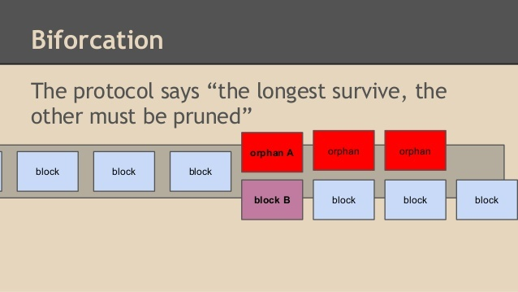

# 双花问题

https://www.odaily.com/post/5132236

**双花攻击究竟是什么呢？**双花，就是同一笔钱花了两次。

那么发生双花攻击，会有集中情况呢？

**１．51%攻击**

51%攻击，这种攻击是通过控制网络算力实现双花。如果攻击者控制了网络上50%以上的算力，那么在他控制算力的这段时间，他可以将区块逆转，进行反向交易，实现双花。

比如Bitcoin Gold发生的双花问题就属于51%攻击。控制者在控制Bitcon Gold网络上51%以上的算力，在控制算力期间，把一定数量的BTG发送给自己在交易所的钱包，这条分支我们命名为A。同时，他又把这些BTG发送给另一个自己控制的钱包，这条分支我们命名为分支B.

分支A上的交易被确认后，攻击者立马卖掉BTG,拿到现金。这时候分支A成为主链。然后，攻击者在分支B上进行挖矿，由于其控制了51%以上的算力，那么攻击者获得几张券的概率很大，于是很快，分支B的长度就超过了主链，也就是分支A的长度，那么分支B就会成为主链，分支A上的交易就会被回滚(回滚指的是程序或数据处理错误，将程序或数据回复到上一次正确的状态行为)。

也就是说，分支A恢复到攻击者发起第一笔交易之前的状态，攻击者之前换成现金的那些BTG又回到了自己手里。当然这些BTG就是交易所的损失了。最后，攻击者，把这些BTG发送到自己的另一个钱包。就这样攻击者凭借51%以上的算力控制，实现同一笔token的“双花”。

**2. 芬尼攻击（Finney attack）**

“Finney”的名称来源于Hal Finney，Hal Finney是第一个描述双花攻击之**0确认（未确认）交易**的人。芬尼攻击主要**通过控制区块的广播时间来实现双花**，攻击对象针对的是**接受0确认的商家**。

假设攻击者挖到了区块，在区块中，包含了一笔交易信息，即地址1向地址2转了一定数量的token，不过这两个地址都是攻击者的。但是攻击者并不广播这个区块，而是立即找到一个商家，用他的地址1，把这些token发给商家的地址3。

发给商家的交易广播出去后，如果这个商家接受0确认，攻击者就把他自己之前挖到的区块广播出去，这时候发给自己的交易就先于发给商家的交易。对于攻击者来说，通过控制区块的广播时间，就实现了同一笔token的“双花”。

一般来说，为了节省时间而接受0确认，特别是对于大额交易而言，是非常不安全的，而且**对于大额交易而言**，**多几次确认，将会降低交易被回滚的风险**。

**3.种族攻击 （Race attack）**

这种方式主要**通过控制矿工费来实现双花**。

比如，攻击者把一定数量的token发给一个商家，我们命名为分支A。如果商家接受0确认，那么攻击者就会再把这笔token发给自己的一个钱包，我们命名为分支B。

不过，攻击者在发给自己的这笔交易中，加了较高的矿工费，从而大大提高被矿工打包的概率（也可以说间接提高了攻击成功的概率）。如果攻击者发给自己的这笔交易被提前打包，这时候这笔交易就先于发给商家的交易，也就是分支B的长度超过分支A的长度，分支A上的交易就会被回滚。对于攻击者来说，通过控制矿工费，就实现了同一笔token的“双花”。

**4. Vector76攻击**

Vector76攻击，是**种族攻击和芬尼攻击的组合**，又称“一次确认攻击”，也就是交易即便有了一次确认，交易仍然可以回滚。

如果电子钱包满足以下几点，Vector76攻击就容易发生。这几点即**钱包接受一次确认就支付**；**钱包接受其它节点的直接连接**；**钱包使用静态IP地址的节点**。

**攻击者控制了两个全节点**，全节点A只是直接连接到电子钱包这个节点，全节点B与一个或多个运行良好的节点相连。

然后攻击者将同一笔token进行了两笔交易，一个是发给攻击者自己在这个钱包（接下来要被攻击的）上的地址，我们命名为交易1，另一个是发给攻击者自己的钱包地址，命名为交易2。但是攻击者给交易1的矿工费，要远大于交易2的矿工费。攻击者并没有把这两笔交易广播到网络中去。 

然后攻击者开始在交易1所在的分支上进行挖矿，这条分支我们命名为分支1。攻击者挖到区块后，并没有广播出去，而是同时做了两件事：在节点A上发送交易1，在节点B上发送交易2。

由于节点A只连接到电子钱包的节点，所以当电子钱包节点想把交易1传给其它对等节点时，连接了更多节点的节点B，已经把交易2广播给了网络中的大部分节点。于是，从概率上来讲，交易2就更有可能被网络认定为是有效的，交易1被认定为无效。

交易2被认为有效后，攻击者立即把自己之前在分支1上挖到的区块，广播到网络中。**这时候，这个接受一次确认就支付的钱包，会立马将token支付给攻击者的钱包账户。然后攻击者立马卖掉token，拿到现金**。

由于分支2连接的更多节点，所以矿工在这个分支上挖出了另一个区块，也就是分支2的链长大于分支1的链长。于是，分支1上的交易就会回滚，钱包之前支付给攻击者的交易信息就会被清除，但是攻击者早已经取款，实现了双花。

**5. 替代历史攻击（Alternative history attack）**

如果商家在等待交易确认，alternative history attack就有机会发生，当然，**这需要攻击者有较高的算力**，对于攻击者来说，会有浪费大量电力的风险。

攻击者把一定数量的token发给一个商家，我们命名为分支A。同时攻击者又把这笔token发给自己的一个钱包，我们命名为分支B。在商家等待确认的时候，攻击者在分支B上进行挖矿。

商家在等待了N次确认后，向攻击者发送了商品。但是如果攻击者凭借高哈希率，挖到了N个以上的区块，那么，分支B的长度就超过分支A，分支A的交易就会被回滚，攻击者实现双花。如果攻击者挖到的区块数量没有超过N个，那么攻击失败。

Alternative history attack能够攻击成功的可能性在于两方面，**一个是攻击者的算力在网络中的比例大小**，**另一个是商家等待的确认次数**。[比如，攻击者控制了网络中10%的算力，如果商家等待了2个确认，那么攻击成功的概率低于10%；如果商家等待了4个确认，那么攻击成功的概率低于1%；如果商家等待了6个确认，那么攻击成功的概率低于0.1%。](https://bitcoil.co.il/Doublespend.pdf)由于该攻击存在的机会成本，所以如果代币交易金额与块奖励金额差不多，才有可能实现博弈。

[^]:                                                                      横轴：攻击者的算力占网络算力的比例，纵轴：攻击成功的概率，n：确认次数

综合近期受到51%攻击的区块链项目来看，**这些项目基本都是分叉币，再加上都处于项目早期，缺乏算力与技术支持**。

目前，几个区块链项目的官方给出的解决方式，主要有如下几种：

1. **提高确认次数****。比如LCC建议将确认次数提高为 100 个。
2. **在共识机制方面改善**。比如 LCC表示可能会**引入PoS机制**。
3. **升级新的算法**。比如Bitcoin Gold表示，正在开发新的 PoW 算法以替代原有的 Equihash 算法。
4. **与交易所等合作**。比如Bitcoin Gold立即与合作交易所合作，阻断黑客的套现渠道。