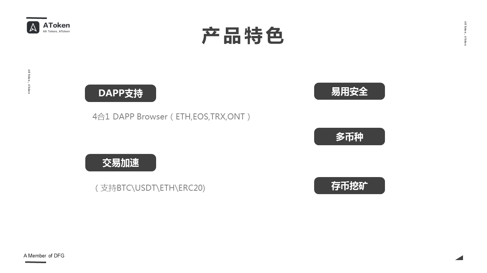
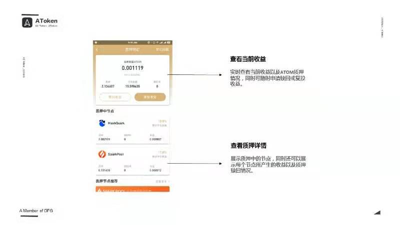
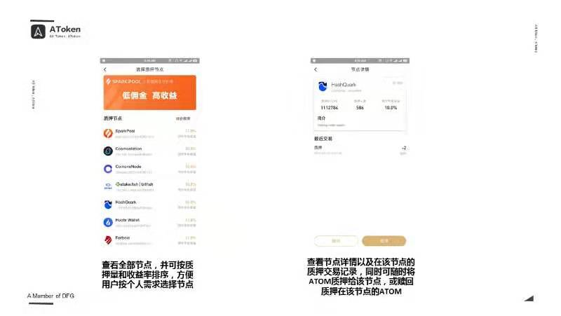

# 区块链钱包

## 1. imToken

[imToken 官方网站 | 首页 | 全球知名的区块链数字货币钱包。支持比特币、以太坊、EOS等多种数字货币资产](https://token.im/)

## 2. AToken Wallet

一个钱包，所有币种支持BTC, USDT, ETH, EOS, ETC等数十条公链及其代币。

https://www.atoken.com/

AToken是一个轻钱包，钱包会成为未来通证社会的入口，

AToken的钱包里有这么几个大的特色，一个是DAPP的支持，**我们是行业里面第一家做到了四合一的DAPP浏览器**。我们在浏览器里面同时可以运行ETH，EOS，TRX和ONT的这个这个DAPP,那么都在同样一个钱包里面就可以去运行这四类的四条链上的DAPP。那么在这方面呢，我们在持续的做一些优化和继承，那么未来呢，我们会在DAPP的知识上面。做非常基础和非常好的这样一个服务，另一个方面呢，**我们是行业里面第一家支持交易加速的钱包****，大家知道在区块网络拥堵的情况下呢，这个交易不能及时确认是一个很头疼的问题，那么矿池的一些交易加速呢，他们的方案会非常的昂贵，而且不便捷，所以我们提供了一个廉价的，便捷的，交易加速的服务。

特色是**有存币挖矿的功能**。

.jpeg)

**HD轻钱包**，分层确定性钱包，**助记词BIP44标准**。**私钥在用户手中**。AToken后台更多的是提供的是信息展示和查询的服务。

.jpeg)

.jpeg)

**一份助记词，管理所有币种。BIP44标准**

**链上币币兑换**，和三方服务商合作的，是钱包的衍生功能，可以直接在钱包里面把您的比特币转换为以太坊或者其他一些币种，那么直接在钱包里就可以完成，整个过程是匿名的，不需要任何的KYC和一些繁琐的流程，它是非常便捷的。

.jpeg)

.jpeg)

**COSMOS支持**

.jpeg)

COSMOS很重要的一个功能是**Staking**，那么AToken钱包也有Staking的支持，**质押挖矿**。

我们可以根据质押节点的收益率和质押人数，选择质押节点。**质押节点，也叫作验证人节点，是100个，这100个验证节点是用来产生COSMOS链上的区块的**。

