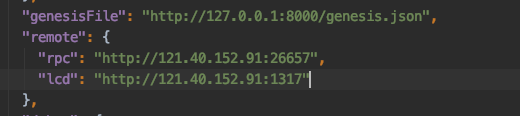
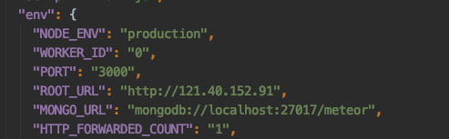

链：zchain

zchaind init zchain --chain-id zchain-test 

服务器地址：121.40.152.91

Linux服务器需要安装的

1. 安装 mongodb,(sudo apt-get install mongodb)

2. ### 关闭／启动

   　　sudo service mongodb stop 　　sudo service mongodb start

3. ```bash
   /usr/bin/mongod --unixSocketPrefix=/run/mongodb --config /etc/mongodb.conf
   ```

   

   安装nvm, nodejs ,

1. 安装Meteor

2. 上传Linux环境的浏览器压缩包，zchain_explorer.jz,然后解压，安装依赖

3. 上传 `zchaind`和`zchaincli`(编译为Linux系统的)二进制文件

   scp /Users/lianhe/gaomengjie/work/blockchain/btcchina-org/zchain/build/zchaincli root@121.40.152.91:/root/zchain-explorer/binary

4. 初始化链：zchaind init ZChain --chain-id zchain-test

5. 添加账户 01-06,密码：123456789

- zchaincli keys add zchain01
- zchaincli keys add zchain02
- zchaincli keys add zchain03
- zchaincli keys add zchain04
- zchaincli keys add zchain05
- zchaincli keys add zchain06

1. 把账户和币添加到创世文件中

   - ```bash
     zchaind add-genesis-account $(zchaincli keys show zchain01-a) 1000000000000000000000uzcoin,1000000000000000000zcoin
     ```

2. zchaincli 配置

3. 生成创世交易

4. 收集创世交易到创世文件中

5. 验证创世文件

6. 启动链：zchaind start --rpc.laddr tcp://121.40.152.91:26657

7. 启动rest-server: zchaincli rest-server --laddr tcp://121.40.152.91:1317 --node tcp://121.40.152.91:26657

8. 在有genesis.json文件的目录执行 `python -m SimpleHTTPServer`,然后``"genesisFile": "http://127.0.0.1:8000/genesis.json"``,就可以访问到。

9. 安装`pm2`, npm install -g pm2

查看服务器信息：

uname -a
Linux iZbp16kp10p7t7yrqr5366Z 4.15.0-52-generic #56-Ubuntu SMP Tue Jun 4 22:49:08 UTC 2019 x86_64 x86_64 x86_64 GNU/Linux

--------





### 在Ubuntu下进行MongoDB安装步骤

https://www.cnblogs.com/shileima/p/7823434.html


