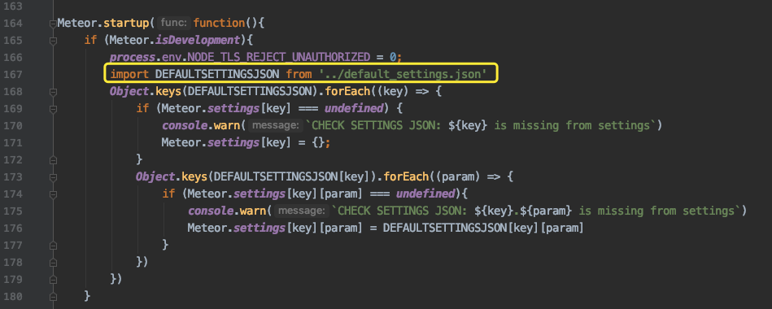
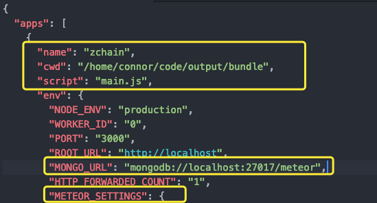
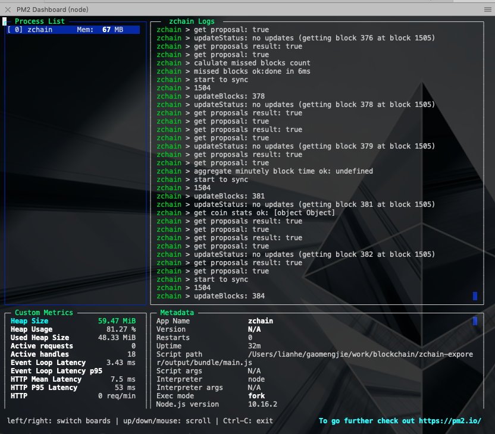

## 整个流程

**源码**

https://github.com/forbole/big_dipper

### Run in local

```bash
meteor npm install
meteor update
meteor --settings settings.json
```

要先安装meteor

执行第三步之前要更改`settings.json`

rpc：链起来后节点的地址

Lcd:rest-server的地址

```json
"public":{
    "chainName": "Cosmos Testnet",
    "chainId": "zchain-test",
    "gtm": "{Add your Google Tag Manager ID here}",
  
    "stakingDenom": "ZCOIN",
    "mintingDenom": "zcoin",
    "stakingFraction": 1000000,
    "gasPrice": 0.02,
    "coingeckoId": "ethereum"
},
"genesisFile": "http://127.0.0.1:8000/genesis.json",
"remote":{
    "rpc":"http://127.0.0.1:26657",
    "lcd":"http://127.0.0.1:1317"
},
```

第三步直接执行会出错，原因是代码中使用的是default_settings.json



可以把`DEFAULTSETTINGSJSON`改为`SETTINGSJSON`，后边路径也改了，”../settings.json“

### Run in production

```bash
./build.sh
```

```bash
#!/bin/bash

echo "Builing for production..."
#meteor build ../output/ --architecture os.linux.x86_64 --server-only
meteor build ../output/ --architecture os.osx.x86_64 --server-only
```

`--architecture os.linux.x86_64`指定服务器的系统，这里是linux系统,也可以指定Mac,

Valid architectures
                      include os.osx.x86_64, os.linux.x86_64, os.linux.x86_32,
                      os.windows.x86_32, and os.windows.x86_64.

---------

执行完后会生成一个压缩包：big_dipper.tar.gz

把这个压缩包上传到服务器上，然后解压缩，得到bundle目录

配置安装项目所需要的插件包

> cd bundle/programs/server
>
> npm install

在bundle目录下新建 pm2.json文件



主要是METEOR_SETTINGS的配置，要把settings.json文件全部拷贝到这里面，

-----

接下来是启动：

1. zchaind start

2. zchaincli rest-server

3. 在有genesis.json文件的目录执行 `python -m SimpleHTTPServer`,然后``"genesisFile": "http://127.0.0.1:8000/genesis.json"``,就可以访问到。

4. pm2 start pm2.json

5. pm2 dash, 查看基本信息

   

scp /Users/lianhe/gaomengjie/work/blockchain/zchain-exporer/output/big_dipper.tar.gz xtsxx@172.168.0.78:/

/Users/xtsxx/zchain-explorer

