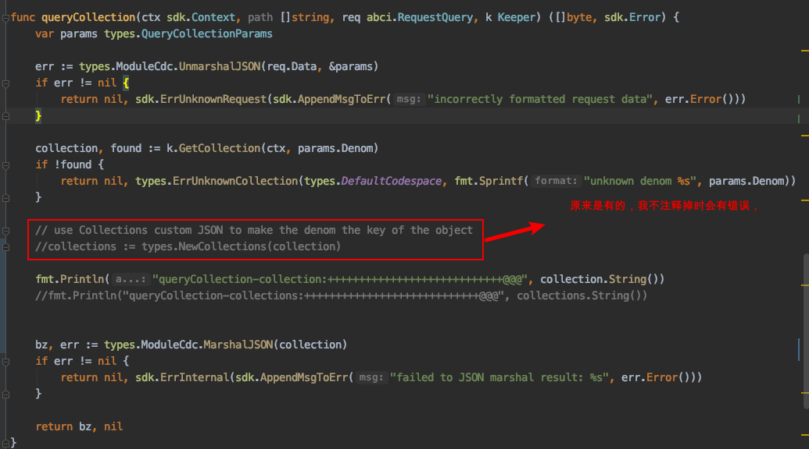
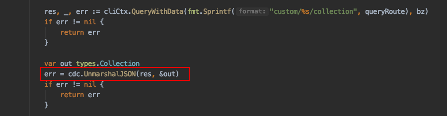
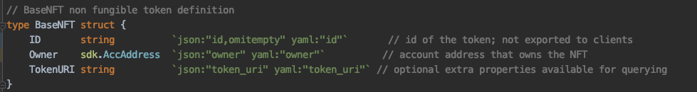
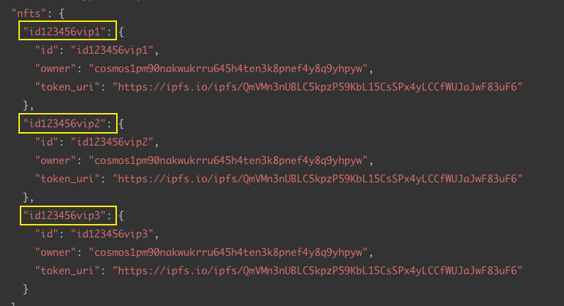

### 在zchain-sdk中增加了nft模块，下面是验证：

先是发行了一个nft资产

zchaincli tx nft mint crypto-kittties id1234565f9e65c4e16e7807340fa $(zchaincli keys show alice -a) --tokenURI https://ipfs.io/ipfs/QmfJyd64srJSX824WoNnF6BbvF4wvPGqVBynZeN98C7ygq --from jack --node tcp://192.168.60.251:26657 --gas-prices 0.30atoken

**下面的查询出错**：

zchaincli query nft supply crypto-kittties --node tcp://192.168.60.251:26657
ERROR: cannot parse disfix JSON wrapper: invalid character '\x01' looking for beginning of value

zchaincli query  nft collection crypto-kittties --node tcp://192.168.60.251:26657
ERROR: JSON encoding of interfaces require non-empty type field.

------------------------

### 测试nft模块的 tx 功能

- mint nft
- edit-medata nft
- burn nft
- **transfer nft** 


**转移nft没有成功**

```bash
zchaincli tx nft transfer $(zchaincli keys show alice -a) $(zchaincli keys show jack -a) crypto-art id123456vip2 --node tcp://192.168.60.251:26657 --gas-prices 0.30atoken
```

转移nft也没有报错，根据交易hash查询交易，也是正常的，各个参数都是正确的，

执行下面命令查询接收者账户下的nft资产信息，发现ids中没有转过去的nft资产id `id123456vip2`

```bash
zchaincli query nft owner $(zchaincli keys show jack -a) crypto-art --node tcp://192.168.60.251:26657
```

```json
{
  "type": "zchain-sdk/Owner",
  "value": {
    "address": "cosmos1wryhhacgmmn9kfm5z0xcpp67chlma2pyn3ajl5",
    "idCollection": [
      {
        "denom": "crypto-art",
        "ids": null
      }
    ]
  }
}
```

再查询发送方的账户下的nft资产信息：发现nft资产 id `id123456vip2`还在,说明没有转移成功。

```bash
zchaincli query nft owner $(zchaincli keys show alice -a) crypto-art --node tcp://192.168.60.251:26657
```

```bash
{
  "type": "zchain-sdk/Owner",
  "value": {
    "address": "cosmos1pm90nakwukrru645h4ten3k8pnef4y8q9yhpyw",
    "idCollection": [
      {
        "denom": "crypto-art",
        "ids": [
          "id123456vip2",
          "id123456vip3"
        ]
      }
    ]
  }
}


```


#### HandleMsgTransferNFT错误分析

```go	

// HandleMsgTransferNFT handler for MsgTransferNFT
func HandleMsgTransferNFT(ctx sdk.Context, msg types.MsgTransferNFT, k keeper.Keeper,
) sdk.Result {

	nft, err := k.GetNFT(ctx, msg.Denom, msg.ID)
	if err != nil {
		return err.Result()
	}

	// update NFT owner
	nft.SetOwner(msg.Recipient)

	// update the NFT (owners are updated within the keeper)
	err = k.UpdateNFT(ctx, msg.Denom, nft)
	if err != nil {
		return err.Result()
	}

	ctx.EventManager().EmitEvents(sdk.Events{
		sdk.NewEvent(
			types.EventTypeTransfer,
			sdk.NewAttribute(types.AttributeKeyRecipient, msg.Recipient.String()),
			sdk.NewAttribute(types.AttributeKeyDenom, msg.Denom),
			sdk.NewAttribute(types.AttributeKeyNFTID, msg.ID),
		),
		sdk.NewEvent(
			sdk.EventTypeMessage,
			sdk.NewAttribute(sdk.AttributeKeyModule, types.AttributeValueCategory),
			sdk.NewAttribute(sdk.AttributeKeySender, msg.Sender.String()),
		),
	})
	return sdk.Result{Events: ctx.EventManager().Events()}
}
```

上面代码中有关键的两部分：

- nft, err := k.GetNFT(ctx, msg.Denom, msg.ID),根据 denom和id获取 一个nft

- // update NFT owner 更新所有者

- nft.SetOwner(msg.Recipient)

  原来SetOwner的方法是这样的，方法是很简单的，就是把显得所有者替换掉nft资产中原来的所有者，

  ```go
  // SetOwner updates the owner address of the NFT
  func (bnft BaseNFT) SetOwner(address sdk.AccAddress) {
  	bnft.Owner = address
  }
  ```

  可是测试得到的结果是并没有替换，还是原来的值，

  再看k.GetNFT的代码,返回的结果是 `nft exported.NFT`

  ```go	
  // GetNFT gets the entire NFT metadata struct for a uint64
  func (k Keeper) GetNFT(ctx sdk.Context, denom, id string) (nft exported.NFT, err sdk.Error) {
  	collection, found := k.GetCollection(ctx, denom)
  	if !found {
  		return nil, types.ErrUnknownCollection(types.DefaultCodespace, fmt.Sprintf("collection of %s doesn't exist", denom))
  	}
  	nft, err = collection.GetNFT(id)
  
  	if err != nil {
  		return nil, err
  	}
  	return nft, err
  }
  
  ```

  而在`/x/nft/internal/types/nft.go`文件中，也就是`SetOwner`所在的文件，该文件最开始处有个定义：

  ```go
  var _ exported.NFT = (*BaseNFT)(nil)
  ```

也就是说export.NFT是 *BaseNFT类型，是指针类型，

由于是指针类型，那么读取值时，不发生值的改变，所以下面的方法，不用指针也可以：

```go	
// GetID return the ID of the token
func (bnft BaseNFT) GetID() string {return bnft.ID}

// GetOwner returns the account address that owns the NFT
func (bnft BaseNFT) GetOwner() sdk.AccAddress {return bnft.Owner}
```

但是SetOwner设计参数的改变，所以要用指针类型：

```go	
// SetOwner updates the owner address of the NFT
func (bnft *BaseNFT) SetOwner(address sdk.AccAddress) {
	bnft.Owner = address
}
```

根据nft的名字查询资产的集合：

```go
zchaincli query nft collection crypto-art --node tcp://192.168.60.251:26657
```

```go	
{
  "type": "zchain-sdk/Collection",
  "value": {
    "denom": "crypto-art",
    "nfts": {
      "id123456vip1": {
        "id": "id123456vip1",
        "owner": "cosmos1pm90nakwukrru645h4ten3k8pnef4y8q9yhpyw",
        "token_uri": "https://ipfs.io/ipfs/QmVMn3nUBLC5kpzP59KbL15CsSPx4yLCCfWUJaJwF83uF6"
      },
      "id123456vip2": {
        "id": "id123456vip2",
        "owner": "cosmos1pm90nakwukrru645h4ten3k8pnef4y8q9yhpyw",
        "token_uri": "https://ipfs.io/ipfs/QmVMn3nUBLC5kpzP59KbL15CsSPx4yLCCfWUJaJwF83uF6"
      },
      "id123456vip3": {
        "id": "id123456vip3",
        "owner": "cosmos1pm90nakwukrru645h4ten3k8pnef4y8q9yhpyw",
        "token_uri": "https://ipfs.io/ipfs/QmVMn3nUBLC5kpzP59KbL15CsSPx4yLCCfWUJaJwF83uF6"
      }
    }
  }
}
```



不注释掉会出现下面的错误：

```bash
ERROR: JSON encoding of interfaces require non-empty type field.
```

是GetCmdQueryCollectionSupply中的`UnmarshalJson`出错




注释掉后虽然能得到结果，但是结果的格式好像不正确：

ntfs是nft组成的切片，**nft只有三个字段**，下面的nfts中的结果怎么会出现 `id --> BaseNFT`的对应关系





nfts这样的对应关系，给人的感觉好像nfts是由一个map组成的切片：

类似这样的：

nftMap [string]nft

nfts []nftMap