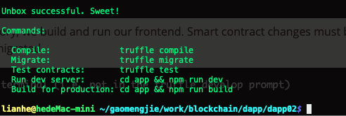

使用MetaMask的provider的web3来调用合约中的方法，

1. web3连接，连接MetaMask的web3,如果没有安装，要提示安装MetaMask才能使用应用

2. 获得MetaMask中的用户地址

   我们可以通过这样来获取 web3 变量中激活的当前账户：

   ```
   var userAccount = web3.eth.accounts[0]
   ```

因为用户**可以随时在 MetaMask 中切换账户**，**我们的应用需要监控这个变量，一旦改变就要相应更新界面**。

我们可以通过 `setInterval` 方法来做:

```js
var accountInterval = setInterval(function() {
  // 检查账户是否切换
  if (web3.eth.accounts[0] !== userAccount) {
    userAccount = web3.eth.accounts[0];
    // 调用一些方法来更新界面
    updateInterface();
  }
}, 100);
```

这段代码做的是，每100毫秒检查一次 userAccount 是否还等于 `web3.eth.accounts[0]` (比如：用户是否还激活了那个账户)。若不等，则将 当前激活用户赋值给 `userAccount`，然后调用一个函数来更新界面。

--------

### 以太坊DApp开发的入门示例

https://blog.csdn.net/pony_maggie/article/details/79685942

### [以太坊DApp开发理论入门到实战](javascritp:void(0))

----------------

## 开发框架

### truffle boxes

### **React**

https://github.com/truffle-box/react-box

https://www.trufflesuite.com/boxes/react

### 基于React+truffle的完整智能合约构建

http://ju.outofmemory.cn/entry/366982

https://segmentfault.com/a/1190000013950908

**webpack**

https://www.trufflesuite.com/boxes/webpack

