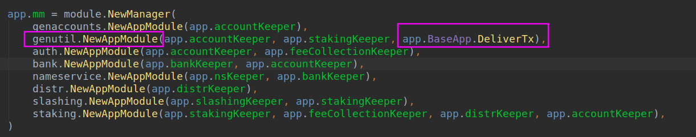
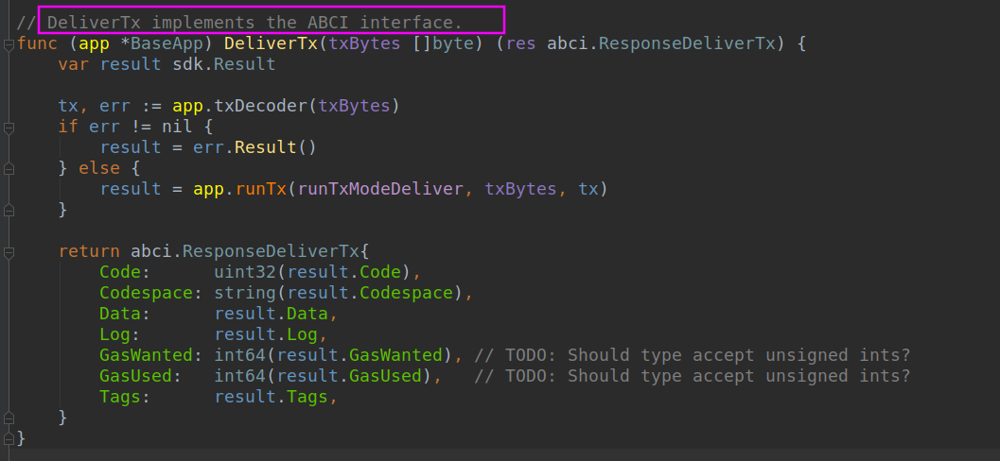
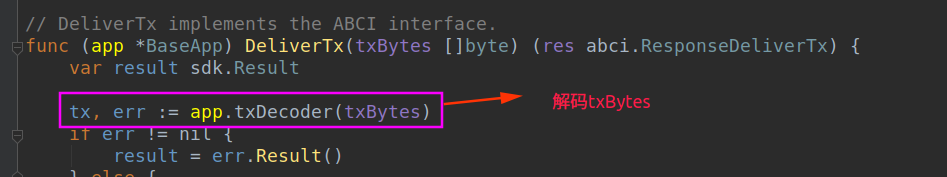
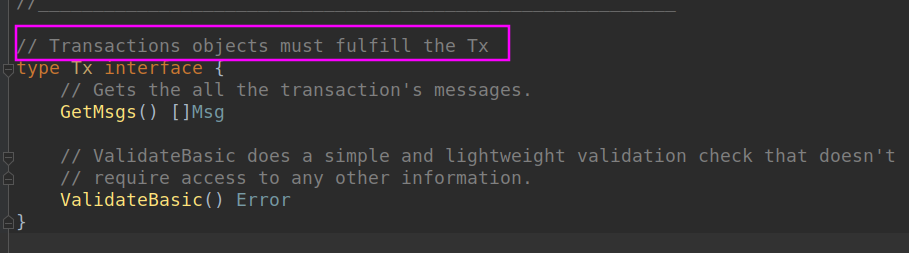

# query and tx

## First check the accounts to ensure they have funds

nscli query account $(nscli keys show jack -a)
nscli query account $(nscli keys show alice -a)

## Buy your first name using your coins from the genesis file

nscli tx nameservice buy-name jack.id 5nametoken -–from jack

## Set the value for the name you just bought

nscli tx nameservice set-name jack.id 8.8.8.8 -–from jack

## Try out a resolve query against the name you registered

nscli query nameservice resolve jack.id

> 8.8.8.8

## Try out a whois query against the name you just registered

nscli query nameservice whois jack.id

> {“value”:“8.8.8.8”,“owner”:“cosmos1l7k5tdt2qam0zecxrx78yuw447ga54dsmtpk2s”,“price”:[{“denom”:“nametoken”,“amount”:“5”}]}

-------------------------------

**app.go**

**BaseApp.DeliverTx** 函数返回一个函数，**DeliverTx函数实现了ABCI接口**

**问题：** ABCI传递从tendermint来的(txbytes)到应用层，我的问题是应用层解码txbytes的，还是ABCI解码txbytes，解码后得到交易(这个交易信息是什么结构？)，把得到的交易再发送给应用。

实现这个**Tx**接口的对象我还没有找到