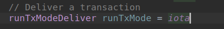
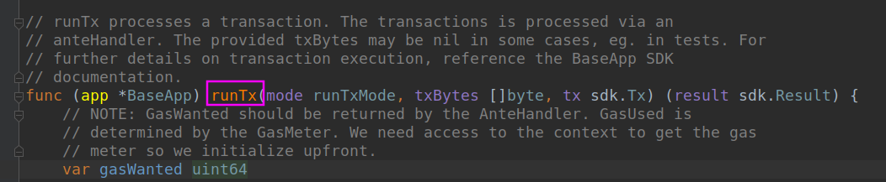

理出思路

从 DeliverTx开始

在**runTx**函数里，runTxModeDeliver 解析到的值为2，**iota再看一下**，

**github.com/cosmos/cosmos-sdk/baseapp/baseapp.go**

更多关于**交易执行**的细节，可以参考 BaseApp SDK文档

GasMeter：gas计量

upfront：在前面

evidence：证明

absent：缺少的

volatile：不稳定的

concrete：具体

deduct：扣除

-----------------

问题：go语言中接口和接口实例的关系?

