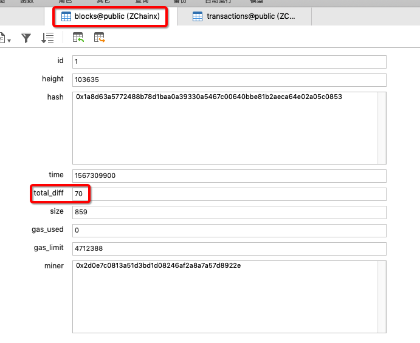

## 190901

go 语言 for range 的遍历是遍历完就自己退出了，还是要写一个判断语句，判断遍历完后退出？

如何判断交易类型是 "public" 或者是 "pos"的？

fmt.Println （fmt语句）和 log 的区别？

第三次测试插入，

数据库表中我定义的是float8，

执行插入语句时，我是把`big.int`类型转成`string`类型插入的，得到下面的结果

------------

### [学习-go语言坑之for range](https://www.cnblogs.com/hetonghai/p/6718250.html)

### [Go语言string，int，int64 ,float之间类型转换方法](https://www.cnblogs.com/yaowen/p/8353444.html)

### go语言时间类型和时间戳

https://blog.csdn.net/Charliewolf/article/details/84323574

### Gosqlx包+postgespq包实现postgres的批量插入、更新

https://www.2cto.com/database/201702/593647.html

### postgres 数据库 多行数据合并为一行

https://blog.csdn.net/L_sliang/article/details/94471072

