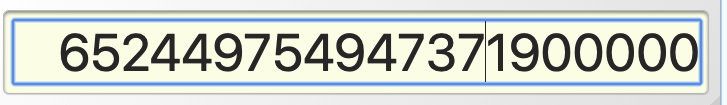
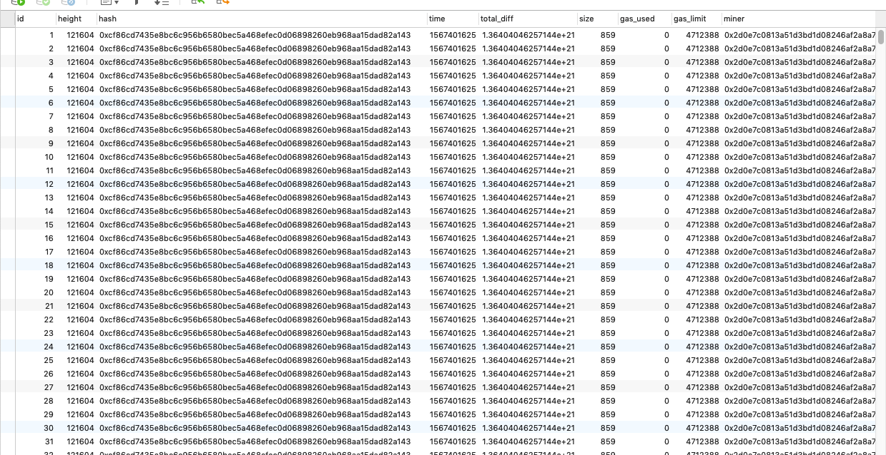

## 190902


```
TotalDifficulty  big.Int
```

**问题：**

这个字段是 `big.int`类型

`big.int`转为int类型（这个过程会不会有数据损失）这样转不行。

数据库中total_diff定义的是float8类型，int类型再存储到数据库（这个过程会不会有数据损失）

------


### PostgreSQL 数据类型

https://www.cnblogs.com/joeson/p/9473885.html

https://www.yiibai.com/postgresql/postgresql-datatypes.html


插入transaction,**tx_cost**字段数据类型， **value**数据类型


32 Bytes - hash of a transaction **txHash**

20 Bytes - The address the transaction is directed to.  **address**

-----------





在向数据库插入区块之前，先判断一下节点最新的区块高度和数据库中最新的区块高度，比较一下，把节点与数据库之间的差额同步到数据库中，

在把区块插入到数据库之间，先判断一下有没有区块的产生，有区块产生才执行插入操作，进而判断是否有交易，有的话再把交易插入到transaction中。

### 1.90E＋10转换成十进制是什么？

https://zhidao.baidu.com/question/584574242734455245.html

--------




### golang 跳出for循环

https://blog.csdn.net/cyk2396/article/details/78873930


