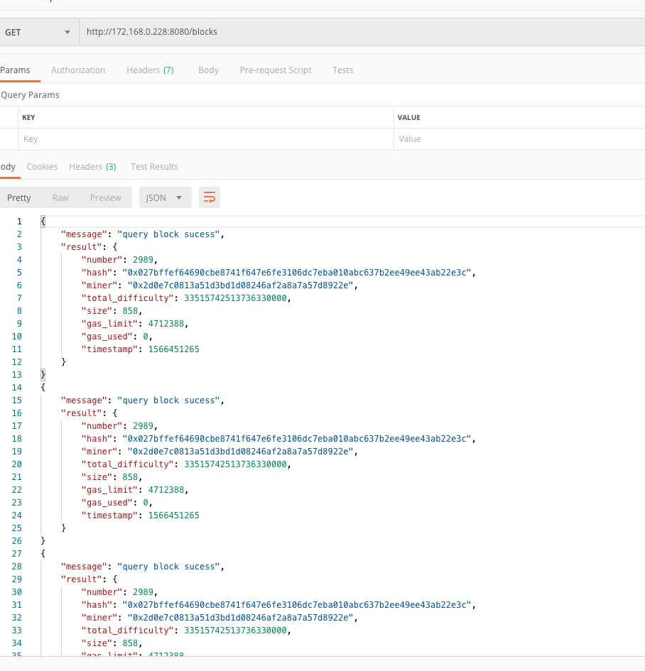
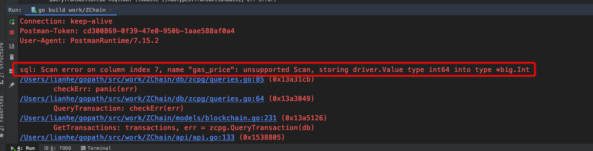
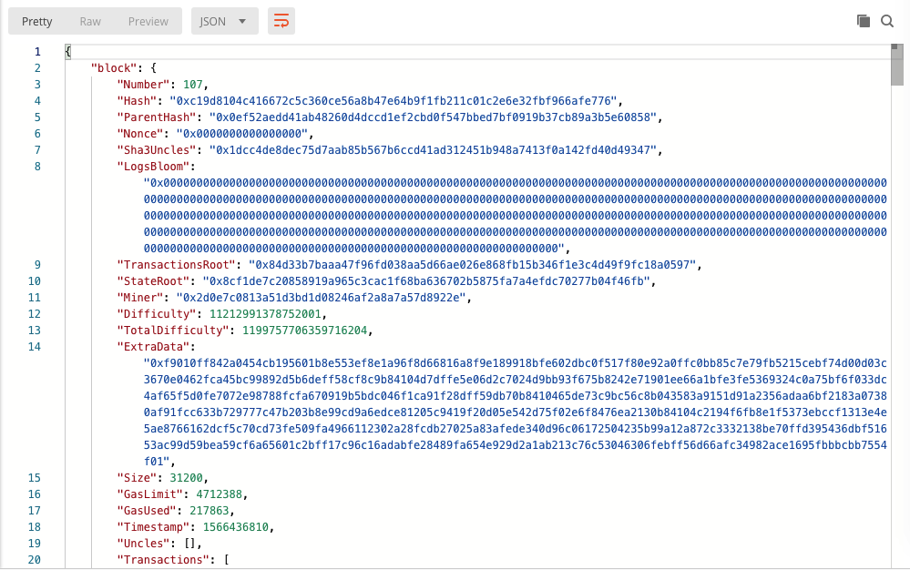

## 190903

今天把区块链浏览器数据库部分完成，把接口完善。





**这个Next()函数和Scan()函数还需要再看一下**。**这里遇到的问题需要总结一下。**



`sql: Scan error on column index 7, name "gas_price": unsupported Scan, storing driver.Value type int64 into type *big.Int`

---------





------------

### 数据库设计有问题的部分：

（1). block表：total_difficulty字段

我在数据库中定义的是 `float8`

BlockBasic结构体：这里定义的是 `float64`

从链上获取的block结构体中，定义的是 `big.int`类型

我向数据库插入数据时，我把`big.int`先转为`string`类型，再转为`float64`类型

```go
totalDiff, err := strconv.ParseFloat(blockInfo.TotalDifficulty.String(),64)
```

从链上获取的block中的TotalDiffculty和从数据库中获取到的对比（同一高度）：

```
549207088373087540000, （1）从数据库中获取的
549207088373087564620, （2）从链上获取的
```


--------------

（1). Transaction表：`value`字段

我在数据库中定义的是`float8`

TransactionBasic结构体中定义的是 `float64`

从链上获取的block结构体中获取的`Transaction`中定义的是`big.int`

我向数据库插入`transaction`数据时，我把`big.int`先转为`string`类型，再转为`float64`类型

从链上获取的`transaction`中的`TotalDiffculty`和从数据库中获取到的`value`对比（同一高度）：

```
"Value": 10000000000000000000000000000, （1） 从链上获取到的
1e+28                                   （2） 从数据库中获取到的
两者是一样的
```

gas_price字段value

和value字段定义的是一样的，插入时转换也是一样的

从链上获取的`transaction`中的`GasPrice`和从数据库中获取到的GasPrice``对比（同一高度）：

```
180000000000, （1）从链上获取到的
180000000000, （2）从数据库获取到的
这两个值是一样的
```


------------


**突然就出现这个错误，连接数据库出错**


2019/09/03 15:30:50 connect postgresql error pq: sorry, too many clients already

------------


### POS、POC共识算法

3215gmjGMJ

-------------------

