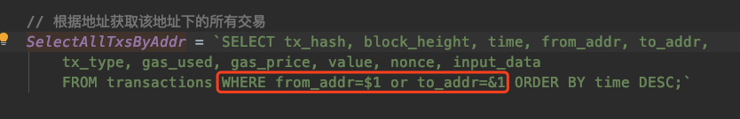
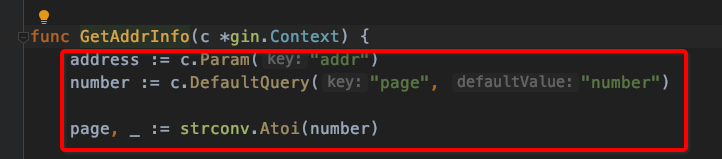

## 190905

------------

**根据地址获取该地址下的所有交易**,我想的是输入一个地址让这个地址去匹配作为发送方和接收方的所有交易数据。

**出现了错误**

------------

### 数据库表索引问题

-----------

2019/09/05 17:00:44 Error -32602 (invalid argument 0: hex string has length 40, want 64 for common.Hash)

前端访问交易hash获取交易时出现上面的错误。

-------------

**路由匹配问题：**

输入高度获取区块信息，我输入任意的英文字符却能获取第0个区块。

应该加个正则，让只匹配数字，其他不匹配

------------------

## 优化

**错误：**

2019/09/05 17:28:08 Error -32602 (invalid argument 0: hex string has length 4, want 64 for common.Hash)

1. **对于前端传来的参数，我后端进行判断**，如果不符合要求就不要调用相关的方法，直接给前端返回对应的错误信息，避免由于错误的参数调用了方法而出现错误，导致服务断掉或者其他进程退出。

-----------------------

### 传带有多个参数的URl串，&的编码问题

https://blog.csdn.net/dabing1989/article/details/39399559

### gin学习一(路由、多级路由、参数传递几种形式)

https://blog.csdn.net/u013210620/article/details/82773905

------------

### Gin web框架路由传参，后端返回的数据很多，要分页返回，

前端请求时要传入一个页码，我每页返回一定量的数据，

https://github.com/gin-gonic/gin#querystring-parameters

页码的参数不在路由里传，但是也获取到，使用`c.DefaultQuery`接受前端传来的页码。

**gin web框架路由的使用，以及参数的获取需要再学习。**

