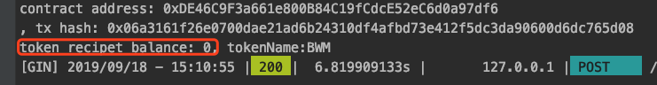
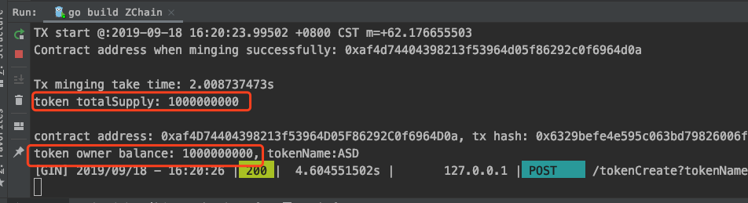

## 190918

**抽时间看 WanChain的 Staking部分的文档和 POS部分代码**

**wanchain怎么查看发行的token信息，怎么转账？**

在代码中，每发一个币。接着我就给另一个地址转账，会出现下面的情况：

发币的交易记录额交易信息是没有 `to`地址的，而新发行的代币转账token,交易信息有 `to`地址，是合约地址

**根据原来的接口**（根据地址查询下的信息）查看代币转账接收者地址的交易信息，**查不到交易信息**

**我想查询代币接收者的余额：在代码中尝试下面写，下面两种查询方式，查到的结果都是0，**

**查询代币发行者的余额却能查询到**

我发行一个token,然后转给另一个地址`100000`个token,我最后才查询的 `owner`的余额，余额没有变化，

难道是转账没有发生吗，但是有交易hash产生，**怎么查询接收者的token余额？**

为什么转账之后，查代币 `owner`的余额还是没有少？按道理有转出，余额应该减少，现在是没有变化，但有交易hash产生，那就是token没有转过去，

16:47,开始看 wanchain 官网 `Staking`部分

--------------------

### golang重写区块链——0.5 区块链中钱包、地址和签名的实现

https://blog.csdn.net/zyj0813/article/details/82118313

### 利用go语言创建钱包并遍历钱包(wallet)

https://blog.csdn.net/m0_37719047/article/details/81949561

