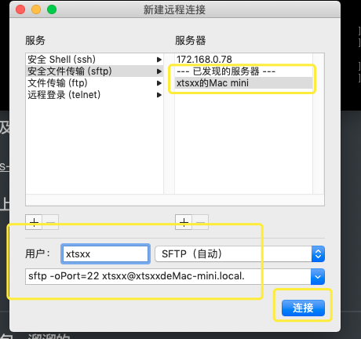
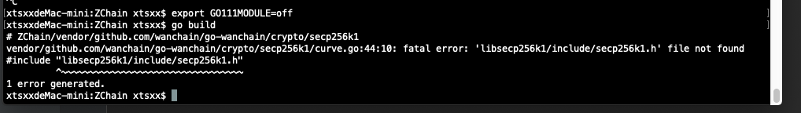

## 190923

**开发项目功能点：**

------

## Pos共识机制、以太坊Casper共识机制以及Casper的发展过程

https://blog.csdn.net/yangwei256/article/details/83188458

## 详解Casper FFG共识算法

https://www.zuocoin.com/a/news/experience/2018/1217/13110.html

https://blog.csdn.net/shangsongwww/article/details/89810252

## 以太坊2.0什么时候来？波卡是敌是友？Vitalik现场亲述

https://mp.weixin.qq.com/s/zH4zONiPeYTZuYHfQE1Gzw

-----

**Byzantine fault tolerance**

PBFT是**Practical Byzantine Fault Tolerance**的缩写，意为**实用**拜占庭容错算法。

-----

可扩展性是包括以太坊在内的区块链需要解决的重大问题。以太坊在解决**可扩展性问题**上有两个方案，首先是layer 1方案，旨在改进区块链的设计以提高其运行效率。**分片（Sharding）**是以太坊的layer 1扩容选择。

分片会将区块链分成多个部分，每个部分都只需要网络中的一部分计算机来进行交易验证。至于由谁来验证哪些区块，系统会随机进行选择。由于每次只需要进行部分交易验证，分片帮助区块链在可扩展性问题上实现了突破。

另一种扩容方案基于layer 2。layer 2方案并不会让区块链做出任何改变，而是改变应用的运作方式，减少对区块链的使用频次，同时享受区块链带来的安全性。Plasma就是最典型的layer 2扩容方案，**数据和交易都是通过链下运行的**，**一旦出现参与者下线、作弊或作恶等情况，相关的数据就会被上传到链上，从而找出作恶者**。

还有一种方案Rollup介于layer 1和layer 2之间——**链上存储数据，链下进行计算**，**通过零知识证明技术，确保链上验证的可行性**。

-------

### 以太坊2.0的部署被分成了四个阶段：

准备阶段：Casper FFG，即创建一个PoS网络，该网络采用的算法就是Casper FFG，在这个阶段尚未用到分片，但却是以太坊迈向PoS的第一步。

第一阶段：数据分片，这个阶段的分片仅支持数据。

第二阶段：计算分片，在这个阶段已经可以支持完整的应用以及以太坊2.0的主要功能。

第三阶段：优化，即对系统的优化，例如算法的更新：从Casper FFG到Casper CBC。

---

“Polkadot的路线与以太坊大不相同。Polkadot更倾向于治理、多链互通；而以太坊则聚焦于链上应用。有些应用可能在以太坊上行得通，而在Polkadot上不行，反之亦然。因此我认为两者之间聚焦的问题不同。”

---------

## 如何在服务器上部署一个前后端分离的项目并解决跨域问题

https://blog.csdn.net/TateBrwonJava/article/details/80373913

## 前后端分离项目的服务器部署

https://www.jianshu.com/p/cbb21c6f3427

back end:后端

-----------

### **服务器：**

ssh 远程登录：

xtsxx@[172.168.0.78](172.168.0.78)

密码：123456

sudo su 登上root账号，密码也是123456

### Mac 远程连接Linux服务器及上传、下载命令

https://www.cnblogs.com/boris-et/p/10861615.html

### mac终端自带的sftp工具（上传文件或目录）

--------------

### go mod 设置代理下载依赖包，溜溜的

https://blog.csdn.net/grace_yi/article/details/90232800

### Golang包管理工具之govendor的使用

https://www.jianshu.com/p/e2db72b1583c

--------

## 在Mac OS X上安装PostgreSQL

https://blog.csdn.net/lissdy/article/details/54099580

https://www.jianshu.com/p/9e91aa8782da

## Mac 下PostgreSQL 数据安装与使用

https://blog.csdn.net/zyz1431/article/details/80380187

-------

### update Homebrew 太慢，更换Homebrew的更新源

https://www.jianshu.com/p/b26c7bc14440

-------------

### mac下终端如何重启postgresql数据库？

#### [macos – 在Mac上启动postgres服务器](https://codeday.me/bug/20190202/603741.html)

