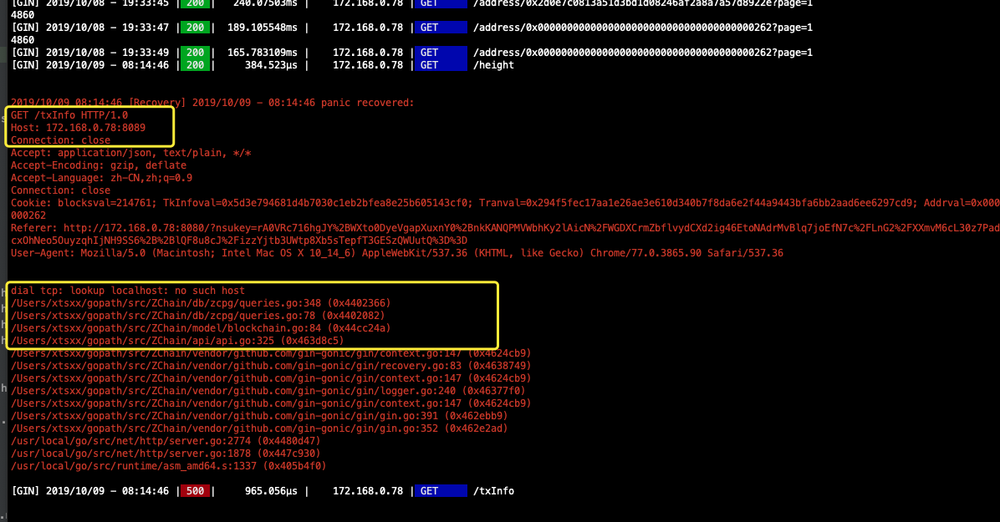

## 191009

今天完成基于cosmos-sdk区块链浏览器block和transaction部分，

原来的区块链浏览器出现的的错误，这个错误之前也出现过，今天把它解决掉，

#### [Lookup [HOST\]: no such host error in Go](https://stackoverflow.com/questions/12952833/lookup-host-no-such-host-error-in-go)

---------------

## **问题：**

### go mod下载依赖时如何指定版本，如何更改go.mod中的版本依赖

#### 使用 Go Modules 管理依赖

https://www.jianshu.com/p/dca7c631587f

#### go mod 使用旧版本 版本号指定

https://blog.csdn.net/gs80140/article/details/95320215

直接在go.mod中更改版本号（也就是v加上分支），如果要指定哪个分支那次提交的，就要仿照上面的方法。

---------------------

### 私有仓库，go mod， go get下载依赖，做配置

914be10407db4f5861e179cb3a6b238382504ca5

**zcapi**是在github上配置的

---

vim $HOME/.netrc

machine [github.com](http://github.com) login USERNAME password zcapi

machine [github.com](http://github.com) login mengjayxc password zcapi

-------

export GOPROXY=https://goproxy.io