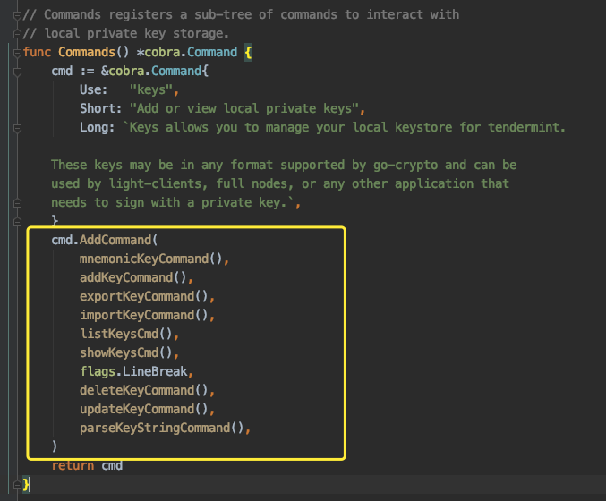
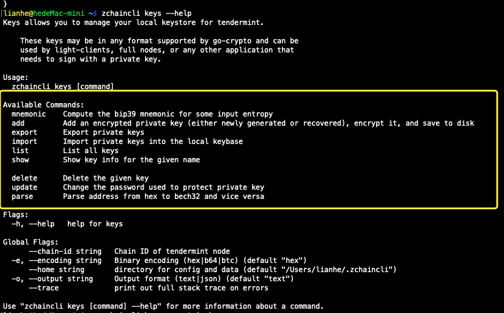
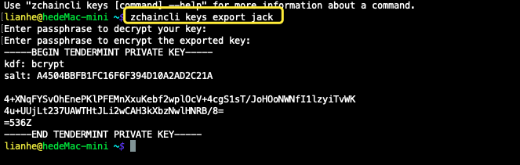
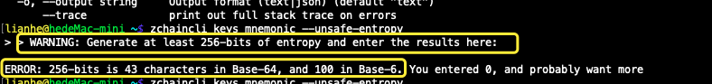
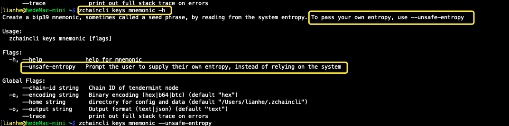
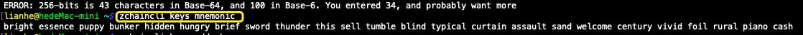
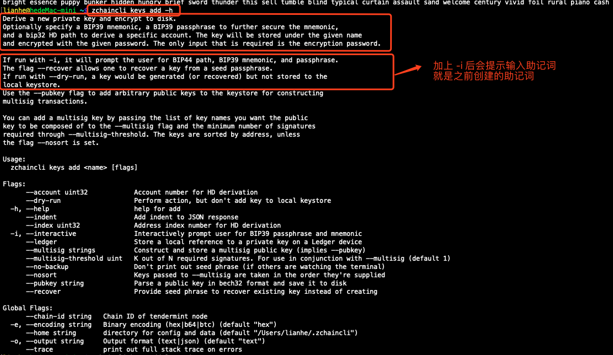
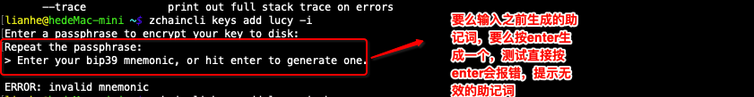
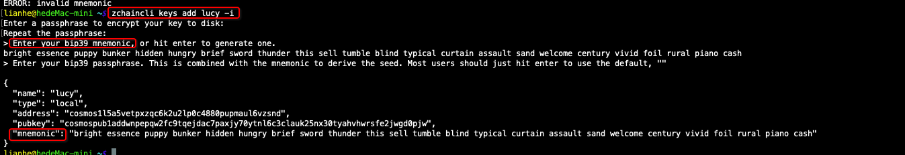

## 191014

开始进行基于zchain链的钱包后端开发

### 问题：

1. 交易如何用**私钥**进行签名的？，看代码中具体是怎么实现的？

**与私钥相关的三个核心包**：

- `zchain-sdk`下`client`包下的`keys`包
- `zchain-sdk`下`crypto`包下的`keys`包
- `tendermint` 下的`crypto`包,以及该包下的`bcrypto`包

**私钥管理**的代码在 `/Users/lianhe/gaomengjie/work/btcchina-org/zchain-sdk/client/keys` keys包下，

**私钥加密**部分在  `/Users/lianhe/gaomengjie/work/btcchina-org/zchain-sdk/crypto` 包下。

**私钥管理的接口**在 `/Users/lianhe/gaomengjie/work/btcchina-org/zchain-sdk/crypto/keys/types.go`这个文件下，`types.go`下的`Keybase接口`定义了私钥相关的方法，

**私钥接口方法的具体实现**在`/Users/lianhe/gaomengjie/work/btcchina-org/zchain-sdk/crypto/keys/keybase.go` `keybase.go`文件中

#### 私钥相关：

- 创建账户，生成私钥
- 助记词
- 更新账户，改变密码
- 导出私钥
- 导入私钥
- 删除私钥
- 显示私钥的信息
- 列出该公钥下的所有私钥

-----

**私钥导出：**

------

### 助记词

**生成助记词：**`zchaincli keys mnemonic --unsafe-entropy`,自己输入自己的助记词（不推荐）

**系统生成的助记词：** `zchaincli keys mnemonic`

**生成私钥时加上助记词：**

**输入之前生成的助记词生成私钥：**

