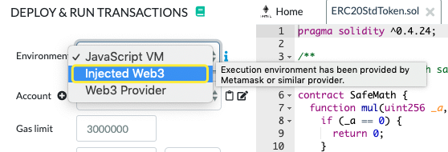

## 191024

签名：

需要的：

- name
- password
- 交易信息

------

## 浏览器端应用（js应用）是如何和metamask交互的

It allows you to run Ethereum dApps right in your browser **without running a full Ethereum node**.

MetaMask includes a secure identity vault, providing a user interface to manage your identities on different sites and sign blockchain transactions.

https://github.com/MetaMask/metamask-extension

### metamask源码学习-controller-transaction

https://www.cnblogs.com/wanghui-garcia/p/9687001.html

### MetaMask官方开发文档

http://cw.hubwiz.com/card/c/metamask-api/

### 以太坊的在线编译器，这样就连接到MetaMask，接下来的部署合约都会与MetaMask交互

--------

MetaMask是一款可以用于Chrome和Firefox的插件，**实现了Web3的接口**，用于管理用户的private key。
MetaMask上可以同时管理多个账号。

MetaMask是**去中心化钱包**

### **MetaMask浏览器扩展**

### [如何实现MetaMask签名授权后DAPP一键登录功能？](javascritp:void(0))

https://www.liangzl.com/get-article-detail-29607.html

----

Mixin Network 开发者大赛 第一名[mixinlight](https://mixinlight.github.io/)，这是一个代码公开的浏览器插件钱包。只需记住 6 位数字密码就能同时管理比特币，以太坊，EOS 等 13 种资产，而且支持所有 ERC20 代币和 EOS 代币。开发者来自澳大利亚。

https://www.v2ex.com/amp/t/527567

\1. 不是 node.js
\2. 该钱包直接引用的第三方库有五个：React, Redux，jQuery 的 ajax，Material UI，以及 Mixin Network 官方维护的 js 签名库
\3. 该钱包内能够读取到用户 pin 的组件是 React 和 Redux。
\4. UI 层使用了 Material UI
\5. 没有自己的服务器来保管任何东西

Mixin network 的私钥系统设计是非常独特的。仅仅掌握私钥无法拿走资产，还需要知道 pin 码，并且 Mixin Network 不提供找回 Pin 码功能。关于 Mixin 如何保护用户资产，可以查看[用户只有一部手机，怎么保护私钥—— mixin 如何实现资产安全]( https://juejin.im/post/5bf109fe6fb9a049bd41e2fa)

### 用户只有一部手机，怎么保护私钥—— mixin如何实现资产安全

https://juejin.im/post/5bf109fe6fb9a049bd41e2fa

-------

pin码：036533

私钥：

eyJrZXkiOiItLS0tLUJFR0lOIFJTQSBQUklWQVRFIEtFWS0tLS0tXHJcbk1JSUNXd0lCQUFLQmdIZXAwNFFKdEJpYi8zN1BrRXBKWUhMUWVXTFVEOGxXYmRhU1RJZk1hMmhpSExWd0Y2RzdcclxuejBiQ3ZYQlFrb24vSlBjUzQ5V0hZUzdjOGRHcndVZ3JnQkJwbkpDK3J2SjZLQXdmOHFsV3l3SnFVdjFLM1BnNVxyXG5WbzJkTlMvTkdkaWVCNXVjaWo3b0NqQmtTdjQvYTZER014bEdENzdoV1VISjBsaFdOYzBzRi9hWEFnTUJBQUVDXHJcbmdZQTJVZnRZZHVjd1BMQndxbHgvdkd0eDh6MEhKZWk4cHVWWmdEUUplVHhRdUNqOEhCUStNUGxZejlJYkNCaGRcclxuV0ZzNVpYUFRYSTg3TE1VQlB3eVFiRjdIYnQrWFFmS29LbzNMWk9MOFFYd3JDNS8rOEYxVlBrMzhSUW8xOHpkNlxyXG41VnBZNzZOWmFyZzF4LzFUSWtQZ0J4bnlqQnk1bFErWkU0L1BReVA2SmpsbXdRSkJBT29RSFlBRXNGZDBNL3loXHJcbk02UXF3cVZKOGVIbEZweE1veDUzZnB1RG9vdm1uRVl4elQ2NzRWVDdtUjcvM3htT0xQSkd0ZlhJYWdUeWp2cDRcclxuSzlwanhMRUNRUUNDNE9xSUp5SThIMFVrQ2FxcWxkQ3lrOERFVE1QS25oL1IvODRHaURPRVBQN29PNkFQSkNQS1xyXG52Rk0vdDZhR2syT2NJQ05BNGh1UkdUNXlsY2NYODJISEFrRUFvOFhpM2xCcGtzZWNHSWd5dWd1eFpqWDNLVGhDXHJcbk9kcmx4OHVVcXZ2UUlGT2J4UUhUdXJGN1dSc3lhSjVnWEdFKzBjYm9TckdRZlNXN0pVWXdhUDZtQVFKQWUvKzBcclxudFVLK2dNL3ZwZkV5cldRNzByV0NVWG1abHdLeGl6a2RiYnJsZEVpR0NtbFRnSVR4RkVmUlovRUw2VDBEaHd3N1xyXG4ybUZmVk4zaCtKWkhoejJrU1FKQWQ5OEV6dWdxYThpbWpad21jSHNTV3NvRUMvbEJIZkp1RnVybStwb0ZsdVlKXHJcbkcxVk9nYzk1L0gxTGl1SDhvWWhkdWNSZ2ZUNmU1WnpTT2RvK2RDSWwxZz09XHJcbi0tLS0tRU5EIFJTQSBQUklWQVRFIEtFWS0tLS0tXHJcbiIsInVpZCI6ImVhZWVkYmRlLTlmNTMtM2Q4Yy04MzdmLTdlNTIyNjdhZjU5YiIsInBpbnRva2VuIjoiQzZWTW1rT2srVEFnMWZ5ODlaeDVYYXB0RnlPbkVZTXZPSSs5N2kyVHZZNHNhT0NibXRkeS9NbFIvTkhWMm1KdkxaNzczMVdvSTlwbjlMTEVoWUl5cFlJbW5NbXJBeVVBTXVxSkdhYkIxM2E2MWYxZmNWQTAyaFR0b0hqK2d0UEFHSENheDJpdTd6UTVRTFFGK3JleU5VM1lPMUJyVFROOWpOMXZkSElNMnNNPSIsInNpZCI6IjhlODlmZmIyLWY0NTgtNGUyNC1hNDlmLTU5ZDRkNjE4MmZkZSJ9

-----------

-------

