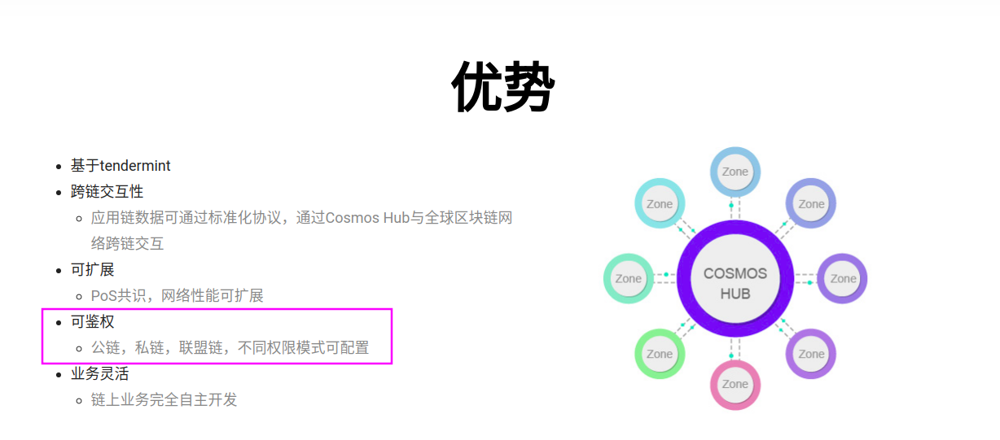
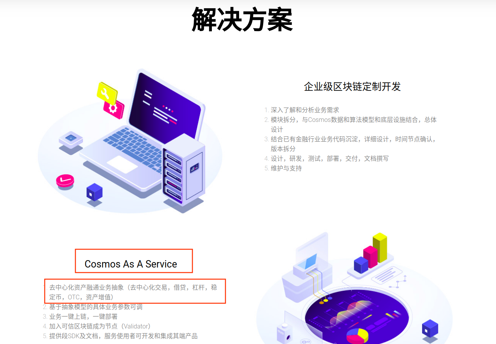

# 191126

今天周二，在家办公。

## Cosmos究竟可以做什么，还被誉为了区块链的互联网

http://m.elecfans.com/article/800708.html

## IRISnet受邀深度剖析Cosmos跨链技术

https://www.beekuaibao.com/article/598236254044823552

## Cosmos跨链协议研究

https://zhuanlan.zhihu.com/p/86165572

## 【深度知识】跨链的3种机制和COSMOS/POLKDOT实现分析

https://cloud.tencent.com/developer/article/1415143

## 联盟链的多链与跨链的思考与实现

https://bbs.chainx.org/topic/5b85042c869387709ed62165

## 链博科技-提供Cosmos技术解决方案

http://chainboard.io/cosmos/

HyperLedger-Fabric区块链平台，在智能合约的基础之上，**引入了权限管理**，被称为联盟链。

