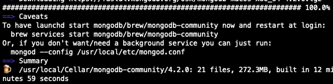

## mac下安装mongoDB服务并启动

### mac安装MongoDB

-----

### mac下homebrew安装mongodb

https://docs.mongodb.com/manual/tutorial/install-mongodb-on-os-x/


In addition to the [binaries](https://docs.mongodb.com/manual/reference/program/), the install creates:

- the [configuration file](https://docs.mongodb.com/manual/reference/configuration-options/) (`/usr/local/etc/mongod.conf`)
- the [`log directory path`](https://docs.mongodb.com/manual/reference/configuration-options/#systemLog.path) (`/usr/local/var/log/mongodb`)
- the [`data directory path`](https://docs.mongodb.com/manual/reference/configuration-options/#storage.dbPath) (`/usr/local/var/mongodb`)

### Run MongoDB

From a terminal, issue the following to run MongoDB (i.e. the [`mongod`](https://docs.mongodb.com/manual/reference/program/mongod/#bin.mongod) process) in the foreground.

```
mongod --config /usr/local/etc/mongod.conf
```

Alternatively, to run MongoDB as a macOS service, issue the following (the process uses the `/usr/local/etc/mongod.conf` file created during the install):

```
brew services start mongodb-community@4.2
```

### Connect and Use MongoDB

To begin using MongoDB, connect a [`mongo`](https://docs.mongodb.com/manual/reference/program/mongo/#bin.mongo) shell to the running instance. From a new terminal, issue the following:

```
mongo
```

-----------------



https://www.jianshu.com/p/b5e4f6a61e2b

### Mac下MongoDb启动停止

https://www.jianshu.com/p/cab181aa376c

https://blog.csdn.net/qq_42815754/article/details/90375070