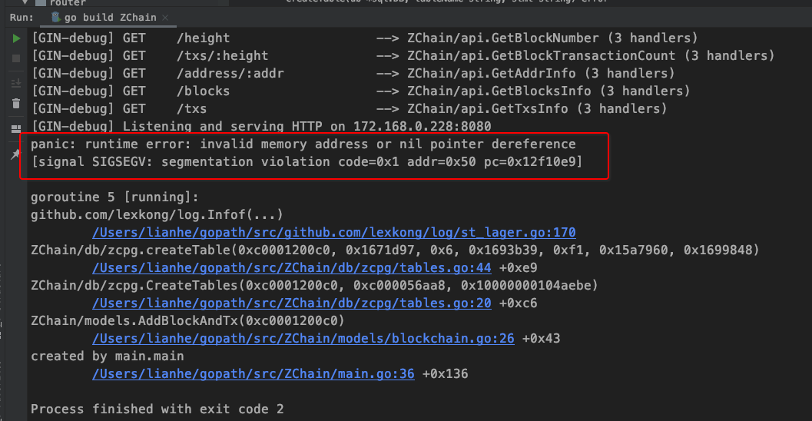
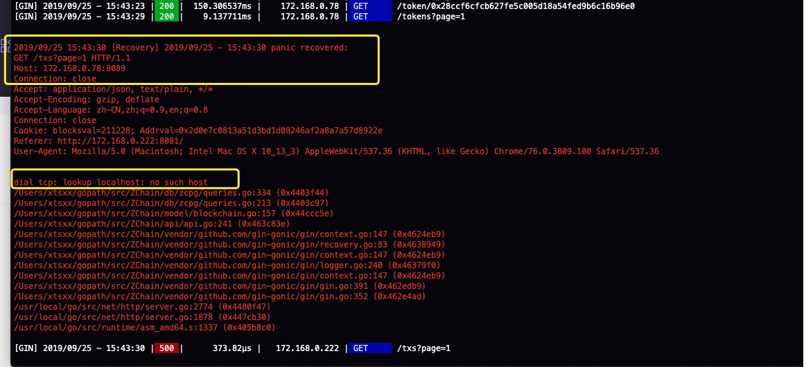

## 浏览器代码问题：

1. 现在web服务断开后，我重启服务之前，我必须把数据库表删除，启动服务后，数据库的创建及插入又要重新开始，现在如果我在重启服务之前，不清数据库就会报错。

**应该改为：**当web服务断开后，再重启服务时，对数据库部分加一个判断：

（1）如果表存在，不再执行创建。

（2）然后判断数据库是否有缓存，如果有缓存，获取缓存的最新的区块高度，然后和当前节点的最新高度相比较，把新生成的区块插入到数据库。

2. 我需要在创建表时，对`blocks`表再增加一个**交易数量字段**，
3. 目前：前端在不断地请求时，过一段时间会出现**数据库断开连接的错误**。

`2019/09/03 16:32:21 connect postgresql error pq: sorry, too many clients already`

我对错误的理解：我创建表时，连接了一次数据库，当我要返回最新的6行block数据时，又连接了一次数据库，返回最新的4行tx数据时，我又连接了一次数据库，由于前端是要不断地更新最新的block和tx数据，所以是不断地发请求，我后端不断地访问数据库，每次都要建立一次连接，一次连接相当于是一个客户端，这里的错误就是有太多的客户端访问了。

-------------

**先解决第2个问题：** 已增加 `tx_count`字段

**解决第1个问题：**

**关于第3个问题的解决方法：**

**（1）.网上的讨论：**

**pq: sorry, too many clients already**

https://stackoverflow.com/questions/53885511/pq-sorry-too-many-clients-already

https://www.spinics.net/lists/pgsql/msg28441.html

https://www.e-learn.cn/content/wangluowenzhang/67131

### greenplum 集群故障(Sorry,too many clients already )排查

https://blog.csdn.net/weberhuangxingbo/article/details/90230260

## Greenplum max_prepared_transactions 设置不正确时的症状 - too many clients already

https://yq.aliyun.com/articles/603288

## PostgreSQL的连接问题汇总

https://my.oschina.net/Kenyon/blog/57816

**数据库最大连接数为300**，**而此时活跃的连接数已达305个**（**包括3个超级用户预留连接数**）

 **解决办法：**

**增大postgresql.conf中的参数max_connections值**,**开发程序上检查连接数是否正常关闭**等，应急情况下，可把pg_stat_activity中IDLE的进程删除，kill procpid; 

**查看数据库配置文件的路径：**

**mac路径：**

### URL参数介绍

https://www.jianshu.com/p/6562e0b0e016

-------------------

----------

## sql.DB相关问题（go语言操作postgresql问题）

**数据库可以被各种语言操作，关键还是把数据库的各个方面搞明白。**

### 配置 sql.DB 获得更好的性能

**英文原文：**

https://www.alexedwards.net/blog/configuring-sqldb

**译文：**

https://colobu.com/2019/05/27/configuring-sql-DB-for-better-performance/

panic: runtime error: invalid memory address or nil pointer dereference
[signal SIGSEGV: segmentation violation code=0x1 addr=0x50 pc=0x12f10e9]

这个错误已解决，是下面的问题，`log.Infof`是引用别人的包，我使用的格式不对。再次重启web服务，创建表时，不会报错，后面也会判断数据库是否有缓存，然后再进行插入。

**等代码差不多了，要把关键的fmt输出换成log记录，原来的log输出，格式不好的话，也改一下。找一个格式好的日志包，不行的话自己封装一个。**

-----------------

## PostgreSQL,mysql的高效高性能分页方法

https://blog.csdn.net/ohyoyo2014/article/details/19329681

### postgreSQL数据库limit分页、排序

https://blog.csdn.net/baidu_18607183/article/details/51200652

------------------

------

## 20190923

**要改进的地方：**凡是需要求数据总量的地方都需要改进，不然求总量时检索整个数据表，太耗时了

**数据量很大的情况下，怎么获取某个字段的总数，时间更短**