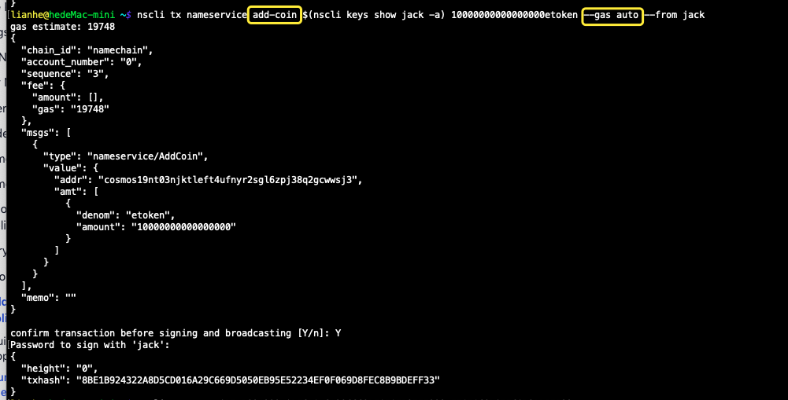
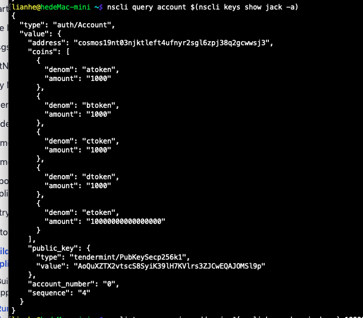
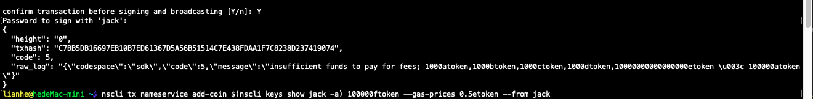
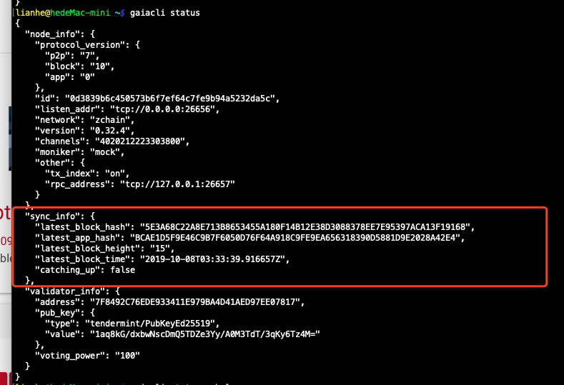
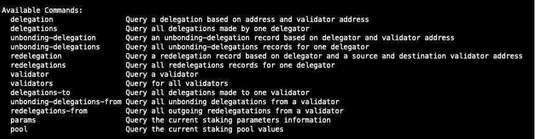

## 计划

1. 熟悉cosoms sdk ============>两周

2. 熟悉cosmos hub(gaia)环境搭建、配置、操作、**新增validator** ============>一周

3. 了解cosmos原生token从何而来，怎样转账，怎样发行新token（目前gaia可能没开放转账和新token发行功能），并尝试加入到新链上 ============>两周

4. 用cosmos sdk搭建一条链(参考gaia以及相关文档)，有最基本的功能 ============>两周

    

5. 了解cosmos怎样在tendermint之上加入pos机制，并尝试在新链上修改共识 ==========>两周

6. 了解cosmos的validator机制，能够简单修改 ============>一周

  ---------
  
  ## 2019年8月12日
  
  新的任务：Hyperledger Burrow，做这个的区块链浏览器后端
  
  写后端的API
  
  ------------
  
  ## cosmos/ethermint
  
  ----
  
  **Ethereum on Tendermint using Cosmos-SDK!**
  
  https://github.com/cosmos/ethermint
  
  
  
  https://github.com/cosmos/peggy  

----------

## 20190814

### 区块链浏览器

以太坊的区块链浏览器

https://github.com/carsenk/explorer

https://github.com/gobitfly/etherchain-light

https://github.com/etherparty/explorer

--------

### 用Go写的后端的区块链浏览器

https://github.com/decred/dcrdata#dcrdata-daemon

--------------

### A block explorer for Cosmos（Cosmos区块链浏览器）

 [https://cosmos.bigdipper.live](https://cosmos.bigdipper.live/)

**github:**https://github.com/forbole/big_dipper

---------

-------

## 2019年9月22日

### 下一阶段的开发计划：

1. 发币的功能实现

   

2. 联盟链，可参考Hyperledger-Fabric

3. 把类似cosmos-sdk的域名购买服务类似的服务做成一个通用的工具（类似sdk）,做好后，其他类似的服务可以直接调用相关的接口来实现相关的服务。

4. 跨链，多链架构，以cosmos-sdk

-------

------

## 先看cosmos hub部分,

#### Cosmos Hub

The Cosmos Hub is the first of [thousands of interconnected blockchains](https://cosmos.network/) that will eventually comprise the **Cosmos Network**. The primary token of the Cosmos Hub is the **ATOM**, but the Hub will support many tokens in the future.

**Cosmos Hub的主要token是ATOM,但是将来将会支持很多token,**

## Proposed Cosmos Fee Token — Codename Photon

https://medium.com/tendermint/proposed-cosmos-fee-token-codename-photon-e0927daf5c4c

https://blog.cosmos.network/cosmos-fee-token-introducing-the-photon-8a62b2f51aa

## Into the CØSMOS

[https://thecontrol.co/into-the-c%C3%B8smos-433586b82865](https://thecontrol.co/into-the-cøsmos-433586b82865)

--------

-------

## Cosmos 费用代币——介绍 Photon

https://blog.csdn.net/shangsongwww/article/details/89817616

[https://ethfans.org/posts/cosmos-fee-token-introducing-the-photon

## 区块链互操作性，Part-1：Cosmos

https://ethfans.org/posts/blockchain-interoperability-cosmos-vs-polkadot-part-1

------------

------

## TokenGazer深度研究 | Cosmos：Staking带来投资策略多样化，代币权重集中问题凸显...

https://blog.csdn.net/TokenGazer/article/details/88984902

------

----------

上述基于cosmos-sdk的发币功能已经实现

1. 通过创世区块，首次发行多个 native token,

2. 系统运行中，任意发行新的token,需要消耗gas,

   现在是在终端实现的，如果只指定 `--gas`为 `auto` ，则默认的gas是200000，因为没有指定`gas-price`,所以不会有交易费，交易费= gas-price * gas-used

   

根据交易hash查询交易

nscli query tx 8BE1B924322A8D5CD016A29C669D5050EB95E52234EF0F069D8FEC8B9BDEFF33`

查询账户信息

`nscli query account $(nscli keys show jack -a)`

` nscli tx nameservice add-coin $(nscli keys show jack -a) 100000ftoken --gas-prices 0.5atoken --from jack `

如果指定gas-prices，为0.5atoken,交易失败，因为atoken根本就不够扣除交易费，

如果指定扣除交易费的币够多，则交易可以成功

`nscli tx nameservice add-coin $(nscli keys show jack -a) 100000ftoken --gas-prices 0.5etoken --from jack`

该账户下有很多etoken，够扣除交易费

-------------

**我的一个简单的想法**：在实际发生交易时（转账或者发新的token）都需要扣除交易费的，要指定gas的价格,如果你指定的gas价格过高，导致你账户下扣除交易费的token不够扣除，那么该交易因为没有足够的资金扣除交易费而导致交易失败。

在一个实际的应用中，怎么制定gas-price和预估需要消耗多少gas, 因为我在交易时要选择交易费，使用哪个币扣除交易费，我自己肯定知道我的账户有多少个token,数量是多少，如果交易时我指定的gasPrices过高，那么指定扣除交易费的币不够扣，那么肯定交易失败，

我的想法：要么我预估需要消耗多少gas,然后再指定一个合理的gasPrice,估算后选择合适的币种扣除交易费，可以避免因为资金不够扣除交易费而失败的情况。

------------------

## 基于cosmos-sdk的区块链浏览器

### **20191008**

1. **确定基本的接口**

**基本接口:**查看区块，交易和验证者信息，（**blocks, transactions, validators**）

**获取区块高度 height**, 这个如何获取？包括最新的区块高度

gaiacli status ：查询节点的信息，**节点信息中有最新的区块高度**

gaiacli query block [height] ：由区块高度查询区块信息

gaiacli query tx [hash] : 由交易hash查询交易信息

gaiacli query account [address] : 由账户地址查询账户余额

----

**staking module的查询命令**

 gaiacli query staking [command]

----

2. **数据库表设计**

   基本的路由接口确定后，就要确定设计数据库，先确定两个表，一个区块表，一个交易表，要确定两个表存储哪些字段，各个字段定义的类型

